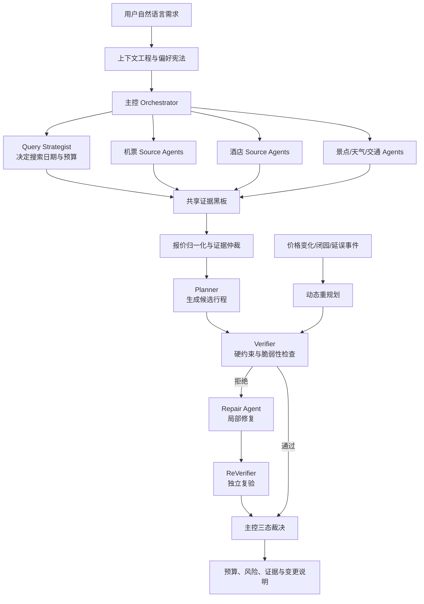

# TripChord（旅弦）

[](https://github.com/Oxygen56/TripChord/actions/workflows/ci.yml)
[](https://www.python.org/)
[](https://react.dev/)
[](LICENSE)

TripChord 是一个面向自由行的、证据驱动的多 Agent 旅行规划系统。它不只是让大模型“写一份看起来合理的行程”，而是让多个 Agent 在明确的工具权限和预算内并发取证，经过 **规划 → 验证 → 修复 → 复验 → 主控裁决**，最终输出带来源、时间、风险和预算解释的方案。

项目可以完全独立运行，不依赖 Codex、ChatGPT 或任何特定 AI 编程工具。没有 API Key 时可以使用内置回放数据；提供兼容 OpenAI API 协议的模型服务后可以启用模型 Agent；安装本地 Chrome Companion 并由用户主动授权、登录旅行平台后，可以实验性地进行只读实时核价。

> 当前定位：可复现的多 Agent 旅行规划参考实现。回放与工程评测是稳定能力；真实 OTA 查询仍是实验能力，会受到登录、验证码、平台页面变化和报价时效影响。TripChord 不下单、不支付、不使用优惠券，也不承诺“全网最低价”。

## 你可以体验什么

| 模式 | 需要 LLM Key | 需要 Chrome/平台登录 | 适合用途 | 稳定性 |
|---|---:|---:|---|---|
| 回放演示 | 否 | 否 | 第一次体验、开发、测试、面试演示 | 稳定 |
| 模型增强规划 | 是 | 否 | 需求理解、查询策略、候选评议、解释生成 | 稳定性取决于模型 |
| 真实平台只读核价 | 是 | 是 | 携程、去哪儿、同程的实验性机酒搜索 | 实验性 |
| 下单与支付 | — | — | 不在项目范围内 | 不支持 |

真实平台当前能力边界：携程和去哪儿支持机票、酒店只读查询；同程仅保留机票查询；飞猪因反复验证门已移出主动矩阵；智行尚未发现可稳定审计的 PC 报价结果页。精确范围见 [平台能力矩阵](docs/providers.md)。

## 为什么需要多 Agent

一次自由行规划同时包含日期搜索、跨平台报价、酒店拆住、交通接驳、开放时间、预算、用户偏好和异常恢复。TripChord 将这些职责拆开，并允许能安全并行的部分同时执行：



关键原则：

- **模型负责语义和策略，硬代码负责事实与安全。** LLM 可以解释偏好、选择工具和评议候选，但不能替代金额计算、时间冲突检查、来源校验和权限控制。
- **用户明示偏好优先。** 用户把早餐设为高权重后，Agent 的“早餐风险很低”不能覆盖用户决定。
- **Verifier 可以拒绝 Planner。** 被拒绝的方案只能修复或暂停，不能由模型悄悄改成“可接受”。
- **修复默认局部化。** 价格变化或景点闭园时尽量保留未受影响的行程，并输出版本差异。
- **每条外部事实都有证据类型。** 实时、复验、用户快照、回放、沙箱和已预订事实不会混为一谈。

## 五分钟开始体验

### 1. 环境要求

- Python `3.12` 或 `3.13`
- [uv](https://docs.astral.sh/uv/)
- Node.js `22` 与 npm

### 2. 安装依赖

```bash
git clone https://github.com/Oxygen56/TripChord.git
cd TripChord

uv sync --locked --all-groups
npm ci
```

### 3. 启动回放模式

终端一：

```bash
uv run alembic upgrade head
uv run uvicorn tripchord.main:app --app-dir apps/api/src --reload
```

终端二：

```bash
npm run dev
```

打开：

- Web 工作区：<http://localhost:5173>
- API 文档：<http://localhost:8000/docs>
- 健康检查：<http://localhost:8000/health>

默认不连接付费模型，也不访问真实旅行平台。页面中的报价是明确标注的回放数据，适合完整观察 Agent 轨迹、规划、拒绝、修复与事件重规划。

## 启用模型 Agent

复制环境变量模板：

```bash
cp .env.example .env
```

在 `.env` 中填写兼容 OpenAI API 协议的模型服务。下面只展示字段，不包含任何真实密钥：

```dotenv
MODEL_PROVIDER=openai_compatible
MODEL_API_KEY=replace-with-your-key
MODEL_NAME=your-primary-model
MODEL_FAST_NAME=your-fast-model
MODEL_BASE_URL=https://your-provider.example/v1
MODEL_AGENTS_REQUIRED=true
```

重启 API 后访问 `/api/v1/agents/runtime` 可以检查模型是否启用。`MODEL_AGENTS_REQUIRED=true` 表示模型阶段失败时必须阻断，而不是静默退回确定性模板。

TripChord 对 DeepSeek 的 OpenAI 兼容接口做过真实结构化输出和工具循环验证，但并不绑定某个模型。更换模型时建议先运行模型 smoke，再运行完整测试：

```bash
uv run python scripts/run_model_runtime_smoke.py --help
uv run pytest
```

## 实验性真实平台核价

真实核价由本机 Chrome Companion 完成。权限来自用户在 Chrome 中的主动授权，不来自 LLM，也不来自 TripChord 服务器。

### 1. 启动只绑定本机的 API 与 Browser Bridge

```bash
uv run python scripts/start_live_api.py
```

首次启动会在 `.runtime/browser-bridge-token` 生成权限为 `0600` 的本地配对密钥。密钥不会打印到终端，也不会进入 Git。

### 2. 安装 Chrome Companion

1. 使用 Google Chrome 打开 `chrome://extensions`。
2. 开启“开发者模式”。
3. 点击“加载已解压的扩展程序”。
4. 选择仓库中的 `apps/browser-companion`。
5. 在扩展弹窗中主动授权需要查询的平台域名。
6. 自行登录对应旅行平台。
7. 将本地配对密钥填入扩展，连接地址保持 `http://127.0.0.1:8000/browser-bridge`。

详细说明见 [Chrome Companion 文档](apps/browser-companion/README.md)。

### 安全边界

- 扩展没有 Cookie 权限，不读取密码、支付信息或账号资料。
- 只允许搜索、筛选、打开结果页和读取可见报价。
- 登录与验证码必须由用户自己处理，系统不会绕过平台风控。
- 未知页面结构返回 `dom_drift`，不会猜测价格。
- Browser Bridge 只监听 `127.0.0.1`，不要暴露到局域网或公网。
- 真实价格只是观察时刻证据，不代表库存锁定或最终成交价。

## 事件驱动的动态重规划

TripChord 不把重规划理解成“让 LLM 再写一遍”。价格变化、闭园、延误或用户偏好变化会先形成结构化事件，然后：

1. 判断事件影响了哪些行程组件；
2. 只让相关 Source Agent 重新取证；
3. 保留未受影响的项目；
4. 由 Repair 生成候选差异；
5. 重新执行硬约束校验和独立复验；
6. 输出旧计划、新计划、修改原因和保留率。

这使“异常恢复”成为完整规划闭环的一部分，而不是额外拼接的聊天功能。

## 上下文、记忆与 RAG

TripChord 使用受作用域约束的记忆系统保存：

- 用户稳定偏好；
- 历史明确决定；
- 平台能力与工具合同；
- 非实时证据和修复经验。

检索层采用 BM25 词法 RAG 构建 Agent 私有 Context Pack。实时价格和库存永远不会从 RAG 恢复为“当前事实”，必须重新查询或复验。默认持久化实现是带校验和的本地原子 JSON，仅面向单进程开发环境；敏感记忆默认不落盘。

详见 [模型、上下文、记忆与 RAG](docs/model-context-memory-rag.md) 和 [持久化记忆](docs/persistent-memory.md)。

## 自适应 Agent 数量与并发

Agent 数量不是无限增加，也不是由 LLM 随口决定。确定性预算控制器根据日期组合数、候选规模、证据缺口、修复次数和事件范围，生成有上限的临时 Agent DAG；模型可以在白名单内调整优先级，但不能扩大浏览器权限、突破总成本或抬高 OTA 并发。

候选规模较大时，Planner 的有界候选池会被分片给只读 Candidate Scouts，并由 Evidence Arbiter 收敛到小型决策前沿，最后只有 Candidate Merger 能写入最终选择。这样既发挥并行搜索优势，也避免多个 Agent 同时篡改最终状态。

相关设计与评测：

- [系统架构](docs/architecture.md)
- [v0.2 → v1.0 产品化路线图](docs/roadmap.md)
- [Agent 架构基准](docs/benchmark-agent-architectures.md)
- [日期搜索基准](docs/date-search-benchmark.md)
- [Done-Gate](docs/done-gate.md)
- [声明与证据边界](docs/claim-ledger.md)

## 后训练能力

`training/` 包含两个彼此独立的后训练方向：

- 行程解释与结构化输出的 SFT/DPO 数据和训练入口；
- Agent 编排策略、工具选择和修复决策的 SFT/DPO 数据和策略重排器。

它们用于验证训练管线和策略接口，不应被宣传成已经证明真实 OTA 质量提升。LoRA 产物默认不进入在线规划链路，训练数据合同和可复现实验见 [training/README.md](training/README.md)。

## 让 AI 帮你理解和运行本项目

仓库根目录的 [AGENTS.md](AGENTS.md) 是给 AI 编程助手的项目合同。你可以把下面这段提示词直接发给 Claude Code、Codex、Cursor 或其他能读取本地仓库的 AI：

如果希望 AI 不只运行当前版本，而是持续实施 v0.2 至 v1.0 产品化路线图，请使用
[Claude Code 自治实施总提示词](docs/claude-code-v1-implementation-prompt.md)。

```text
请先完整阅读 README.md、AGENTS.md、docs/architecture.md、docs/providers.md 和
docs/claim-ledger.md，再帮助我运行 TripChord。

要求：
1. 先检查 Python、uv、Node.js 和 npm，不要修改业务代码；
2. 默认使用 replay 模式，不要访问真实旅行平台，也不要发起付费模型调用；
3. 执行 uv sync --locked --all-groups、npm ci、数据库迁移，然后分别启动 API 和 Web；
4. 用 /health、/ready 和 Web 页面验证启动结果；
5. 如果失败，请给出根因、最小修复和验证证据，不要伪造成功；
6. 只有我明确授权后才能启用 LLM 或 Chrome Companion；
7. 不得下单、支付、使用优惠券、绕过登录或验证码；
8. 任何价格都要说明是 replay、live search、revalidated 还是 user snapshot。
```

如果希望 AI 讲解代码，可以继续问：

```text
请沿着“用户需求 → 上下文工程 → Orchestrator → Source Agents → 报价归一化 →
Planner → Verifier → Repair → ReVerifier → 最终裁决 → 事件重规划”这条链路，
逐个指出核心代码文件、输入输出模型、确定性边界和测试证据，并画一张 Mermaid 图。
```

## 测试与质量门

```bash
# Python
uv run ruff check .
uv run mypy apps/api/src
uv run pytest

# Web
npm run build
npm test

# 容器配置
docker compose config
```

CI 还会验证数据库迁移、训练入口、冻结评测、依赖审计和 Docker 构建。测试通过只代表工程合同通过，不自动代表真实平台 Done-Gate 通过。

## Docker 部署

Docker Compose 提供 PostgreSQL、Redis、FastAPI、Nginx 和 Web UI：

```bash
cp .env.example .env
# 将 .env 中的 TRIPCHORD_AUTH_TOKENS 换成随机且不可提交的值
docker compose up --build
```

打开 <http://localhost:8080>。容器部署不控制宿主机 Chrome；真实 OTA 模式必须在安装 Chrome Companion 的同一台机器上启动本地 Browser Bridge。

## 目录结构

```text
apps/api/                 FastAPI、领域模型、多 Agent 与规划闭环
apps/web/                 React 工作区
apps/browser-companion/   用户授权的 Chrome 只读核价扩展
benchmarks/               冻结场景、评测器和公开摘要
training/                 SFT/DPO 数据合同、训练与策略重排
scripts/                  本地启动、模型 smoke 与 Companion 发布门
docs/                     架构、运维、平台边界、面试与证据文档
```

## 已知限制

- 平台 DOM、登录和验证码会变化，真实适配器可能返回阻断或页面漂移。
- 当前严格真实验收尚未形成两个酒店平台的同条件精确报价覆盖，因此不能声称完整 OTA Done-Gate 已通过。
- SQLite、内存任务队列和本地 JSON 记忆适合单机体验，不是多节点生产协调方案。
- 不支持自动预订、退改签、支付和价格锁定。
- 不保证穷举整月所有日期，也不保证找到全网最低价；日期搜索使用受预算约束的策略与可审计停止条件。
- 公开仓库不分发包含真实用户行程、平台 URL、截图或运行标识的原始核价证据。

## 参与贡献

欢迎提交 Issue 和 Pull Request。开始前请阅读 [CONTRIBUTING.md](CONTRIBUTING.md) 和 [SECURITY.md](SECURITY.md)。新增平台适配器必须遵守只读、最小权限、用户授权、失败关闭和证据标注原则。

## 来源与许可证

TripChord 是独立的 clean-room 实现。Datawhale HelloAgents 只作为教程与对照基线，TripChord 未复制其源代码；具体边界见 [docs/upstream-baseline.md](docs/upstream-baseline.md)。

项目代码采用 [MIT License](LICENSE)。第三方网站、报价、页面截图和平台内容仍归各自权利人所有，不因本项目许可证而改变。
