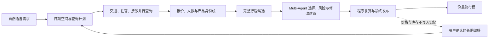

# TripChord（旅弦）

[](https://github.com/Oxygen56/TripChord/actions/workflows/ci.yml?query=branch%3Amain)
[](pyproject.toml)
[](https://www.python.org/)
[](https://react.dev/)
[](LICENSE)

**把多个平台的交通、住宿和接驳，组合成更适合你的旅行方案。**

TripChord 是一个主要在用户自己电脑上运行的智能旅行规划产品。用户只需要说明想去哪里、哪段时间方便、准备玩几天、同行人数和在意的体验，系统就会展开可行日期，向已连接的交通、住宿和接驳来源发起查询，只使用本次成功返回且能够公平比较的结果，算清这次所有人的总费用。在确实需要语义判断并且启用了模型时，不同模型角色处理需求、体验取舍和结果说明；日期、金额与行程是否成立始终由程序统一检查。

**当前 1.0** 会先排除不能成行或不符合明确要求的方案，再从本次实际查到且能够公平比较的结果中，选择这次所有人总费用更低的一份。酒店品质、位置、早餐、行李或是否接受中转等明确要求不会被低价覆盖。

**下一阶段** 会让价格、时间和舒适度等个人取舍真正影响最终选择：偏好明确时给出一份个性化建议；偏好不足时，从同一次查询得到的候选中提供省钱、均衡和体验优先三种代表方案。这部分是已经确定的产品方向，不是当前 1.0 已有功能。

当前版本是 **1.0.0**。核心规划、偏好记忆和自然语言修改已经形成闭环；它仍是本地开发者版本，不代表签名安装包、生产稳定性、商业采用或全平台覆盖。

项目为什么保留自己的旅行规划内核、哪些工作需要模型、哪些必须由程序完成，以及为什么暂时不更换 Agent 框架，都集中记录在[重要架构决策](docs/architecture-decisions.md)中。

## 为什么叫 TripChord

`Trip` 是旅行，`Chord` 是和弦。单独的航班、酒店和接驳像不同音符；TripChord 要做的是让它们在日期、衔接、预算和个人偏好上彼此协调，组成一份真正能走的完整行程。中文名“旅弦”保留了这个含义。完整的命名考虑见[项目命名说明](docs/naming.md)。

## 从一句需求到一个答案

例如：

> 8 月 20 日到 9 月 10 日之间，从杭州去马尔代夫玩 4–8 天，2 位成人。住宿不要简陋或偏僻，希望住得舒服，也别太贵。

TripChord 会在后台完成这些工作：

1. 理解日期范围、旅行天数、同行人和住宿偏好。
2. 用程序生成全部合法日期组合，再按本次查询预算并行搜索。
3. 同时读取已连接的机票、酒店和接驳来源；平台失败与真正无票、无房会被分别记录。
4. 核对报价对应的具体航班、房型、日期、人数、税费和币种。
5. 把交通、住宿与接驳组合成完整行程，排除时间接不上、住不下或不符合要求的方案。
6. 在可行方案中比较总费用和用户偏好，并由程序重新核对后只发布一份结果。
7. 用户继续用中文修改行程；只重算受影响的部分，新方案不成立时保留原方案。

同行人数不是固定的“两位成人”。系统会按每次实际出行人数计算总费用；只有来源能够明确支持对应的成人、儿童、婴儿和房间组合时，报价才会进入比较。

## 一次实际规划结果

2026 年 8 月的一次杭州至马尔代夫只读查询生成了 85 组合法日期，受当次查询预算限制，实际精查了其中 3 组，耗时约 4 分 15 秒。随后系统针对其中一组日期完成了交通、住宿和接驳的完整规划，得到下面的安排。它展示的是一次已经发生的规划结果，不是今天的价格，也不代表当时已经比较完全部 85 组日期。

| 行程部分 | 最终安排 |
| --- | --- |
| 去程 | 2026-09-03 21:45 杭州出发，JD5907 + JD455；09-04 12:20 抵达马累 |
| 住宿 | 09-04 至 09-09，Kaani Beach Hotel，市景豪华阳台房，含早餐、免费取消；携程双人含税总价 ¥2,485 |
| 接驳 | 09-04 15:25 机场至 Maafushi；09-09 09:30 Maafushi 至机场；按当日参考汇率折合共 ¥806.47 |
| 返程 | 2026-09-09 14:20 马累出发，JD456 + JD5908；09-10 09:25 抵达杭州 |
| 费用 | 机票与住宿已确认小计 ¥10,687；按当日参考汇率计入接驳后约 ¥11,493.47 |

接驳税费仍未知，所以 ¥11,493.47 是参考估算，不是锁定的结算价。住宿位置只依据页面明确地址及附近潜水、水上活动服务点判断为不偏僻，不额外声称靠近码头或市中心。本次只有携程返回了满足同一住宿要求的可比较报价，因此它证明的是“当前合格结果中的选择”，不是全网最低价。

同一份保存数据还复现了自然语言修改：

- “酒店换成海景房，航班和接驳保持不变”——只替换住宿，海景房 ¥2,605，比原房型增加 ¥120；航班和两段接驳完全不变。
- “换一家酒店”——其他酒店缺少足以证明位置合适的信息，修改停止，原方案保留。
- 同时修改出发和返程日期——升级为完整重算；若新日期没有形成合格方案，原方案不会被覆盖。

离线复现整条链约需 0.21 秒；这个数字只代表本地重算速度，不能代替平台实时查询耗时。详见 [1.0 验收记录](docs/v1.0-acceptance.md)。

## 系统怎样工作



TripChord 不让多个模型自由聊天。每个角色只看到完成自己工作所需的信息，使用限定工具，并输出可以被程序检查的结构化结果。当前在程序已经得到唯一结果时会跳过方案选择模型；让其他角色也只在真正需要时触发，是下一阶段的性能优化。

| 角色 | 在一次规划中负责什么 |
| --- | --- |
| 需求与偏好 | 理解当前需求，读取或提出长期偏好；当前请求始终优先，价格与库存不能进入长期记忆 |
| 查询调度 | 在程序已经生成的日期范围内安排查询顺序、来源和并行节奏，不能擅自省略日期或扩大平台权限 |
| 信息核对 | 判断不同页面是否对应同一航班、房型或班次，以及价格是否真的可以比较 |
| 方案选择 | 在完整可行的候选中比较总费用和用户明确偏好；没有真实取舍时不调用模型 |
| 风险检查与调整 | 发现中转、入住、位置等旅行风险，提出修改范围，并复查修改是否带来新问题 |
| 结果说明 | 汇总已经核准的信息并组织中文说明，不能新增报价、航班或房型 |

日期生成、人数换算、金额、税费、产品身份、行程衔接、修改执行和最终复查始终由确定性程序负责。完整角色、输入合同与工具权限见 [系统架构](docs/architecture.md)。

## 关键设计取舍

| 问题 | TripChord 的选择 |
| --- | --- |
| 灵活日期会产生大量组合 | 程序生成完整合法空间，固定工作池并行精查；结果必须说明本次究竟查了多少，模型不能偷偷省略日期 |
| 平台价格写法不同 | 先统一具体产品、日期、人数、税费与币种，再比较这趟旅行所有人的总费用 |
| LLM 灵活但可能编造事实 | 模型只负责语言理解和有限候选中的判断；所有事实和最终发布都能由程序拒绝 |
| Multi-Agent 容易拖慢 | 当前已经能在程序得出唯一结果时跳过方案选择模型；让其余角色也按实际需要触发，是下一阶段的性能优化 |
| 用户希望被记住 | 只保存用户确认过的稳定偏好，并允许查看、撤销和过期；实时价格、库存和班次永不进入长期记忆 |
| 用户想继续修改 | 先识别受影响范围，只重查对应部分；修改后的完整行程必须再次通过独立复查 |
| 是否更换 Agent 框架 | 多种主流方案已经按同一旅行任务完成对比；目前没有发现重写生产流程能改善旅行结果，因此先保留当前实现，完整结论见[重要架构决策](docs/architecture-decisions.md) |

平台能力通过专用连接模块和本机浏览器连接扩展接入。当前没有要求用户额外安装某个 Agent 框架；新增平台必须先证明能够稳定返回日期、人数、产品和费用都对得上的结果。

## 1.0 已完成的范围

- 中文自然语言需求进入统一规划链；
- 灵活日期组合生成、并行查询、去重和实际覆盖说明；
- 交通、住宿、接驳的产品身份与所有人总费用统一；
- 只输出一份最终行程，并展示去程、住宿、接驳、返程和人民币费用；
- 住宿品质、位置、早餐、行李与是否接受中转等明确要求进入选择；
- 用户偏好可保存、撤销和过期，实时旅行事实与记忆隔离；
- 自然语言修改、受影响部分重算、失败后原方案保留；
- 长任务状态、已完成日期、浏览器任务和短期结果具备本机持久化路径；
- 一条由保存真实来源数据驱动、可重复运行的端到端验收链。

1.0 之后继续成熟化的内容包括普通用户安装与升级封装、手机端、减少浏览器标签或改为无头查询、更多平台与目的地、混合成人与儿童场景的持续真实验证，以及更长时间的真实平台成功率和性能观测。

## 接下来做什么

核心架构已经确定，下一步直接沿用同一份杭州至马尔代夫需求实施，不再继续比较框架，也不再增加第二个耗时很长的旅行场景：

1. 让同一次查询稳定取得至少两个平台可公平比较的住宿报价，并重新计算各自对应的完整行程总费用；
2. 让个人偏好真正改变最终选择，并在没有偏好时给出省钱、均衡和体验优先三种代表方案；
3. 把全部合法日期的查询通过固定工作池、跨日期去重和结果复用压缩到十分钟目标；
4. 再让模型角色按实际需要触发，最后提供供其他 AI 应用调用的完整 TripChord 接口。

每一步的用户结果、实施边界和端到端完成标准见 [产品形态与实施路线](docs/roadmap.md)。

## 本地运行

需要 Python 3.12 或 3.13、Node.js 22 和 [uv](https://docs.astral.sh/uv/)。

```bash
git clone https://github.com/Oxygen56/TripChord.git
cd TripChord
uv run python scripts/tripchord_launcher.py check
uv run python scripts/tripchord_launcher.py setup
uv run python scripts/tripchord_launcher.py wizard
```

分别启动本机 API 与 Web 界面：

```bash
uv run python scripts/tripchord_launcher.py api
uv run python scripts/tripchord_launcher.py web
```

访问 `http://localhost:5173`。默认配置不访问真实平台，也不调用外部模型。实时网页查询需要用户在自己的 Chrome 中登录对应平台，为[本机 Chrome 只读连接扩展（Chrome Companion）](apps/browser-companion/README.md)授予指定域名的读取权限，并配置模型服务；TripChord 不读取 Cookie、密码或 Chrome 用户目录。

复现 1.0 核心验收：

```bash
env -u TRIPCHORD_FORMAL_MODEL_ROLE .venv/bin/pytest -q -s apps/api/tests/test_v1_acceptance.py
```

## 能力边界

- 只比较本次真正查到且能公平比较的平台，不宣称全网最低。
- 保存案例是历史来源回放，不是当前价格、库存或可订承诺。
- 平台登录、验证码、网络和页面结构变化仍可能让某个来源失败；失败不会被解释成无库存。
- 混合成人、儿童和婴儿只有在来源给出完整同行报价时才能参与选择，当前还没有同等级真实端到端覆盖。
- `1.0.0` 不代表签名安装包、跨机器生产稳定或真实商业采用。
- TripChord 永远不下单、付款、接受条款、使用优惠券、锁定库存、修改或取消预订。

## 进一步阅读

- [完整文档导航](docs/README.md)
- [1.0 验收记录](docs/v1.0-acceptance.md)
- [重要架构决策与框架对比](docs/architecture-decisions.md)
- [项目命名说明](docs/naming.md)
- [系统架构与关键取舍](docs/architecture.md)
- [模型、上下文与偏好记忆](docs/model-context-memory-rag.md)
- [平台接入](docs/providers.md)
- [本地运行与恢复](docs/operations.md)
- [架构面试指南](docs/interview-guide.md)
- [产品形态与实施路线](docs/roadmap.md)

## License

[MIT](LICENSE)
