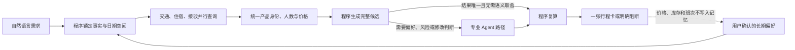

# TripChord（旅弦）

[](https://github.com/Oxygen56/TripChord/actions/workflows/ci.yml?query=branch%3Amain)
[](pyproject.toml)
[](https://www.python.org/)
[](https://react.dev/)
[](LICENSE)

**面向个人或多人复杂自由行，把可在线查询的交通、住宿、接驳和活动组合成更适合你的完整方案。**

TripChord 是一个主要在用户自己电脑上运行的旅行决策 Agent。它理解自然语言中的出发地、目的地、同行者、日期、固定安排、预算和体验偏好，把当前可查询的飞机、铁路、轮渡、住宿、接驳与活动组成一份时间、人数、总费用和体验都能成立的完整行程。它既处理普通往返，也能表达多城市、异地进出、不同地点出发后汇合、亲子或长辈同行，以及“保留航班，只换酒店”一类后续修改。

**当前 2.0** 是七轮范围受控功能形态的完成版本：在同一条旅行状态、报价合同、确定性求解和中文行程卡链路上，已经覆盖单目的地、多城市、分地出发与汇合、个性化按需 Agent、复杂修改、新交通与活动，以及外部 MCP 宿主接入。单目的地往返仍保留为最快的兼容路径；每种复杂结构都只在明确记录的来源范围内声明。

**2.0 的准确边界** 是范围受控的复杂自由行决策能力，不是对任意旅行需求的普遍保证。偏好明确时给出一份个性化建议；偏好不足时，从同一次查询得到的候选中提供省钱、均衡和体验优先三种代表方案。用户确认过的稳定偏好可以被记住，当前请求永远可以覆盖历史偏好。价格、库存和班次始终只来自本次查询。

当前版本是 **2.0.0**。七轮功能形态已经形成闭环；它仍是本地开发者版本，不代表签名安装包、生产稳定性、商业采用、全平台最低价或所有外部宿主覆盖。

第一次从面试或架构视角了解项目，可以直接阅读[简历与面试项目说明](docs/resume-project.md)：它用一页说明项目价值、Agent 分工、关键取舍、真实运行和可追问边界。

项目为什么保留自己的旅行规划内核、哪些工作需要模型、哪些必须由程序完成，以及为什么暂时不更换 Agent 框架，都集中记录在[重要架构决策](docs/architecture-decisions.md)中。

面向复杂自由行的领域模型、组合算法、按需 Agent、上下文、记忆与渐进迁移方案，见[复杂自由行目标架构](docs/target-architecture.md)。

七轮迭代的用户结果、当前/冻结证据和准确声明见 [TripChord 2.0 公共验收矩阵](docs/v2.0-acceptance.md)；详细需求和每轮完成标准见 [TripChord 2.0 产品需求文档](docs/product-requirements.md)。

外部 Agent 接入已经有一条范围受控的 MCP 证据链：Claude Code 2.1.245 可创建、断开后恢复并修改同一个 TripRun，官方 Python MCP SDK 1.29.1 可独立读取相同状态。详见 [I7 MCP 当前来源证据](benchmarks/results/i7-mcp-current-2026-08-26.json)；这不等于已经覆盖所有宿主或完成全网旅行能力。

## 为什么叫 TripChord

`Trip` 是旅行，`Chord` 是和弦。单独的航班、酒店和接驳像不同音符；TripChord 要做的是让它们在日期、衔接、预算和个人偏好上彼此协调，组成一份真正能走的完整行程。中文名“旅弦”保留了这个含义。完整的命名考虑见[项目命名说明](docs/naming.md)。

## 从一句需求到一个答案

例如：

> 8 月 20 日到 9 月 10 日之间，从杭州去马尔代夫玩 4–8 天，2 位成人。住宿不要简陋或偏僻，希望住得舒服，也别太贵。

这个例子是当前已经跑过的首个真实场景，不是 TripChord 未来只能处理的旅行类型。

TripChord 会在后台完成这些工作：

1. 理解日期范围、旅行天数、同行人和住宿偏好。
2. 用程序生成全部合法日期组合，再按本次查询预算并行搜索。
3. 同时读取已连接的机票、酒店和接驳来源；平台失败与真正无票、无房会被分别记录。
4. 核对报价对应的具体航班、房型、日期、人数、税费和币种。
5. 把交通、住宿与接驳组合成完整行程，排除时间接不上、住不下或不符合要求的方案。
6. 在可行方案中比较总费用和用户偏好，并由程序重新核对后只发布一份结果。
7. 用户继续用中文修改行程；只重算受影响的部分，新方案不成立时保留原方案。

同行人数不是固定的“两位成人”。系统会按每次实际出行人数计算总费用；只有来源能够明确支持对应的成人、儿童、婴儿和房间组合时，报价才会进入比较。

## 历史真实规划结果（保留作证据）

2026 年 8 月 24 日，TripChord 使用同一份“8 月 20 日至 9 月 10 日之间，杭州出发去马尔代夫玩 4–8 天，2 位成人”需求运行了一次只读实时查询。系统在约 100 秒内读取了 30/30 个可行日期组合的批量价格线索，其中 8 组显示人民币起价，再对排名靠前的 3 组做详细查询。得到的当前最佳候选是：

| 行程部分 | 最终安排 |
| --- | --- |
| 去程 | 2026-09-03 21:25 杭州出发，HU7678 + JD455；09-04 12:20 抵达马累 |
| 住宿 | 09-04 至 09-07，Kaani Beach Hotel，海景豪华阳台大床房，含早餐；官网双人 3 晚含税价按参考汇率约 ¥2,203.68 |
| 接驳 | 09-04 15:25 机场至 Maafushi，16:10 抵达；09-07 09:30 返回机场，10:15 抵达；两人基础价按参考汇率约 ¥806.47 |
| 返程 | 2026-09-07 19:40 马累出发，MU236 + MU6549；09-09 00:40 抵达杭州 |
| 费用 | 两人往返航班页面比较价 ¥12,038；计入住宿和接驳参考换算后预计约 ¥15,048.15 |

这张结果被标为“当前最佳候选”，而不是可直接购买的最终方案：航班价是平台比较价，尚未确认两人余位和成交价；接驳税费仍未知；窗口内只对 Top 3 做了详细查询；“兼顾住宿品质与价格”和“机场过渡住宿与更优选择的比较”在本次只被保留为偏好，尚未实际影响候选生成或排序。因此它没有完成整份需求，也不代表全窗口、全平台的最低可订价。

本次查询做了什么、没有做什么，以及各项来源入口，见[完整真实运行记录](docs/real-run-maldives-2026-08-24.md)。

正式界面会把这些内容放进同一张中文行程卡：往返当地日期时间、机场和航班号、酒店与房型、接驳班次、同行人数、人民币费用拆分、查询时状态以及对应平台或官网入口。TripChord 只负责查询、比较和建议，不会自动下单或付款。

历史保存运行还复现了自然语言修改：

- “酒店换成海景房，航班和接驳保持不变”——只替换住宿，海景房 ¥2,605，比原房型增加 ¥120；航班和两段接驳完全不变。
- “换一家酒店”——其他酒店缺少足以证明位置合适的信息，修改停止，原方案保留。
- 同时修改出发和返程日期——升级为完整重算；若新日期没有形成合格方案，原方案不会被覆盖。

历史回放的本地重算约需 0.21 秒；这个数字只代表保存数据的重算速度，不能代替平台实时查询耗时。详见 [1.0 验收记录](docs/v1.0-acceptance.md)。

## 2.0 系统怎样工作

下面是当前 2.0 的统一纵向流程；单目的地、多城市、分组同行和活动组合都复用同一入口与状态，不会另建一套产品。



TripChord 不让多个模型自由聊天。每个角色只看到完成自己工作所需的信息，使用限定工具，并输出可以被程序检查的结构化结果。全窗口探索会先走确定性查询，只有候选进入需要语义取舍或发布重搜的路径时才承担相应模型成本；进入这类路径时固定其内部复核步骤，普通任务则由 Need Router 跳过无价值模型。角色表描述的是责任边界，不代表每次运行都会调用全部角色。

上面的 2026-08-24 真实运行中，模型阶段在全窗口探索时被延后，且没有候选进入发布重搜，因此实际模型调用为 **0 次**；这不代表整份需求已经完成。另一次 required-model 聚焦运行的本机诊断记录显示模型阶段完成，但因合格住宿精确报价不足而停止发布；该次运行尚无公开封存的机器记录。这些结果说明：Agent 是否执行成功和旅行方案是否足够可信是两件事，最终决定权仍在程序检查。详情见[真实运行记录](docs/real-run-maldives-2026-08-24.md)和[公开声明与运行记录](docs/claim-ledger.md)。

下表为了让产品流程容易理解，把 12 类内部模型职责归并成 6 个业务环节；它不是“同时运行 6 个 Agent”的数量说明。完整角色和触发路径见[简历与面试项目说明](docs/resume-project.md#一页-agent-架构)。

| 角色 | 在一次规划中负责什么 |
| --- | --- |
| 需求与偏好 | 理解当前需求，读取或提出长期偏好；当前请求始终优先，价格与库存不能进入长期记忆 |
| 查询调度 | 在程序已经生成的日期范围内安排查询顺序、来源和并行节奏，不能擅自省略日期或扩大平台权限 |
| 信息核对 | 判断不同页面是否对应同一航班、房型或班次，以及价格是否真的可以比较 |
| 方案选择 | 在完整可行的候选中比较总费用和用户明确偏好；没有真实取舍时不调用模型 |
| 风险检查与调整 | 发现中转、入住、位置等旅行风险，提出修改范围，并复查修改是否带来新问题 |
| 结果说明 | 汇总已经核准的信息并组织中文说明，不能新增报价、航班或房型 |

日期生成、人数换算、金额、税费、产品身份、行程衔接、修改执行和最终复查始终由确定性程序负责。完整角色、输入合同与工具权限见 [系统架构](docs/architecture.md)。

## 关键设计取舍

| 问题 | TripChord 的选择 |
| --- | --- |
| 旅行需求形态很多 | 统一表示同行者、地点、时间、活动和不能妥协的条件，再由程序按问题结构选择求解器，而不是为每种旅行复制工作流 |
| 灵活日期会产生大量组合 | 程序生成完整合法空间，固定工作池并行精查；结果必须说明本次究竟查了多少，模型不能偷偷省略日期 |
| 平台价格写法不同 | 先统一具体产品、日期、人数、税费与币种，再比较这趟旅行所有人的总费用 |
| LLM 灵活但可能编造事实 | 模型只负责语言理解和有限候选中的判断；所有事实和最终发布都能由程序拒绝 |
| Multi-Agent 容易拖慢 | 日期、平台和候选数量只增加普通并行任务；只有需求歧义、来源冲突、体验取舍或特殊风险真实出现时，才调用对应 Agent |
| 用户希望被记住 | 只保存用户确认过的稳定偏好，并允许查看、撤销和过期；实时价格、库存和班次永不进入长期记忆 |
| 用户想继续修改 | 先识别受影响范围，只重查对应部分；修改后的完整行程必须再次通过独立复查 |
| 是否更换 Agent 框架 | 多种主流方案已经按同一旅行任务完成对比；目前没有发现重写生产流程能改善旅行结果，因此先保留当前实现，完整结论见[重要架构决策](docs/architecture-decisions.md) |

平台能力通过专用连接模块和本机浏览器连接扩展接入。当前没有要求用户额外安装某个 Agent 框架；新增平台必须先证明能够稳定返回日期、人数、产品和费用都对得上的结果。

## 2.0 已完成的范围

- 中文自然语言需求进入统一规划链；
- 灵活日期组合生成、并行查询、去重和实际覆盖说明；
- 交通、住宿、接驳的产品身份与所有人总费用统一；
- 偏好明确时输出一份收敛方案；偏好不足时从同一批候选输出省钱、均衡、体验代表方案，并展示去程、住宿、接驳、返程和人民币费用；
- 住宿品质、位置、早餐、行李与是否接受中转等明确要求进入选择；
- 用户偏好可保存、撤销和过期，实时旅行事实与记忆隔离；
- 自然语言修改、受影响部分重算、失败后原方案保留；
- 长任务状态、已完成日期、浏览器任务和短期结果具备本机持久化路径；
- 一条由保存真实来源数据与范围受控当前来源驱动、可重复运行的七轮端到端验收链。

2.0 之后的主线是产品成熟化：普通用户安装、手机端、减少浏览器标签、更多平台和长期真实运行成功率仍需单独验证。这些不改变当前 2.0 的功能形态声明。

## 接下来做什么

2.0 的七轮主线已经完成。下一步只在真实用户结果证明有价值时推进成熟化工作；冻结来源继续用于回归，当前来源继续单独记录，不能把回放当作实时能力。

完整产品要求、每次迭代的实施内容和端到端完成标准见 [TripChord 2.0 产品需求文档](docs/product-requirements.md)；简要路线见[产品形态与实施路线](docs/roadmap.md)。

## 本地运行

需要 Python 3.12 或 3.13、Node.js 22 和 [uv](https://docs.astral.sh/uv/)。

```bash
git clone https://github.com/Oxygen56/TripChord.git
cd TripChord
uv run python scripts/tripchord_launcher.py check
uv run python scripts/tripchord_launcher.py setup
uv run python scripts/tripchord_launcher.py wizard
```

分别启动本机 API 与 Web 界面：

```bash
uv run python scripts/tripchord_launcher.py api
uv run python scripts/tripchord_launcher.py web
```

访问 `http://localhost:5173`。默认配置不访问真实平台，也不调用外部模型。实时网页查询需要用户在自己的 Chrome 中登录对应平台，为[本机 Chrome 只读连接扩展（Chrome Companion）](apps/browser-companion/README.md)授予指定域名的读取权限，并配置模型服务；TripChord 不读取 Cookie、密码或 Chrome 用户目录。

复现历史 1.0 核心验收：

```bash
env -u TRIPCHORD_FORMAL_MODEL_ROLE .venv/bin/pytest -q -s apps/api/tests/test_v1_acceptance.py
```

## 能力边界

- 只比较本次真正查到且能公平比较的平台，不宣称全网最低。
- 保存案例是历史来源回放，不是当前价格、库存或可订承诺。
- 平台登录、验证码、网络和页面结构变化仍可能让某个来源失败；失败不会被解释成无库存。
- 混合成人、儿童和婴儿只有在来源给出完整同行报价时才能参与选择，当前还没有同等级真实端到端覆盖。
- `2.0.0` 不代表签名安装包、跨机器生产稳定或真实商业采用。
- TripChord 永远不下单、付款、接受条款、使用优惠券、锁定库存、修改或取消预订。

## 进一步阅读

- [完整文档导航](docs/README.md)
- [TripChord 2.0 七轮公共验收](docs/v2.0-acceptance.md)
- [简历、Agent 架构与 GPT 面试提示词](docs/resume-project.md)
- [2026-08-24 马尔代夫真实只读运行](docs/real-run-maldives-2026-08-24.md)
- [1.0 验收记录](docs/v1.0-acceptance.md)
- [重要架构决策与框架对比](docs/architecture-decisions.md)
- [复杂自由行目标架构](docs/target-architecture.md)
- [TripChord 2.0 产品需求与七次迭代](docs/product-requirements.md)
- [项目命名说明](docs/naming.md)
- [系统架构与关键取舍](docs/architecture.md)
- [模型、上下文与偏好记忆](docs/model-context-memory-rag.md)
- [平台接入](docs/providers.md)
- [本地运行与恢复](docs/operations.md)
- [架构面试指南](docs/interview-guide.md)
- [产品形态与实施路线](docs/roadmap.md)

## License

[MIT](LICENSE)
