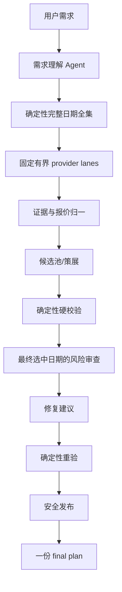

# TripChord 多 Agent 架构

## 产品目标与独立边界

TripChord 的核心问题是：给定灵活日期窗口、结构化同行人数和偏好，在成功覆盖的已连接来源中，找到满足硬约束、完整人民币同行总价最低的一份最终行程。它不是 OTA，不承诺全网最低、库存锁定、最终成交价或自动下单。

TripChord 是独立运行时，不依赖 OxygenTeam、Codex 或 ChatGPT。历史马尔代夫运行可能由外部开发编排监督；那只是开发过程的监督，不是产品运行时组件。

## 运行分层

### 第一层：理解与冻结输入

需求理解 Agent 将自然语言解析为日期窗口、晚数、目的地、同行人数、房间、预算、交通偏好和硬约束。用户明示字段优先；无法安全解释的歧义不能由模型猜测。成人、儿童、婴儿、房间和儿童年龄在领域结构与验证器中有位置，但现有 OTA 适配器对混合同行人会明确拒绝而非静默错算，因此不能声称混合人数已被真实平台完整支持。

### 第二层：完整日期探索

确定性枚举器根据日期窗口和晚数生成固定、可审计的合法日期全集（当前支持上限为 400 个日期对）。探索阶段不为每个日期创建 LLM，也不让模型决定日期全集。系统用 3 个固定日期 worker 执行全集，并在 provider 内维持连续的有界 lane；lane 是非 LLM worker，受 provider allowlist、只读权限、并发、超时和可配置安全间隔约束。

不同日期对中的 source 任务先按 provider、垂直类型、路线、日期、完整 party/房间、币种与住宿计划生成采集指纹。运行级 singleflight 让重复消费者共享同一次成功或类型化失败，新指纹才占用下一个 provider 时间槽；最终发布前的刷新则显式绕过该复用，保证重查。

在 66 个日期组合的确定性集成路径中，858 个逻辑查询归并为 648 个唯一采集，210 个重复查询被消除；静态计划与运行时最后启动时间均为 290 秒，加上 240 秒保守执行/收尾预算为 530 秒。这证明项目内部的并行、去重和时间预算契约，不是外部 OTA 网络的十分钟端到端证明。平台 range/batch 只是可选增强，当前性能路径不依赖它；任何未完整执行的窗口都不能伪装成全集最低价。

### 第三层：证据、报价与候选

Source worker 只执行已批准查询并返回带时间戳的结构化回执。确定性归一化负责：

- 稳定产品身份、日期、人数和房间匹配；
- 币种校验；只有完整的人民币同行总价才进入最终价格排序；
- 税费、服务费、行李/早餐等产品组成；
- 新鲜度、重复观察、空结果和技术失败的区分；
- provider 覆盖和证据可比性。

只有成功覆盖、完整 party total 足够明确且仍新鲜的来源才进入价格比较。缺失税费、身份、人数总价或必要覆盖时，候选保持待确认/阻断，不填零、不用旧价格补齐。候选策展可以保留内部 ranked diagnostics，但用户界面只发布一份 final plan。

### 第四层：最终选中日期上的模型角色

模型角色只在最终选中日期的候选决策阶段使用，且只能提出结构化意见：候选评议、软风险发现、修复建议和解释。确定性代码拥有最终权威：金额、时间冲突、人数/房间、住宿衔接、来源权限、新鲜度、硬预算和发布门均不可被模型覆盖。

修复通过独立确定性重验；必要时再由不同的风险审查角色复核。任何模型超时、结构化输出错误、工具越权或证据不足都会明确阻断。系统不会因为“局部恢复成功”就把未覆盖的日期或报价宣称为全局最优。

## 多 Agent 的实际职责

| 角色/组件 | 实际职责 | 权威边界 |
|---|---|---|
| 需求理解 Agent | 解析需求、冲突、偏好和澄清项 | 不能改写用户硬约束 |
| 日期枚举器 | 生成完整合法日期全集 | 不由 LLM 扩大或缩小 |
| Source workers | 执行交通/住宿/接驳只读查询 | 非 LLM；不能改变预算和权限 |
| Evidence/Quote normalizer | 归一回执、身份、税费、CNY party total、新鲜度 | 确定性计算 |
| Candidate Curator | 在可比证据上策展候选 | 不能伪造报价或发布多推荐 |
| Hard Verifier | 检查所有硬约束 | 最终拒绝权 |
| Risk Reviewer | 识别软风险 | 不能覆盖 Hard Verifier |
| Repair Advisor | 提出替换、补查或询问建议 | 执行与重验由确定性代码完成 |
| ReVerifier/Safety Gate | 独立重验、绑定证据、决定可发布性 | 最终发布权 |
| Preference Memory | 处理显式稳定偏好候选 | 可撤销、可过期、可被本次覆盖 |

这是一组固定职责和有界并发。完整日期探索不会为每个日期创建模型实例；只有最终日期才走模型角色。

## 偏好、记忆与实时事实

显式确认的稳定偏好可以写入受作用域约束的记忆，支持撤销和过期；本次请求的明确选择覆盖历史值。实时报价、库存、余位、班次和可订状态永不长期记忆，必须在本次运行重新查询或复验。RAG 只能恢复偏好、历史决定和仍新鲜的非实时平台能力，不能恢复当前价格。

## 当前实现与目标态

“已接线”“本地测试验证”“真实平台实验”“目标态”是四个不同声明层级。当前代码已具备固定 lane、跨日期去重、运行级 singleflight、结构化 party、报价归一、硬校验、修复/重验和只读浏览器路径；66 个日期组合的内部集成路径可重复。真实 OTA 覆盖仍可能因登录、验证码、DOM 漂移、报价时效、平台限速或平台缺证据而阻断。因此当前可以声明“内部调度预算通过”，不能声明“真实平台十分钟完成”；range/batch 也仍是无生产适配器的可选契约。

## 安全发布合同

最终发布至少需要：日期和 party 与需求一致；所有硬约束通过；每个关键报价有可追溯来源、采集时间和稳定身份；总价为完整可比的人民币同行总价；必要来源覆盖满足门槛；重验没有过期或冲突证据。否则返回结构化待确认/阻断，并说明缺口。真实预订、支付和余位锁定永远在项目范围之外。
