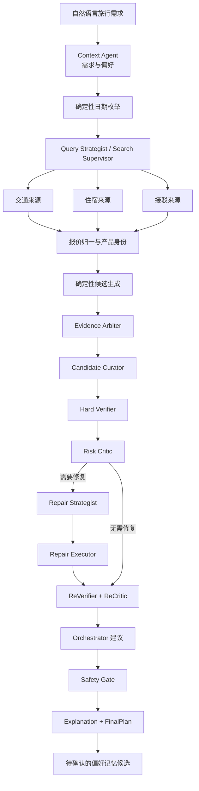

# TripChord 系统架构

TripChord 要解决的不是“生成一段旅行建议”，而是把一个带有灵活日期、同行人数和个性化偏好的旅行需求，转化为一份交通、住宿与接驳彼此成立、总价口径一致、可以直接帮助用户做决定的完整行程。

它的架构主张是：**让多个专业 Agent 处理需要语义判断的工作，让确定性系统掌握日期、金额、产品身份、权限和最终发布。**

## 1. 产品问题如何定义

### 输入

- 出发地和目的地；
- 可出行日期窗口与旅行时长；
- 成人、儿童、婴儿、儿童年龄和房间需求；当前来源尚未完整覆盖所有混合同行人报价；
- 预算、交通、住宿、餐食、行李与中转偏好；
- 必须满足的硬条件和可以权衡的软偏好。

### 输出

TripChord 在发布条件成立时，面向用户只发布一份 `FinalPlan`，其中包含：

- 确切的出发、返程日期与交通班次；
- 对应日期、房型、餐食和取消条件的住宿；
- 机场、酒店与目的地之间的接驳；
- 按本次实际同行人数计算的完整人民币总价；
- 选择理由，以及预订前仍需确认的条件。

若来源、完整总价或硬条件不足以支持发布，结果是零份方案和明确缺口，而不是降级成未经验证的候选列表。

### 优化目标

系统先排除不满足硬条件的方案，再在本次成功获取、产品身份明确且总价口径可比的候选中，以完整人民币同行总价为首要排序依据，结合用户明确设置的偏好做最终取舍。

这一定义不等同于“全网最低价”。未连接的平台、失败的查询、验证码阻断和不可比较的报价都必须作为覆盖边界披露，不能被模型补成成功结果。

## 2. 总体架构

下图表达职责关系，不等同于每个入口都逐节点执行；部分角色只在发布、修复或变化事件路径中触发。



这个流程包含三条互相制约的主线：

1. **搜索主线**负责扩大有效覆盖并取得当前来源结果；
2. **决策主线**负责理解语义、比较候选和识别软风险；
3. **验证主线**负责阻止金额、身份、时间和权限错误进入最终答案。

## 3. 六个架构层

### 3.1 需求与偏好层

`Context Agent` 将自然语言需求转换为结构化旅行意图。系统把条件区分为：

- **硬条件**：日期边界、人数、房间数、预算上限、禁止中转等；
- **软偏好**：更看重价格、早餐、行李、位置或更短中转；
- **待确认项**：语义不充分且不能安全推断的字段。

本次请求永远优先于历史偏好。模型只能提出偏好候选，不能直接修改用户画像，也不能把一次旅行中的临时选择升级为长期规则。

### 3.2 日期搜索与并发层

灵活日期会形成组合搜索空间。TripChord 使用确定性代码生成合法日期对，而不是让模型挑几个“看起来不错”的日期。执行预算决定本次能够精查多少日期；只有预算覆盖完整枚举时才能声称完成全窗口比较。执行阶段采用：

- 固定大小的日期 worker pool，避免为每个日期复制 Agent；
- 每个平台独立的并发、启动间隔和超时；
- 跨日期查询指纹与 singleflight，让相同查询共享一次结果；
- 完成一个日期对就记录进程内阶段进度，而不是等待整批结束；跨重启持久恢复仍是 Beta 目标；
- 最终发布前只刷新被选中的关键组件，并绕过探索缓存。

模型可以在冻结的搜索空间中提出精查顺序，但不能删改日期全集、提升平台权限或绕过查询预算。预算未覆盖全集时，运行结果必须保留 `sampled/not exhaustive` 语义。

### 3.3 来源与报价层

每个 Source worker 只负责一种来源能力，例如航班、住宿或接驳。它返回结构化结果，而不是一段供模型自由解释的网页文本。

报价进入候选池前必须绑定：

- 平台、路线、日期和产品身份；
- 成人、儿童、婴儿与房间口径；
- 单人、单晚、单程或同行总价的价格基础；
- 税费、服务费、行李、早餐和取消条件；
- 币种、采集时间、新鲜度和查询状态。

技术失败、空结果和真实售罄是三种不同状态。系统不会把页面没加载出来解释为“没有库存”，也不会把缺税费的低价放进最终总价排序。

当用户选择本机浏览器来源时，Chrome Companion 只在获准域名内读取用户可见信息。Cookie、密码、Chrome 用户目录和配对密钥不会进入模型上下文。

### 3.4 候选规划层

确定性 Candidate Generator 将交通、住宿和接驳组合成完整行程，先检查日期覆盖、机场和地点、入住区间、接驳衔接、房间与人数，再计算完整人民币同行总价。

`Evidence Arbiter` 负责判断不同来源是否描述同一产品、能否比较；`Candidate Curator` 只在合格候选中做语义取舍。这个顺序避免“先喜欢一个方案，再为它补齐事实”。

内部可以保留多个候选和淘汰原因，诊断 API 也可以返回它们；产品界面的最终投影只展示一份 `FinalPlan`，不会把内部候选重新交给用户筛选。

### 3.5 审查与修复层

`Hard Verifier` 检查可以明确计算的约束；`Risk Critic` 使用与策展者隔离的上下文检查软风险，例如中转过紧、到店过晚或住宿位置与偏好冲突。

若方案不成立：

1. `Repair Strategist` 只能从冻结候选和允许的补查动作中提出修复；
2. `Repair Executor` 以确定性规则执行修改；
3. `ReVerifier` 重新计算全部受影响硬条件；
4. `ReCritic` 检查修复是否引入新的软风险。

局部修复是一项效率能力，而不是产品主命题。它的价值是保留仍然有效的工作；修复后仍不满足最终发布条件时，系统必须停止发布。

### 3.6 发布与解释层

`Orchestrator` 汇总结构化意见，但它没有最终发布权。`Safety Gate` 重新检查价格完整性、来源覆盖、新鲜度、硬约束和最终候选身份，只有全部成立时才创建 `FinalPlan`。

`Explanation Agent` 只能从已批准的事实目录中选择和组织说明，不能新增航班、酒店、价格或保障性承诺。这样既保留自然语言表达能力，又避免解释阶段重新“创作事实”。

## 4. 每个模型角色为什么独立

这些角色不是按日期复制的聊天机器人，而是共享同一类型化运行时、使用不同输入合同、上下文预算、工具白名单和输出结构的专业决策节点。

| 模型角色 | 决策责任 | 独立存在的原因 |
| --- | --- | --- |
| `Context` | 解析需求、冲突和偏好候选 | 用户事实不能被后续搜索结果反向改写 |
| `Query Strategist` | 在冻结日期空间内提出精查顺序 | 搜索覆盖与最终选品是两个不同问题 |
| `Search Supervisor` | 安排已批准查询的依赖和波次 | 它只看允许执行的任务，不能改变用户条件 |
| `Evidence Arbiter` | 判断产品身份和价格可比性 | 在偏好决策前先统一事实口径 |
| `Candidate Curator` | 在合格候选中提出首选 | 有语义取舍权，但没有创造报价的权限 |
| `Risk Critic` | 独立检查首选方案的软风险 | 不继承策展理由，减少确认偏误 |
| `Repair Strategist` | 根据失败码提出有界修复 | 修复建议与实际修改权限分离 |
| `ReCritic` | 复查修复后的软风险 | 修复者不能同时给自己的方案验收 |
| `Event Diagnoser` | 判断输入的价格、班次或库存变化事件的影响范围 | 先定位变化，再决定局部修复或全局重查；当前不代表已接供应商实时推送 |
| `Orchestrator` | 汇总各角色意见并建议业务状态 | 统一决策语义，但不越过最终安全门 |
| `Explanation` | 将获准事实组织成用户说明 | 表达与事实生产分离 |
| `Memory Curator` | 提出待确认的稳定偏好 | 规划结果与长期用户画像分离 |

这些角色共享同一类型化运行时、模型路由和进程，因此逻辑隔离不等于物理隔离，仍存在共同故障域。角色数量本身不是质量证明。TripChord 会通过模型调用、延迟、成本、失败率和结果一致性评测每个角色的边际价值；无法证明价值的角色可以合并或改为条件触发，而不影响上述权限边界。

### Agent 的业务能力如何配置

TripChord 没有让 Agent 共享一个万能工具箱。每个模型角色由五部分共同定义：业务目标、专属 Context Pack、工具白名单、结构化输出 schema 和确定性提案校验器。这组合同相当于角色的内置业务 Skill。

| 类型化工具 | 获准角色 | 解决的业务问题 |
| --- | --- | --- |
| `inspect_date_search_space` | Query Strategist | 查看冻结日期全集、预算和可选精查前沿 |
| `inspect_search_capabilities` | Search Supervisor | 查看已批准来源任务、能力和依赖 |
| `inspect_normalized_inventory` | Evidence Arbiter | 审查归一后的交通、住宿和接驳报价 |
| `inspect_package_candidates` | Candidate Curator、Risk Critic、Repair Strategist、ReCritic | 查看有限候选及其组件，不允许发明候选 ID |
| `inspect_package_verification` | Risk Critic、Repair Strategist、ReCritic | 查看硬校验失败码与受影响字段 |
| `inspect_planning_handoffs` | Orchestrator、Explanation、Memory Curator、Event Diagnoser | 查看阶段交接、最终事实目录和变化影响 |

当前没有为了扩充名词而接入通用插件框架。新的旅行能力应优先实现为带输入、输出、权限、错误语义和测试的来源适配器或领域工具；只有跨项目通用、权限边界清楚的能力，才适合包装成外部 Skill、MCP 或插件。

## 5. LLM 与确定性系统的职责边界

| 交给 LLM | 必须由确定性系统负责 |
| --- | --- |
| 语言歧义和偏好理解 | 日期、晚数和搜索空间 |
| 有限候选中的语义选择 | 人数、房间、税费和人民币总价 |
| 软风险发现 | 产品身份、来源和新鲜度 |
| 有界修复建议 | 工具权限、并发、重试和取消 |
| 面向用户的解释顺序 | 修复执行、重验和最终发布 |

这不是“用规则限制模型发挥”，而是让模型专注于规则难以表达的判断，同时让每一个事实性结论可被复算、拒绝和重做。

## 6. 上下文、记忆与 RAG

每个角色只接收完成自身任务所需的 Context Pack。当前请求、不可裁剪的验证结果、新鲜来源摘要、作用域内偏好和工具观察分别管理；大型网页结果只进入摘要与哈希引用，不直接塞进所有 Agent 的上下文。

长期记忆只保存用户明确确认的稳定偏好，并具备作用域、来源、版本、过期和撤销能力。价格、库存、余位、班次、可订状态和本次页面结果不得进入长期记忆或作为下一次规划的当前事实。

当前结构化记忆使用可解释的文本检索与规则过滤。未来即使增加向量检索，也必须保留租户隔离、实时事实禁入和本次请求优先这三条不变量。

## 7. 为什么保留自研运行时

TripChord 已有类型化任务图、依赖校验、有界并发、重试、动态任务准入、工具权限、回执和确定性发布门。它们承载的是旅行领域合同，而不只是 Agent 调度语法。

因此当前不全面迁移 LangGraph：

- LangGraph 的 checkpoint、interrupt 和状态调试适合复杂模型子图；
- 它不能替代浏览器租约、报价新鲜度、平台限速、金额验证和最终发布；
- 全量迁移会形成第二套状态与恢复语义，并要求重新证明现有安全合同。

下一阶段先把长任务的状态、幂等键、租约、取消意图和阶段检查点统一到 PostgreSQL 持久化控制面。只有某个模型子流程真实出现跨重启暂停恢复、人工介入或复杂循环，并且隔离试验能证明收益时，才局部引入 LangGraph。若未来需要跨机器、小时级可靠执行，再评估 Temporal 作为外层持久工作流。

这是一个刻意的工程取舍：框架是可替换手段，旅行决策的正确性和可恢复性才是目标。

## 8. 性能设计

TripChord 的速度优化来自减少无效工作，而不是盲目增加 Agent：

1. 日期组合由固定 worker 并行执行；
2. 交通、住宿和接驳来源可以同时推进；
3. 相同查询通过稳定指纹去重；
4. 同一次失败也由消费者共享，避免重复撞击平台；
5. 模型只处理汇总后的决策前沿，不按日期成倍复制；
6. 最终只刷新被选中方案的关键组件。

当前 66 个日期组合的确定性集成基准中，858 个逻辑查询归并为 648 个唯一采集，去除 210 个重复查询。这个数字用于验证内部调度和去重策略；真实完成时间还取决于平台响应、登录状态、限流和页面稳定性。

## 9. 从 Alpha 到成熟版本

成熟项目的标志不是用了更多 Agent 或框架，而是用户可以重复获得正确结果，系统可以被安装、升级、观测、恢复和安全维护。

### Beta：稳定完成受控真实规划

- 统一标准实时入口与 worker 组成；
- PostgreSQL 成为任务状态和恢复的唯一事实源；
- 支持范围内的同行人、来源和错误语义明确；
- 记录端到端延迟、平台耗时、模型成本和阻断原因；
- 每个模型角色都有边际价值评测。

### RC：多进程与故障恢复

- 多 API worker 下幂等提交、租约、取消和重试成立；
- 浏览器进程被终止后能证明真实停止，并安全恢复或隔离；
- 当前来源覆盖可以重复形成同一口径的最终方案；
- schema、数据库和运行中任务具备兼容迁移策略。

### 1.0：可发布、可运维的产品

- 提供不可变安装包、版本升级与回滚；
- 明确支持矩阵、服务目标、数据保留和安全策略；
- 真实用户运行指标达到预先定义的成功标准；
- 外部来源变化有监控、降级和恢复机制。

## 10. 代码结构

```text
apps/api/src/tripchord/
  agents/          模型角色、上下文、运行时与长任务控制
  planning/        候选组合、排名、验证、修复与重验
  providers/       API、浏览器与官方来源适配器
  persistence/     任务、运行、监控和数据库状态
  domain/          旅行、报价、金额与身份领域模型

apps/web/          面向用户的 React 应用
apps/browser-companion/  本机只读浏览器连接
benchmarks/        并发、去重、恢复与 Agent 评测
docs/              架构、来源、模型、运行与安全说明
```

继续阅读：

- [架构面试指南](interview-guide.md)
- [模型、上下文、记忆与 RAG](model-context-memory-rag.md)
- [平台接入](providers.md)
- [运行与部署](operations.md)
