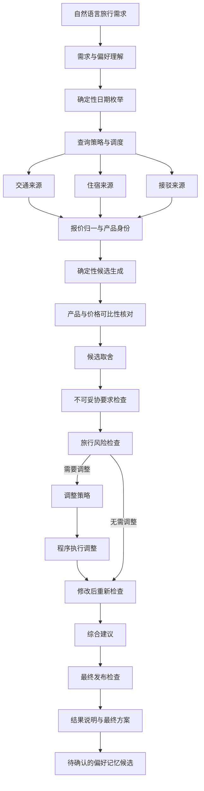

# TripChord 系统架构

TripChord 要解决的不是“生成一段旅行建议”，而是把一个带有灵活日期、同行人数和个性化偏好的旅行需求，转化为一份交通、住宿与接驳彼此成立、总价口径一致、可以直接帮助用户做决定的出行方案。

它的架构主张是：**让多个专业 Agent 处理需要语义判断的工作，让确定性系统掌握日期、金额、产品身份、权限和最终发布。**

本文面向希望了解实现细节的开发者。文中的英文角色名对应代码里的模块名称；“确定性系统”指不依赖大模型判断、可以由程序重复计算和检查的部分；“最终发布检查”（代码中称为 `Safety Gate`）是结果展示给用户前的最后一次程序核对。

当前产品版本为 **1.0.0**。这里的 1.0 表示桌面核心功能合同已经形成，并有保存真实来源数据驱动的端到端回放；它不代表签名安装包、生产稳定性、长期真实平台成功率或商业采用已经完成。当前可复现结果与边界见 [1.0 桌面核心验收](v1.0-acceptance.md)。

## 1. 产品问题如何定义

### 输入

- 出发地和目的地；
- 可出行日期窗口与旅行时长；
- 成人、儿童、婴儿、儿童年龄和房间需求；当前来源尚未完整覆盖所有混合同行人报价；
- 预算、交通、住宿、餐食、行李与中转偏好；
- 不能妥协的旅行要求，以及可以在价格和体验之间权衡的偏好。

### 输出

当前 1.0 在查询结果足以支持可靠选择时，只给出一份最终出行方案（代码中的 `FinalPlan`），其中包含：

- 确切的出发、返程日期与交通班次；
- 对应日期、房型、餐食和取消条件的住宿；
- 机场、酒店与目的地之间的接驳；
- 按本次实际同行人数计算的整趟旅行人民币总费用；
- 选择理由，以及预订前仍需确认的条件。

如果关键平台没有返回可用结果、整趟费用没有算清，或行程不满足用户不能妥协的要求，系统会说明目前缺少什么、为什么暂时不能给出可靠行程，而不是降级成未经核对的候选列表。

### 当前选择方式与目标形态

系统先排除日期、人数、住宿和衔接不成立的方案。当前 1.0 对本次确实查到、航班与房型能够对上、费用口径一致的可行方案，先满足用户不能妥协的要求，再按这次所有人的总费用选择；一般性的价格、时间和舒适度偏好还不能让一个更贵的方案排到前面。

下一阶段已经确定：偏好明确时只给一份真正按个人取舍选出的建议；偏好不足时，从同一次查询与同一批候选中给出省钱、均衡和体验优先三种代表方案。这个目标及其算法边界见 [D002：用户目标决定什么叫最佳方案](architecture-decisions.md#d002用户目标决定什么叫最佳方案)。

这一定义不等同于“全网最低价”。未连接的平台、失败的查询、验证码阻断和不可比较的报价都必须作为覆盖边界披露，不能被模型补成成功结果。

## 2. 总体架构

下图表达职责关系，不等同于每个入口都逐节点执行；部分角色只在发布、修复或变化事件路径中触发。



这个流程包含三条互相制约的主线：

1. **搜索主线**负责扩大有效覆盖并取得当前来源结果；
2. **决策主线**负责理解语义、比较候选和识别软风险；
3. **验证主线**负责阻止金额、身份、时间和权限错误进入最终答案。

## 3. 六个架构层

### 3.1 需求与偏好层

`Context Agent` 将自然语言需求转换为结构化旅行意图。系统把条件区分为：

- **必须满足的要求**：日期边界、人数、房间数、预算上限、禁止中转等；
- **可以权衡的偏好**：更看重价格、早餐、行李、位置或更短中转；
- **待确认项**：语义不充分且不能安全推断的字段。

本次请求永远优先于历史偏好。模型只能提出偏好候选，不能直接修改用户画像，也不能把一次旅行中的临时选择升级为长期规则。

### 3.2 日期搜索与并发层

灵活日期会形成组合搜索空间。TripChord 使用确定性代码生成合法日期对，而不是让模型挑几个“看起来不错”的日期。执行预算决定本次能够精查多少日期；只有预算覆盖完整枚举时才能声称完成全窗口比较。执行阶段采用：

- 固定大小的日期 worker pool，避免为每个日期复制 Agent；
- 每个平台独立的并发、启动间隔和超时；
- 跨日期查询指纹与 singleflight，让相同查询共享一次结果；
- 每完成一个日期对就把结果写入 PostgreSQL；同机 API 或 worker 中断后，新进程从未完成的日期继续；
- 最终发布前只刷新被选中的关键组件，并绕过探索缓存。

模型可以在冻结的搜索空间中提出精查顺序，但不能删改日期全集、提升平台权限或绕过查询预算。预算未覆盖全集时，运行结果必须保留 `sampled/not exhaustive` 语义。

### 3.3 来源与报价层

每个来源查询任务（代码中称为 `Source worker`）只负责一种来源能力，例如航班、住宿或接驳。它返回结构化结果，而不是一段供模型自由解释的网页文本。

报价进入候选池前必须绑定：

- 平台、路线、日期和产品身份；
- 成人、儿童、婴儿与房间口径；
- 报价究竟按单人、单晚、单程还是全体同行人计算；
- 税费、服务费、行李、早餐和取消条件；
- 币种、采集时间、新鲜度和查询状态。

技术失败、空结果和真实售罄是三种不同状态。系统不会把页面没加载出来解释为“没有库存”，也不会把缺税费的低价放进最终总价排序。

当用户选择本机浏览器来源时，本机 Chrome 只读连接扩展（Chrome Companion）只在获准域名内读取用户可见信息。Cookie、密码、Chrome 用户目录和配对密钥不会进入模型上下文。

### 3.4 候选规划层

确定性 Candidate Generator 将交通、住宿和接驳组合成完整出行方案，先检查日期、机场和地点、入住区间、接驳衔接、房间与人数，再计算这趟旅行所有人的人民币总费用。

`Evidence Arbiter` 负责判断不同来源是否描述同一产品、能否比较；`Candidate Curator` 只在合格候选中做语义取舍。这个顺序避免“先喜欢一个方案，再为它补齐事实”。

内部可以保留多个候选和淘汰原因，诊断 API 也可以返回它们。当前 1.0 的产品界面只展示一份最终出行方案；下一阶段在用户没有表达足够偏好时，才展示三种代表方案，而不是把全部候选重新交给用户筛选。

### 3.5 审查与修复层

`Hard Verifier` 检查可以明确计算的约束；`Risk Critic` 使用与策展者隔离的上下文检查软风险，例如中转过紧、到店过晚或住宿位置与偏好冲突。

若方案不成立：

1. `Repair Strategist` 只能从冻结候选和允许的补查动作中提出修复；
2. `Repair Executor` 以确定性规则执行修改；
3. `ReVerifier` 重新检查全部受影响的日期、人数、费用和衔接要求；
4. `ReCritic` 检查修复是否引入新的软风险。

局部修复是一项效率能力，而不是产品主命题。它的价值是保留仍然有效的工作；修复后仍不满足最终发布条件时，系统必须停止发布。

### 3.6 发布与解释层

`Orchestrator` 汇总结构化意见，但它不能独自决定用户最后看到什么。最终发布检查（代码中称为 `Safety Gate`）会重新检查费用是否算清、关键平台是否有结果、报价是否仍然有效、用户要求是否满足，以及具体航班和房型是否一致；全部成立时才创建最终出行方案。

`Explanation Agent` 只能从已批准的事实目录中选择和组织说明，不能新增航班、酒店、价格或保障性承诺。这样既保留自然语言表达能力，又避免解释阶段重新“创作事实”。

## 4. 每个专业 Agent 为什么独立

这些角色不是按日期复制的聊天机器人，而是共享同一类型化运行时、使用不同输入合同、上下文预算、工具白名单和输出结构的专业决策节点。当前实时主链把多数审查与修复职责放在固定任务图中；Query Strategist、Event Diagnoser 等职责属于特定路径。下面列的是职责边界，不是每次运行的模型调用清单。哪些职责可以延后或改为条件触发，要由后续对照评测决定。

| 专业 Agent | 决策责任 | 独立存在的原因 |
| --- | --- | --- |
| `Context` | 解析需求、冲突和偏好候选 | 用户事实不能被后续搜索结果反向改写 |
| `Query Strategist` | 在冻结日期空间内提出精查顺序 | 搜索覆盖与最终选品是两个不同问题 |
| `Search Supervisor` | 安排已批准查询的依赖和波次 | 它只看允许执行的任务，不能改变用户条件 |
| `Evidence Arbiter` | 判断产品身份和价格可比性 | 在偏好决策前先统一事实口径 |
| `Candidate Curator` | 在合格候选中提出首选 | 有语义取舍权，但没有创造报价的权限 |
| `Risk Critic` | 独立检查首选方案的软风险 | 不继承策展理由，减少确认偏误 |
| `Repair Strategist` | 根据失败码提出有界修复 | 修复建议与实际修改权限分离 |
| `ReCritic` | 复查修复后的软风险 | 修复者不能同时给自己的方案验收 |
| `Event Diagnoser` | 判断输入的价格、班次或库存变化事件的影响范围 | 先定位变化，再决定局部修复或全局重查；当前不代表已接供应商实时推送 |
| `Orchestrator` | 汇总各角色意见并建议业务状态 | 统一决策语义，但不越过最终安全门 |
| `Explanation` | 将获准事实组织成用户说明 | 表达与事实生产分离 |
| `Memory Curator` | 提出待确认的稳定偏好 | 规划结果与长期用户画像分离 |

这些角色共享同一类型化运行时、模型路由和进程，因此逻辑隔离不等于物理隔离，仍存在共同故障域。角色数量本身不是质量证明。TripChord 会通过模型调用、延迟、成本、失败率和结果一致性评测每个角色的边际价值；无法证明价值的角色可以合并或改为条件触发，而不影响上述权限边界。

### Agent 的业务能力如何配置

TripChord 没有让模型角色共享一个万能工具箱。当前每个需要调用模型的专业角色，都由业务目标、角色输入、专属信息、必要时的工具权限、固定输出格式、程序提案校验以及失败回退方式共同定义；Context 等角色不需要使用同一套工具调用方式。来源查询、候选生成、规则检查、修改执行和最终核对由普通程序组件完成，不把这些组件包装成模型 Agent。它们都是 TripChord 内部能力，不是用户需要另行安装的 Skill。

| 模型决策工具 | 获准角色 | 解决的业务问题 |
| --- | --- | --- |
| `inspect_date_search_space` | Query Strategist | 查看冻结日期全集、预算和可选精查前沿 |
| `inspect_search_capabilities` | Search Supervisor | 查看已批准来源任务、能力和依赖 |
| `inspect_normalized_inventory` | Evidence Arbiter | 审查归一后的交通、住宿和接驳报价 |
| `inspect_package_candidates` | Candidate Curator、Risk Critic、Repair Strategist、ReCritic | 查看有限候选及其组件，不允许发明候选 ID |
| `inspect_package_verification` | Risk Critic、Repair Strategist、ReCritic | 查看硬校验失败码与受影响字段 |
| `inspect_planning_handoffs` | Orchestrator、Explanation、Memory Curator | 查看阶段交接和最终事实目录 |
| `inspect_event_semantic_diff` | Event Diagnoser | 查看一次变化具体影响了哪些行程内容 |

`Repair Strategist` 当前只能让程序在已经核对的候选中执行有限调整。它可以建议扩大搜索或请求用户确认，但这些建议会转成后续状态，不会在同一轮里自行发起新的平台查询。

当前没有外部 Agent 插件运行时。新的旅行能力应优先实现为带输入、输出、权限、错误说明和测试的平台连接模块或领域工具；未来只有真正提供平台能力或可靠数据、且不会绕过现有权限与检查的组件，才考虑包装成外部 Skill、MCP 或插件。

## 5. LLM 与确定性系统的职责边界

| 交给 LLM | 必须由确定性系统负责 |
| --- | --- |
| 语言歧义和偏好理解 | 日期、晚数和搜索空间 |
| 有限候选中的语义选择 | 人数、房间、税费和人民币总价 |
| 软风险发现 | 产品身份、来源和新鲜度 |
| 有界修复建议 | 工具权限、并发、重试和取消 |
| 面向用户的解释顺序 | 修复执行、重验和最终发布 |

这不是“用规则限制模型发挥”，而是让模型专注于规则难以表达的判断，同时让每一个事实性结论可被复算、拒绝和重做。

## 6. 上下文、记忆与历史信息检索

每个角色只接收完成自身任务所需的信息包（代码中称为 `Context Pack`）。当前请求、不可裁剪的验证结果、新鲜来源摘要、适用的历史偏好和工具观察分别管理；大型网页结果只进入摘要与哈希引用，不直接塞进所有 Agent 的上下文。

长期记忆只保存用户明确确认的稳定偏好，并具备作用域、来源、版本、过期和撤销能力。价格、库存、余位、班次、可订状态和本次页面结果不得进入长期记忆或作为下一次规划的当前事实。

当前结构化记忆使用可解释的文本检索与规则过滤。未来即使增加向量检索，也必须保留租户隔离、实时事实禁入和本次请求优先这三条不变量。

## 7. 为什么暂时不更换 Agent 框架

TripChord 已有类型化任务图、有界并发、工具权限、任务状态和最终发布检查。本轮又用同一份旅行任务合同对比了当前实现、PydanticAI、LangGraph、OpenAI Agents SDK、Google ADK 和 DBOS。结果证明这些框架都能承载各自擅长的通用能力，但没有任何一个已经证明能让 TripChord 的真实旅行结果更好或平台查询更快。

因此生产主链保持不变：TripChord 继续掌握旅行需求、报价、候选、偏好和最终方案，避免同一次旅行出现两套状态。PydanticAI 只保留为以后替换模型调用层的有界试验候选；LangGraph 和 DBOS 的恢复能力有价值，但现在叠加会重复现有任务状态。完整实验和重新评估条件见 [D005：Agent 运行框架选型](architecture-decisions.md#d005agent-运行框架选型)。

当前更值得做的是取得同一日期下至少两个平台可公平比较的报价、实现真正按个人偏好选择方案，并缩短灵活日期的完整查询时间。框架只有在真实主线证明现有实现阻碍这些结果时才重新评估。

## 8. 性能设计

TripChord 的速度优化来自减少无效工作，而不是盲目增加 Agent：

1. 日期组合由固定 worker 并行执行；
2. 交通、住宿和接驳来源可以同时推进；
3. 相同查询通过稳定指纹去重；
4. 同一次失败也由消费者共享，避免重复撞击平台；
5. 模型只处理汇总后的决策前沿，不按日期成倍复制；
6. 最终只刷新被选中方案的关键组件。

当前固定的 11 天、3–8 晚确定性集成基准包含 66 个合法日期组合：858 个逻辑查询归并为 648 个唯一采集，去除 210 个重复查询；计划中最后一个平台任务的启动时间不晚于第 290 秒，加上保守执行与收尾预算后为 530 秒。它验证的是内部调度、去重和时间预算，不代表任何 21 天产品窗口都固定为 66 组，也不代表现实平台已经能在这个时间内完成；真实搜索必须按用户输入计算日期全集，完成时间仍取决于平台响应、登录状态、限流和页面稳定性。

## 9. 桌面核心 1.0 与后续边界

桌面核心 1.0 已把自然语言需求、灵活日期、只读来源、同行价格、组件组合、双重复验、人民币方案和自然语言局部修改接入同一主入口。它的验收依据是一条保存真实来源数据驱动、完全离线可重放的端到端链，而不是 Agent 数量或版本名称。

1.0 之后才继续手机端、减少或无头化浏览器标签、更多平台与目的地、签名安装升级，以及持续真实运行的成功率与性能验证。这些后续工作不能被描述成 1.0 已完成能力。

当前状态与后续顺序见 [TripChord 产品形态与实施路线](roadmap.md)。

## 10. 代码结构

```text
apps/api/src/tripchord/
  agents/          Agent、上下文、运行时与长任务控制
  planning/        候选组合、排名、验证、修复与重验
  providers/       API、浏览器与官方来源适配器
  persistence/     任务、运行、监控和数据库状态
  domain/          旅行、报价、金额与身份领域模型

apps/web/          面向用户的 React 应用
apps/browser-companion/  本机只读浏览器连接
benchmarks/        并发、去重、恢复与 Agent 评测
docs/              架构、来源、模型、运行与安全说明
```

继续阅读：

- [1.0 桌面核心验收](v1.0-acceptance.md)
- [产品形态与实施路线](roadmap.md)
- [架构面试指南](interview-guide.md)
- [模型、上下文与偏好记忆](model-context-memory-rag.md)
- [平台接入](providers.md)
- [运行与部署](operations.md)
