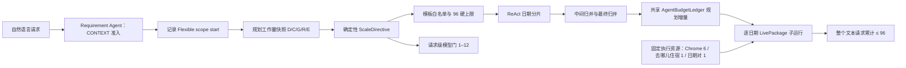
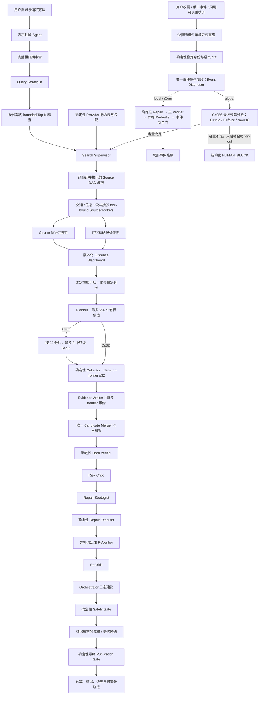

# TripChord 多 Agent 架构

## 一句话定位

TripChord 是面向自由行的、证据驱动的多 Agent 决策系统：它把用户需求转成受约束的
搜索与整包规划任务，使用获准的只读来源取得带时间戳的报价，再通过
Planner–Verifier–Repair–ReVerifier–ReCritic–Safety Gate 闭环输出可解释方案。

它不是 OTA，也不承诺全网最低、库存锁定或自动下单。真实预订仍回到官方渠道完成。

## 当前模型与独立运行边界

- 安全默认是 `MODEL_PROVIDER=none`、`MODEL_AGENTS_REQUIRED=false`，克隆后不会自动调用
  付费模型；
- 网关支持 Anthropic Messages 与 OpenAI-compatible Chat Completions；2026-08-04 已用
  DeepSeek `deepseek-v4-flash` 真实完成固定三请求 JSON/tool-loop smoke，并在 focused
  required-model Chrome run 中真实完成必需模型阶段；
- focused run 最终因住宿精确报价平台只有 1/2 而 `HUMAN_BLOCK`。它证明模型参与和失败关闭，
  不是当前 Done-Gate 通过、模型质量领先或生产稳定性的证据；
- `MODEL_AGENTS_REQUIRED=true` 时，必需模型阶段不可用或提案未通过安全门会阻塞最终发布，
  不会把脚本降级伪装成模型成功；
- TripChord 没有 Codex 或 ChatGPT runtime 依赖。真实 OTA 查询除 LLM endpoint/key 外，
  还需要本地 FastAPI/browser bridge、Chrome Companion、用户授予的域名权限、有效登录态、
  网络以及仍兼容当前页面的 DOM 合同。
- replay fixtures 与确定性 replan policy 作为 wheel package data 读取；隔离目录 wheel
  import + `/health` smoke 防止运行时再次依赖源码仓库层级。Chrome Companion 仍是显式外部组件。

## Agent 拥有什么决策权

Agent 不是给确定性流水线换名字。模型阶段输出受 schema 约束的提案，并能改变后续查询、
候选或修复路径；不可被概率模型改写的事实和安全门仍由确定性代码掌控。

| 模型 Agent 的真实决策 | 确定性代码的最终权威 |
|---|---|
| 需求语义提案、歧义与冲突解释 | 用户明示字段锁、缺字段阻塞、日期全集 |
| 日期 Query Strategist 的精查顺序 | 1–8 对硬预算、停止门、完整粗日期宇宙 |
| Search Supervisor 的 Source 优先级与波次 | provider capability、租户授权、只读工具白名单、资源上限 |
| 证据可比性分析与候选策展 | DOM/回执解析、金额、币种、税费、稳定身份、新鲜度 |
| Risk Critic 的软风险发现 | Hard Verifier 与 ReVerifier |
| Repair Strategist 的换选、扩搜或询问用户建议 | Repair Executor 的候选 ID、diff 与预验证 |
| ReCritic 对修复后剩余软风险的复审 | 最终 Safety Gate 的发布否决权 |
| Event Diagnoser 对语义 diff 的局部/全局/阻塞建议 | 单源重查范围、语义 diff、局部确定性 Repair/主 Verifier/异构 ReVerifier/事件安全门与全局预算预检 |
| Orchestrator 建议、解释与记忆候选 | 用户确认、租户隔离、持久化完整性 |

这条边界是项目的核心：Agent 负责不确定语义、工具计划、方案取舍与返工策略；硬代码负责
事实计算、权限、硬约束和发布门。把金额、新鲜度或安全授权交给 LLM 并不会让项目“更 Agent”，
只会让结果不可复算、不可测试。

## 受控动态 Agent：固定硬上限 + ReAct 日期/候选分片

这里的“动态”不是让 LLM 任意复制角色或扩大权限，而是让确定性控制器根据本轮工作量决定
**需要多少个白名单模型 Agent**，再让这些 Agent 在各自的 ReAct 工具循环内做有限决策：

1. `AdaptiveControlInput` 冻结日期对数 `D`、候选数 `C`、证据缺口 `G`、是否 Repair `R`、
   是否有事件 `E`，以及探索/发布日期对数；
2. `ScaleDirective` 确定性计算日期分片、归并节点、理论逻辑 Agent 数和模型并发上限；相同输入
   产生相同 SHA-256 state fingerprint；
3. `AgentTemplatePlan` 只能从 16 个模板白名单分配实例，工具仍受角色 allowlist 约束；逻辑 Agent
   硬上限是 96，超出的整组任务延后，无法安全拆分的饱和请求在模型和浏览器启动前拒绝；
4. Query 分片 Agent 必须先调用 `inspect_date_search_space`，只能从当前 12 行合法日期里提名，
   不能发明日期或扩大最终 1–8 对精查预算；
5. `AgentBudgetLedger` 在模型 Agent 进入阶段前按 task id、role 和序号记账；模型响应成功与否、
   tool-loop 请求数和 HTTP attempt 仍在另一组 trace 中统计，不能混成一个“调用数”。

自然语言文本入口从 `_execute_live_flexible_from_text` 开始创建或复用同一个 ContextVar ledger：
Requirement Agent 在发起模型提案前先以 `CONTEXT` 角色准入，随后日期 Query 和所有获准日期的
`LivePackageAgentSystem.run` 子运行继续使用同一本账。进入 `FlexibleLiveAgentSystem.run` 时记录
`agent_budget_scope_start_admitted_count`，因此既能算规划阶段增量，也能保留整个文本请求累计。
直接调用结构化 Flexible API 时没有前置 Requirement Agent，scope start 通常为 0。

因此要区分三种 Agent 数量：

| 口径 | 代码字段 | 回答的问题 |
|---|---|---|
| 计划需求 | `ScaleDirective.raw_logical_agents` | Flexible 规划阶段若完整执行需要多少逻辑模型 Agent；不包含此前 Requirement Agent，允许超过 96 以发现饱和。 |
| 获准计划 | `AgentTemplatePlan.logical_agent_count` 与 `deferred_instance_count` | Flexible 规划经过 96 上限、模板白名单和整组原子分配后，最多允许安排多少个。 |
| 实际执行 | `AgentBudgetAudit` 与 `agent_budget_scope_start_admitted_count` | 规划实际增量为 `final admitted - scope start`；`final admitted` 是含 Requirement Agent 的整个文本请求累计，二者都必须受各自门约束。 |

Source worker 数、浏览器任务数、模型请求轮数都不是“实际模型 Agent 数”。同一个 ReAct Agent
可以产生两轮以上模型请求，13 路浏览器 Source 也只是固定只读 worker。ScaleDirective 只约束
Flexible 规划增量；request-wide ledger 另行保证文本请求累计不超过 96，不能拿其中一个替代另一个。

发布前重新核价也不是冻结预算外的“免费重试”。首批刷新和每个后续 fallback 在任何
浏览器或模型副作用前，都按累计尝试数重新派生 `ScaleDirective` 与原子
`AgentTemplatePlan`；每个 publication attempt 计 8 个基础模型 Agent，最多尝试
`exact_pair_budget=8` 次。控制器还会加上已审计的 Candidate Scout 增量，同时检查
Flexible scope 和 request-wide ledger 剩余名额。下一次无法完整准入时，系统在该次
外部调用前停止，写入 `publication_refresh_shortfall` 并最终 `HUMAN_BLOCK`，不会先搜索再
超限，也不会以 500 或隐藏 rejected admission 结束。当前证据是代码与本地 fixture，
尚无真实 OTA 连续触发 8 次 publication fallback 的封存运行。

### 日期分片为什么是树形归并

每个日期 Agent 最多观察 12 行。`D=400` 时先产生 34 个互不重叠的日期分片；每个分片独立完成
“模型提名 → schema 校验 → 合法 ID 过滤”。当分片胜者超过 12 个时，先按每组最多 12 个交给
中间归并 Agent，压缩到最终 Agent 可观察的至多 12 个候选，再由最后一个 Query Strategist 在
1–8 对硬预算内裁决。当前上限下这是两级归并：34 个 scout + 3 个中间节点 + 1 个最终节点；
任何节点都看不到越界日期，也不能提升浏览器并发。

这与旧 `AdaptiveDateRefiner` 是两件事：旧策略决定“精查哪些日期”且在基准中输给 Top-K；新的
受控分片是**如何在固定 Query Strategist 合同下分摊上下文与并行推理**，最终 acquisition 仍是
合法重排后的 bounded Top-K。

### 四类并发不能混为一谈

| 资源 | 当前上限与反馈 | 是否会随逻辑 Agent 数增加 |
|---|---|---|
| 模型 HTTP 进程池 | FastAPI lifespan 共享连接池，`max_in_flight` 默认且最多为 12 | 不超过 12；关闭时等待在途请求完成 |
| 单次日期分片模型门 | 从 1–2 个许可启动；连续成功按窗口加 1，失败时减半；工作量先量化为 2/6/8/12，模型 endpoint 健康可再下调到 1/2/4/6/8/12 | 仅在模型请求层自适应 |
| Chrome Companion | 全局固定 6 个只读 lease | 不增加 |
| 去哪儿住宿 / 日期对 | 去哪儿住宿固定 1；精确日期对顺序准入固定 1 | 不增加 |

Provider 健康和模型健康也分开建模。`provider_health` 描述 OTA 来源/垂类是否可用，用于 strict
覆盖不可达和“无可搜索来源”等诊断；`model_endpoint_health` 才能下调模型并发 ceiling。粗日历
缺失、DOM pending 或住宿覆盖不足不能被偷换成“LLM endpoint 不健康”，模型调用失败也不能被
偷换成“OTA 没库存”。当前执行前把未观测 OTA 状态标为 `unknown`，模型调用结果再驱动运行时
的加一/减半门；最终报价覆盖仍由 Source 与 Publication Gate 判断。

### Candidate Scout 分片已经进入 live 决策链

确定性 Planner 当前最多生成 256 个有界候选。Planner 完成后，candidate-stage controller 用实际
`C` 重新生成独立 `ScaleDirective`；这不是执行前 `C=0` 的 Flexible 全请求指令，也不扩大 Planner
候选池。`C<=32` 时保持单 Candidate Curator 兼容路径；`C>32` 时按每组最多 32 个切成
`N=ceil(C/32)` 个服务端绑定的只读 Candidate Scout，因而最多产生 8 个可并发 Scout 任务。每个
Scout 必须调用只读候选工具，只能提名本分片 ID，不能修改 Planner handoff；实际同时在途数量仍受
从 1–2 起步、成功加一/失败减半的模型并发门和全请求 96 Agent ledger 约束。

所有分片完成后，确定性 Collector 按 Planner anchor、合法 Scout 提名与原多样性 shortlist 构造
最多 32 个 decision frontier。Evidence Arbiter 随后逐项审核该 frontier 引用的非披露型报价；最后
只有一个 `candidate_merger` 模型 Agent 可以从已审核 frontier 更新 Planner 初案。Scout、Collector
和 Evidence Arbiter 都不是共享候选状态的写入者。scope/pool/frontier 的有序 ID 与 SHA-256、动态
并发、fallback、Agent admission 和 Merger 模板均进入类型化审计。

这项能力有代码、65 候选的 32/32/1 分片测试、越权提名/伪造 hash/预算拒绝反例和 API 测试全集
证据；尚无一轮真实 OTA 运行触发 `C>32` 的封存证据。Planner 的 live 上限是 256，不是 2,000。
`C=2,000` 只用于离线 adaptive-controller 合成预算算术，不能写成“并行穷举全网 2,000 个候选”。

## 端到端运行图

## Search Supervisor 为什么不是装饰

每个精确日期对先由服务器构造确定性 Source allowlist。Search Supervisor 必须先调用
`inspect_search_capabilities`，看到 provider、垂类、是否必需、缓存策略、启动延迟、硬预算、
Chrome lease cap 与只读权限，然后输出结构化 waves。

通过确定性校验后，`materialize_search_schedule` 会把 waves 变成真实 DAG dependencies 与
priority，所以模型提案会改变哪些 Source 先开始、哪些任务等待上一波。它不能新建 Source、
改查询参数或扩预算；strict 模式不得跳过任务，degraded 模式也只能处置预声明的可选任务。
未知 ID、重复 ID、越权、漏掉必需任务或超预算会整份拒绝，不会部分应用。可选模型模式记录
拒绝原因并使用安全脚本调度；required-model 模式同时使最终发布失败关闭。

Search Supervisor 的“波次”是逻辑依赖；实际浏览器并发仍由调度器和 bridge 的全局资源上限
约束。当前 frozen-stay 形态每日期对有 13 个浏览器 Source 和 4 个 iCom 公共读取；历史 v3
基础形态的 11 + 4 只保留为旧证据。浏览器始终最多 6 个任务并发，不能把任一逻辑 Source
总数表述为“同时打开同样多的浏览器页面”。

交通、住宿与 iCom Source 是固定单工具、固定权限的 tool-bound workers，不单独做模型推理，
因此不能为了凑数量把它们包装成自治 Agent。真正决定来源波次和优先级的是 Search Supervisor；
workers 只执行其通过确定性 allowlist、预算和权限校验后的只读调度。

## Source 完成不等于报价够用

住宿 Source 只有四个互斥证据态：`QUOTE_FOUND`（精确报价）、`CONFIRMED_EMPTY`
（receipt-v2 双观测确认本次查询为空）、`BOUNDED_NO_EXACT_QUOTE`（扫描上限内未命中）和
`BOUNDED_PROVIDER_PENDING`（平台仍在实时搜索）。后端会对 v2 空结果的查询指纹、至少两秒
间隔、tab/window/runtime lineage、时间戳和两个 parser-v1 canonical SHA 独立重算；单次观测、
技术失败或 lineage 漂移不能升级成空库存。

`source_execution_completeness` 只回答“所有 required Source 是否得到允许的类型化终态”；
`exact_quote_comparison_coverage` 另行回答“所选住宿每个分段是否有至少两个不同 provider 的
`QUOTE_FOUND`”。后三个库存态可以让 Source 诚实结束，但都不贡献第二个平台价格。2026-08-04
focused run 正是前者 complete、后者 1/2，最终正确 `HUMAN_BLOCK`。

## 日期搜索：完整枚举与昂贵精查分离

“2026 年 8 月出发、玩 5–8 天”按 `住宿晚数 = 日历旅行天数 - 1` 换算为住 4–7 晚，
共有 `31 × 4 = 124` 个日期对。TripChord 会低成本枚举完整粗日期宇宙，但只对最多 1–8 对
执行昂贵的多平台精查。

默认 acquisition 是：Query Strategist 在硬预算内重排，系统按该顺序执行 bounded Top-K。
旧 `AdaptiveDateRefiner` 只保留为显式注入实验项。原因不是“简单算法更高级”，而是冻结 v1
synthetic 基准中 adaptive 在预算 3/5/8 的 Recall@3 与 regret 总体均输给粗价 Top-K；随后
guarded hybrid 在新的 4–7 晚 sealed holdout 也未通过预冻结的不退化门。项目因此主动保留
负结果，禁止包装“自适应搜索优于 Top-K”，也不把 synthetic 结果升级为真实 OTA 质量结论。

## 上下文、记忆与 RAG

`EvidenceBlackboard` 保存带版本、来源、采集时间、过期时间、置信度与负责 Agent 的本轮事实。
`BudgetedAgentContextBuilder` 为 Query、Planner、Repair 分配 1600 / 4000 / 3000 token，优先级为：

1. 当前用户请求；
2. 不可裁剪的 Verifier/工具关键证据；
3. 其他本轮新鲜证据；
4. 经 tenant/user/session/trip、隐私、TTL 与角色权限过滤的历史记忆；
5. 从同一预算中预留的后续工具观察。

关键拒绝理由放不进预算时失败关闭。工具回执按不可信输入处理；过大时只保留显式预览、原始
字节数和 SHA-256，不能在预算外无限追加。

记忆分短期工作记忆、事件/决策记忆、用户偏好和平台能力。用户长期偏好只能经确认接口写入，
可按 record id 撤销；匿名模式没有稳定 user identity，不能读写长期用户记忆。持久化参考实现
使用带校验和的原子 JSON 快照并限制 payload、深度和字符串长度。

RAG 是 BM25 词法检索，不是向量 RAG。它只检索用户偏好、历史决策、平台能力与明确允许的
非实时证据；实时价格、余票、库存和可订状态必须来自本轮工具回执，永远不能从历史 RAG 恢复。

### 外部模型的数据边界

配置外部 LLM endpoint 后，预算化的用户需求、所选结构化证据摘要和 Agent 被允许观察的工具回执
会发送到该 endpoint；否则模型无法基于真实需求和证据作决定。TripChord 不把 Chrome Cookie、
登录凭据、浏览器 profile 或 bridge pairing secret 交给模型，内部 model trace 只保存 prompt
digest，不保存 prompt 明文。

但“本地 trace 不存明文”不等于“数据从未离开本机”：外部供应商会收到实际模型输入，其日志、
训练、保留和地域政策取决于用户选择的 endpoint。当前项目没有企业级 DLP、字段级脱敏策略证明、
数据驻留或地域合规承诺；处理敏感个人行程时应选择满足组织政策的自托管/合规 endpoint，或保持
`MODEL_PROVIDER=none`。

## 报价一致性、缓存与候选空间

- 两级稳定身份区分“同一产品”与“同一权益/价格合同”，DOM 临时 ID 或价格变化不会冒充新产品；
- 精确报价只在显式允许、同 tenant/user 分区、完全相同查询且 10 分钟半开新鲜窗口内复用；
- 相同的在途查询使用 single-flight 共享一个 bridge task；一个等待者超时不会取消其他消费者；
- 事件重查绕过复用；跨分区请求禁止共享；
- 同一整包组件的抓取时间差默认超过 20 分钟时，Verifier 产生 `QUOTE_CAPTURE_SKEW` 并拒绝；
- 机票、住宿、接驳先按类型/provider/权益做确定性预筛，再使用 transfer beam 与默认 256 个候选
  cap；运行回执给出原始/预筛数量、结构上界、ID hash、生成数量和是否截断；
- `C<=32` 时 Candidate Curator 最多看到 32 个多样性 shortlist；`C>32` 时每个只读 Scout
  最多看到自己的 32 个服务端绑定候选，而 Candidate Merger 只看到 Collector 收敛出的
  `<=32` decision frontier。任何模型都不能选择作用域外 candidate ID，也不能声称检查了
  Planner 之前已被 beam/prescreen 截断的全部原始组合。

## 验证、修复与最终裁决

1. `C<=32` 时 Candidate Curator 只能从冻结 shortlist 选择初案；`C>32` 时 Scouts 只读提名、
   Collector 确定性收敛、Evidence Arbiter 审核，再由唯一 Candidate Merger 从冻结 frontier 选择初案；
2. Hard Verifier 确定性检查日期、时间、预算、接驳、证据、新鲜度、报价口径和用户硬偏好；
3. Risk Critic 只补充红眼、自转机、取消规则缺失等软风险；
4. Repair Strategist 在 schema 内选择 `SWITCH_CANDIDATE / EXPAND_SEARCH / ASK_USER / KEEP`；
5. Repair Executor 校验目标 ID、实际组件 diff、依赖刷新和确定性预验证；
6. ReVerifier 不调用 LLM，也不复用 `PackageVerifier`/`diff_packages`；第二套声明式不变量
   引擎从序列化意图、候选和 Repair receipt 独立重算 13 类不变量：组件唯一性、版本父链、
   diff、未影响项、日期/人数/房间、逐晚住宿、用户硬偏好、住宿类型/分段、接驳价格合同、
   金额与预算最低下界、报价信任与时效、抓取偏差和接驳链；这属于共享业务语义的异构实现与
   故障隔离，不是形式化证明；
7. ReCritic 是修复后的第二次模型软风险审查；
8. Orchestrator 只能读取完整 handoff 提出三态建议；
9. Safety Gate 可拒绝 Orchestrator，任何 Agent 都不能静默覆盖 Verifier；
10. Explanation 的选择理由、权衡和机酒权益陈述必须绑定最终候选的组件 ID
    与 evidence_ref；未知引用或与结构化权益冲突时，advisory 模式丢弃解释并
    记录拒绝轨迹，required-model 模式失败关闭；
11. 最终 Publication Gate 依赖 Explanation 与 Memory Curator，确保任一声明为必需的
    模型阶段在 Safety Gate 之后失败也不会漏出 `ACCEPT`。

三态为“直接接受 / 确认例外后接受 / 重新规划或暂停”。例外只允许用户可确认的软边界，
不能绕过金额、新鲜度、权限或其他硬错误。

不要把这组三态与住宿库存四态混淆；前者是 Orchestrator 建议，后者是工具证据分类。

## 事件与动态重规划

`replan_after_event` 创建或复用同一 request-wide `AgentBudgetLedger`，并记录事件 scope 开始时的
已准入数。浏览器局部路径与 iCom 路径都先只读重查一个受影响组件，再生成稳定身份绑定的确定性
语义 diff；其唯一可调用模型的事件阶段是 Event Diagnoser。局部 `ScaleDirective` 固定
`E=true、R=false、raw_logical_agents=1`：这里的 Repair、主 Verifier、异构 ReVerifier 与事件
安全门全部是确定性实现，不会暗中再运行模型 Repair Strategist、ReCritic 或 Orchestrator。

只有 Event Diagnoser 经确定性影响域校验后升级为 global，系统才嵌套重跑完整的正常精确日期模型
pipeline，并关闭近期报价复用。启动全局浏览器 fan-out 前，控制器按 Planner 最坏候选数 `C=256`、
`D=0、G=0、E=true、R=false、direct_final_pair_count=1` 生成保守预检，当前合同
`raw_logical_agents=18`；Event Diagnoser 已占 1 个，因此通常还需证明剩余 17 个名额可从同一本
96-Agent 请求账本获得。容量不足时返回带 required/available 计数的结构化 `HUMAN_BLOCK`，且
`global_run` 不会启动；容量充足时 nested global run 继续使用同一本账，不重置额度。
`AgenticRunSummary.combine` 合并 Event Diagnoser 与 global pipeline 的 stage/request/HTTP trace，
同时保留各阶段模型并发审计，而不是用后一个 summary 覆盖前一个。

当前 synthetic `sold_out` 与全局升级/预算不足测试证明上述代码合同：排除原商品、同 provider
替换、确定性 Repair 删除 1/新增 1、主 Verifier、异构 ReVerifier、事件安全门，以及全局搜索前
预算失败关闭。它们是本地 structured-model/fixture 证据，不是真实 OTA 自然涨价、售罄或当前
事件预算链的 live 验证。2026-08-03 历史 v3/canary 只证明旧合同下由验收器注入涨价后曾完成一次
单平台页面重查并保留 75% 原组件，不能替代当前 `replan_after_event`、共享 ledger 与全局预检证据。

系统还提供用户显式开启的进程内周期监控：每轮只读重查一个当前组件并走同一事件闭环，支持
立即检查、停止、最大次数和新鲜度轮转门。它不是供应商 push、库存锁定、操作系统常驻任务或
持久化生产监控；进程重启后必须重新开启。当前证据层级是代码与本机测试，不是长期 OTA 运行。

## 长耗时 live 搜索控制面

多平台浏览器搜索不再要求前端一直等待一个长 HTTP 请求。异步控制面提供：

- `POST .../live-flexible-plan-from-text/jobs` 快速返回 `202 + job_id`；
- `GET` 查询 `queued / running / succeeded / failed / cancelled` 与阶段进度；
- strict runner 通过 tenant-scoped GET polling 等待终态，并记录单调 revision、阶段进度和日期对
  checkpoint；场景将服务端总预算冻结为 3600 秒；
- SSE 推送 revision 变化，前端也能在断流后用 GET 恢复状态；
- `DELETE` 请求取消，取消沿实际任务传播到仍在排队或执行的 browser bridge work；
- 同一 tenant 下相同 `Idempotency-Key + payload digest` 复用原 job，不同 payload 返回 409；
- tenant 分区、容量上限、有限 running slots、终态 TTL 与错误信息脱敏。

它是进程内的有界控制面，不是 Redis/Celery/Kafka 持久队列。进程重启后 job 不恢复，SSE 也不构成
交付 SLA。Round 17 已在真实三日期作业中完成 3600 秒异步路径、三个绑定 checkpoint 和
47/47 job-scoped 模型回执，关闭了旧长 HTTP 请求超时问题；业务 runner 仍为
`done_gate_failed`。真正多 worker 部署仍需要外部队列、分布式租约和一致的幂等存储。

## Chrome Companion 后台重载边界

用户负责一次性安装 unpacked Companion、配对本机 bridge，并为具体官方域名授予 host
permission。之后 Agent 可调用一个受限 reload 工具，但不能传路径、URL、hash 或任意脚本；工具
只接受枚举原因，并从本地 release seal 推导目标。当前 `0.1.16` 的 source SHA、manifest、content
runtime、build metadata 和当前用户所有的 `0600` seal 必须完全一致，命令还绑定旧 runtime
instance。扩展只在没有活动 task lease 时执行 `chrome.runtime.reload()`，新 service worker 必须回传
不同 runtime instance 的 applied receipt。请求有 TTL、幂等键、冷却和重试上限，失败目标不会形成
重载循环；协议不打开或聚焦页面。

这一授权不等于“Agent 控制 Chrome 一切”。它不能安装或启用扩展、扩大 host permission、恢复
登录、处理账号安全门、绕 CAPTCHA，也不能加载未通过 release gate 的源码。没有 fresh control
companion 时 fail-closed。

## 评测与声明边界

- 240 条/12 类固定种子 suite 可证明冻结合同下的机制、权限、证据与故障注入回归；其中 75%
  是历史“单候选确定性代理”，不是 one-shot LLM Agent；
- 公平 scripted A/B 使用同任务、同工具、同模型标识、同预算与共同最终审计。单/多 Agent 都
  达到 100%，但多 Agent 使用更多调用、token、成本和延迟，所以不宣称多 Agent 质量更高；
- 多 Agent 的可辩护价值是最小权限、阶段化失败归因、结构化 handoff、可审计返工和独立等待重叠；
  同一 Router、进程和模型供应商仍是明确的共同故障域；
- 2026-08-03 Chrome v3/canary 只证明一次授权账户/设备/日期/时点的旧能力矩阵读取与注入事件
  局部重查；2026-08-04 Round 17 的异步 job 完成但业务 gate 失败，policy 修复后的同日期
  focused strict 运行仍因住宿精确平台 1/2 而 `HUMAN_BLOCK`；当前 Done-Gate 尚未通过；
- 135M LoRA 只证明离线 3-step SFT/DPO 与 adapter reload 链路，不声称中文规划质量提升或已接入 live；
- SQLite/本地 JSON/进程内 monitor 是单进程参考实现；多 worker、分布式租约和生产 SLA 尚未声称。

精确声明与证据路径见 `docs/claim-ledger.md`，面试追问见 `docs/interview-guide.md` 与
`docs/interview-red-team.md`。
