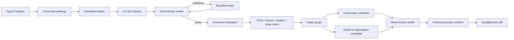

# TripChord architecture

## Product boundary

TripChord is an independent-leisure planning and decision system. It is not an
OTA, does not scrape undocumented booking interfaces, and does not claim that a
replay or sandbox price is bookable. Purchase remains on an official or
authorised supplier channel.

## End-to-end flow

The learned policy is downstream of verification. It may choose between
verifier-approved candidates, but it cannot legalise an infeasible plan.

## Main modules

1. **Truth-labelled data gateway** normalises Amadeus, Booking Demand, AMap,
   replay fixtures, and user-confirmed quotes. Price state, provider, capture
   time, environment, and freshness travel with every offer.
2. **Typed requirement and candidate layer** converts form/natural-language
   evidence into `TripSpec`, activities, time windows, route edges, costs, and
   utilities.
3. **Planner–Verifier–Repair** uses OR-Tools CP-SAT for schedule selection and a
   separate deterministic verifier for date, window, overlap, route, budget,
   must-visit, provenance, and quote-state rules.
4. **Event recovery** resolves direct/downstream dependencies, locks unaffected
   items, creates local and global candidates when possible, and emits a version
   diff.
5. **Policy layer** loads a checked-in pairwise logistic artifact and exposes
   minimum-change, balanced, and quality-first preferences. Missing or invalid
   global candidates deterministically fall back to local repair.
6. **Persistent control plane** stores tenant-owned workspaces, plans, events,
   jobs, idempotency keys, trace IDs, attempts, and leases in SQLite/PostgreSQL.
   Queued or expired-lease jobs are recovered on process startup.
7. **Runtime controls** provide static Bearer/API-key authentication, tenant
   filtering, Redis-backed fixed-window rate limiting (single-process in-memory
   fallback), request IDs, JSON access logs, readiness, Prometheus text metrics,
   and security headers.
8. **React workspace** supports trip intake, truth-labelled offer comparison,
   progress, version selection, diffs, event injection, and recovery-policy
   selection. Authenticated progress uses header-bearing polling; the SSE API is
   retained for clients that can attach credentials.

## Why a modular monolith

Planning, verification, repair, and persistence share a rich transaction. A
modular monolith keeps the full decision trace replayable and testable while
preserving explicit provider, repository, and planning boundaries. PostgreSQL
leases and Redis rate limits support multiple API instances without pretending
that the project already needs a distributed workflow platform.

## Claim boundary

- Frozen replay quality metrics are deterministic synthetic evidence, not live
  user conversion or booking success.
- Provider contract tests prove request/response integration, not production
  inventory coverage.
- The CPU policy result uses a synthetic weighted preference oracle, not human
  labels.
- SFT/DPO launch paths are structurally validated; no LLM adapter quality lift is
  claimed without a completed model run and unseen-city evaluation.
