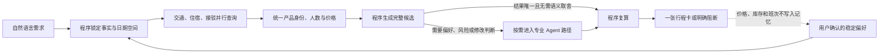

# TripChord 简历与面试项目说明

这一页写给第一次了解 TripChord 的面试官：先给出可直接放进简历的版本，再说明 Agent 架构、关键取舍、真实运行结果和声明边界。

## 简历可直接使用的版本

### TripChord（旅弦）——确定性内核与多角色协作的自由行决策 Agent

**技术栈：** Python、FastAPI、Pydantic、SQLAlchemy/PostgreSQL、React/TypeScript、Chrome Extension、OpenAI-compatible Model Gateway

- 从 0 设计交通、住宿与接驳一体化的旅行决策系统，将自然语言需求转成合法日期空间，统一不同平台的产品身份、同行人数和费用口径，再生成包含完整日期、衔接关系、人民币总费用及来源链接的行程方案。
- 设计确定性探索与多角色 Agent 分层的架构：各角色使用专属 Context Pack、工具白名单、结构化输出和类型化交接；LLM 只处理需求语义、偏好权衡和软风险，确定性内核负责日期、人数、金额、产品身份、行程衔接和发布判定；全窗口探索可延后模型阶段，只有候选进入相应决策路径时才承担模型成本。
- 实现固定工作池、跨日期查询指纹、single-flight 复用和异步任务，避免逐日期串行查询及相同请求重复执行。一次真实只读运行约 100 秒覆盖 30/30 个可行日期组合的批量价格线索、详查 Top 3，并组合出含航班、酒店、接驳、总价和官方入口的当前最佳候选。
- 将长期偏好设计为可确认、可撤销、可过期的数据；实时价格、库存和班次禁止进入长期记忆。对同任务、同工具、同预算的 12 组脚本化 A/B 评测中，单 Agent 与 Multi-Agent 的有效方案率均为 100%，而 Multi-Agent 成本更高，因此不把固定执行全部角色当作最终方向，并保留按问题复杂度继续收窄触发范围的演进路径。

项目地址：[github.com/Oxygen56/TripChord](https://github.com/Oxygen56/TripChord)

## 30 秒口述版

TripChord 不是生成旅游文案的聊天机器人，而是一个把灵活日期、航班、酒店、接驳和同行总费用放进同一个决策问题的旅行 Agent。它把不确定的语义理解、个人偏好和软风险交给受限的模型角色，但把日期、金额、产品身份、行程衔接和最终发布权留给可复算的程序。多 Agent 的价值不是“角色越多越智能”，而是隔离上下文、工具权限、审查责任和修改责任。最新一次真实运行中，模型阶段在全窗口探索时被延后，且没有候选进入发布重搜，因此模型调用为 0；它说明模型成本不是每次查询都固定发生，但不证明本次需求已经完成。

## 一页 Agent 架构



这些是不同运行路径可以使用的能力角色，不代表每次运行都会调用全部角色；当前进入 required-model 主链后，多数审查与修改职责仍按固定任务图执行：

| 角色 | 真正负责的决定 | 为什么单独存在 | 不能做什么 |
| --- | --- | --- | --- |
| Context | 把用户表达整理成当前需求和待确认偏好 | 隔离当前事实、历史偏好与工具回执 | 不能生成价格或放宽明确要求 |
| Query Strategist | 在程序生成的合法日期中调整搜索优先级 | 灵活日期过多时需要语义化探索顺序 | 不能删除合法日期或扩大工具权限 |
| Search Supervisor | 根据来源能力、预算和缓存安排查询波次 | 把来源调度与旅行取舍分开 | 不能把失败解释成无票或无房 |
| Evidence Arbiter | 判断页面是否对应同一航班、房型或班次 | 跨平台名称和价格口径常不一致 | 不能修改金额、人数或来源原文 |
| Candidate Curator | 在已通过硬约束的完整方案中处理体验取舍 | 价格、位置、舒适度常不存在唯一答案 | 不能让低价覆盖用户明确要求 |
| Risk Critic | 识别中转、入住、位置等软风险 | 与方案选择者形成独立反方视角 | 不能直接改写候选或否决程序结论 |
| Repair Strategist | 提出保留组件、替换组件和扩大重查的边界 | 将修复建议与实际修改权限分开 | 不能直接执行修改或覆盖原方案 |
| ReCritic | 检查修改后是否出现新的软风险 | 修复建议者不能给自己的结果验收 | 不能代替程序重新计算硬约束 |
| Event Diagnoser | 判断价格、余位或班次变化影响哪些组件 | 避免每次变化都重跑整条规划链 | 不能接收供应商推送或直接执行修改 |
| Orchestrator | 汇总已核准意见并建议输出状态 | 统一多角色结论和失败语义 | 不能越过程序的最终发布判定 |
| Explanation | 把获准事实组织成用户能理解的说明 | 将表达能力与事实生产分离 | 不能新增未被来源支持的事实 |
| Memory Curator | 提议可长期保存的稳定偏好 | 防止一次性需求污染长期记忆 | 未经用户确认不能写入记忆 |

交通、住宿和接驳的来源查询是受控工具任务，不是会自行决策的 Agent。日期与金额计算、Hard Verifier、修改执行、ReVerifier 和最终发布均由确定性程序完成，而不是“再问一次模型”。

## 最值得面试追问的取舍

### 1. 为什么不用一个强模型接全部工具？

单模型更简单、调用更少，但也会把需求理解、搜索权限、证据判断、自我审查和结果说明耦合在同一个上下文里。TripChord 只在这种耦合确实影响责任隔离时启用多个角色；即使启用，金额、硬约束和发布权仍不交给模型。

### 2. 为什么不是每次都固定执行 Multi-Agent？

在 12 组同任务、同工具、同模型标识和同预算的脚本化比较中，单 Agent 与 Multi-Agent 的有效方案率都为 100%；平均调用数分别为 4.25 和 10.25，Multi-Agent 的 token 和延迟也更高。因此项目保留它在权限隔离、独立反方检查和修改协同上的价值，但不把“更多 Agent”当作质量指标。

### 3. 为什么没有直接迁移 LangGraph？

项目比较过 PydanticAI、LangGraph、OpenAI Agents SDK、Google ADK 和 DBOS。旅行领域状态、报价身份、组合优化、修改边界和最终判定仍必须由 TripChord 自己维护；现阶段没有实验表明重写运行时能改善真实旅行结果、耗时或维护成本。因此保留自有旅行内核，只把 PydanticAI 作为未来可替换的模型交互层候选，而不是为了框架名称重写主链。

### 4. 为什么不对所有日期和平台逐一做精确查询？

程序会完整生成合法日期空间，但 OTA 精确查询成本高、页面不稳定且常受登录状态限制。当前策略先获取低成本批量线索，再用固定工作池详查有希望的 Top K；如果没有完成全空间精查，结果必须明确写成“本次已评估范围内的当前候选”，不能宣称全月或全网最低。

### 5. 为什么旧价格不能放进 RAG？

“偏爱海景、少中转、住市中心”是可复用偏好；价格、余位和班次是随时变化的当前事实。TripChord 为两者使用不同的数据合同：前者经用户确认后可进入长期记忆，后者只能来自本轮工具回执。

### 6. 为什么把修改建议和修改执行分开？

模型只提出“保留什么、调整什么、何时扩大重查范围”；程序执行组件替换并重新计算完整行程，独立 ReVerifier 再检查金额、衔接和硬要求。新方案不成立时保留原方案，避免模型为了完成任务静默扩大修改范围。

## 当前真实证据和声明边界

| 证据 | 能说明什么 | 不能说明什么 |
| --- | --- | --- |
| [2026-08-24 马尔代夫真实只读运行](real-run-maldives-2026-08-24.md) | 约 100 秒覆盖 30/30 批量价格线索、详查 Top 3、产出当前最佳候选；本次模型调用为 0 | 不能说这次是多 LLM 协作，也不能说得到全窗口、全平台最低可订价 |
| [公开声明与运行记录](claim-ledger.md) | 一次 required-model 聚焦运行的本机诊断记录显示模型阶段完成，但因合格住宿精确报价不足而阻断；该次尚无公开封存的机器记录 | 不能把本机诊断或“模型阶段完成”写成“旅行方案已经可发布” |
| [单 Agent 与 Multi-Agent 对比](benchmark-agent-architectures.md) | 脚本化 12 任务中两种方案的有效方案率均为 100%，Multi-Agent 调用更多 | 不能宣称 Multi-Agent 已证明更准确 |
| [1.0 验收记录](v1.0-acceptance.md) | 保存的真实来源数据可以重复验证组合、费用和局部修改边界 | 回放不是当前 OTA 价格或库存 |

TripChord 当前不能声称全网最低、稳定覆盖所有 OTA、锁定库存、自动下单、拥有生产用户或达到生产 SLA。`1.0.0` 表示桌面核心产品合同已经形成，不等于成熟商业服务。

## 可直接交给 GPT 面试官的提示词

```text
你是第一次了解 TripChord 的资深 Agent 系统面试官，请从问题定义、Agent 架构、上下文工程、工具权限、确定性系统边界、组合优化、记忆、失败语义、性能和框架取舍等角度，对候选人进行高强度技术面试。

项目背景：TripChord 是一个本地优先的自由行决策系统。它把自然语言需求转成合法日期空间，并行查询交通、住宿和接驳来源，统一产品身份、同行人数和费用口径，生成完整行程。LLM 只处理语义理解、偏好权衡、软风险和修改策略；日期、金额、产品身份、衔接、修改执行与最终发布由确定性程序负责。全窗口探索可以延后模型阶段；进入 required-model 主链后，多数审查和修改角色目前仍按固定任务图执行。

你必须基于以下已知事实提问：
1. 一次真实只读运行约 100 秒，覆盖 30/30 个日期组合的批量价格线索、详查 Top 3，产出当前最佳候选；模型阶段被延后且没有候选进入发布重搜，因此模型调用为 0，但整份需求没有完成。
2. 另一次 required-model 聚焦运行的本机诊断记录显示模型阶段完成，但合格住宿精确报价不足，因此结果为 HUMAN_BLOCK；该次尚无公开封存的机器记录。
3. 12 组同任务、同工具、同预算的脚本化比较中，单 Agent 与 Multi-Agent 的有效方案率均为 100%，Multi-Agent 成本更高。
4. 长期记忆只保存用户确认的稳定偏好，价格、库存和班次不能进入长期记忆。
5. 项目不能声称全网最低、稳定覆盖所有 OTA、库存锁定、自动下单、生产 SLA 或 Multi-Agent 更准确。
6. 最近一次真实运行保留了住宿价格取舍和机场过渡住宿比较的偏好，但它们尚未实际影响候选生成或排序；这是当前产品缺口，不得包装成已完成。

面试方式：
- 每次只问一个精准问题，根据我的回答继续追问，不要一次给出问题清单。
- 按“产品问题 → LLM 与程序的权力边界 → 每个角色的必要性 → Context 与工具权限 → 单/多 Agent A/B → 日期搜索 → 跨平台报价可比性 → 偏好记忆 → 修改与恢复 → 框架选择 → 延迟和成本”逐步深入。
- 不接受“更智能、更可靠、可扩展”等空泛回答；要求我说清数据怎样流动、谁拥有状态、失败如何表示、有什么反例、为什么不选更简单方案。
- 如果我把历史回放、模型调用成功或当前候选夸大成实时可订方案，立即指出声明越界。
- 每轮追问结束后，简短评价回答的准确性、深度和遗漏，再进入下一问。

现在从这个问题开始：为什么这个问题需要 Agent 系统，而不是一个带搜索工具的单模型？
```

## 继续阅读

- [最近一次真实只读运行](real-run-maldives-2026-08-24.md)
- [系统架构](architecture.md)
- [重要架构决策与框架对比](architecture-decisions.md)
- [架构面试指南](interview-guide.md)
- [高压追问与回答边界](interview-red-team.md)
