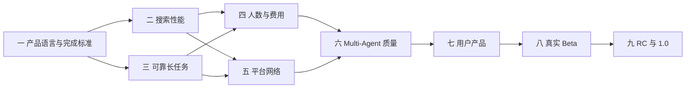

# TripChord 1.0 产品蓝图与完整迭代路线

这份文档回答两个问题：TripChord 最终要成为怎样的产品，以及从当前基础走到 1.0 需要依次完成什么。

下面描述的是 1.0 目标，不代表当前版本已经全部具备。

它不是下一阶段的待办清单，也不是按功能数量堆出来的版本表。每个阶段都必须让用户获得一种新的、可以实际感受到的能力；上一阶段达成后，才进入下一阶段。

## 1. TripChord 最终解决什么问题

自由行最费时间的部分不是搜到一张机票或一家酒店，而是把所有信息拼成一套真的能走、价格合适、体验也符合个人喜好的出行方案。

用户通常要自己完成这些工作：

- 在一段灵活日期里反复尝试出发和返程组合；
- 在多个平台之间核对机票、酒店和接驳；
- 分辨单人价、每晚价、起价、税前价和最终总价；
- 判断航班、入住时间、机场、码头和酒店位置能否衔接；
- 在“更便宜”“住得更好”“少中转”“取消更灵活”之间取舍；
- 页面价格变化后，重新做一遍前面的比较。

TripChord 的目标是替用户完成这套比较工作：用户说一次需求，系统完成搜索、核对、组合和选择，最后给出一份可以直接判断是否满意的出行方案。

在已连接且本次成功查到的平台中，TripChord 会优先选择整趟旅行费用更低的可行方案。如果用户明确更在意酒店品质、位置、早餐、行李或少中转，系统会按用户明确表达的偏好做取舍。它不会把“全网最低”当作营销口号，也不会在数据不完整时假装已经找到答案。

## 2. 1.0 的完整产品形态

### 2.1 1.0 交付合同

TripChord 1.0 是一套**本地优先的旅行决策产品**，不是托管用户平台账号的云服务：

- 一个安装包管理用户界面、本地 API、后台任务和内嵌持久存储，普通用户不需要分别启动或维护这些组件；内部实现以本地 PostgreSQL 承担多进程任务领取、租约和恢复，但不把数据库运维交给用户；
- Chrome Companion 继续使用用户自己的浏览器登录态，只在获准的平台页面读取可见信息；
- 用户自行配置兼容的模型服务密钥，密钥保存在操作系统安全存储中；
- 平台 Cookie、密码、浏览器资料和配对密钥不离开用户设备，也不进入模型上下文；
- 为完成语言理解而发送给用户所选模型服务的旅行需求和必要摘要，会在首次设置时清楚说明；
- 旅行需求、偏好、任务和结果默认保存在本机，用户可以导出或全部删除；
- 1.0 提供安装、自动升级、失败回滚和卸载，不要求用户维护开发环境。

1.0 聚焦**交通、住宿和接驳的一体化出行决策**。它给出完整的出行组合，但不承诺生成逐日景点、餐厅和游玩日程；天气、签证、景点与活动属于 1.0 之后的扩展。

### 2.2 首发用户与支持范围

TripChord 首先服务使用中文、出发和返程日期有弹性、需要跨平台比较交通与住宿的自由行用户。

首个贯穿全部阶段的参考场景沿用已有开发与受控运行需求：杭州出发前往马尔代夫，在不超过 21 天的日期窗口内旅行 4–8 天。它已经用于暴露真实问题，但不代表稳定实时闭环已经完成。性能和可靠性先在成人同行场景上收口；1.0 最低支持范围扩展到 1–4 位旅客、1–2 间房，并正确处理成人、儿童年龄和婴儿。正式支持的平台和更多出发城市由版本化支持表公布，不能因为某个适配器存在就自动算作支持。

在等待时间优化完成前，先反复使用这个参考场景修复性能和可靠性，不用增加更多完整旅行场景来掩盖同一类慢和失败；达到时间目标后再扩展需求集。

### 2.3 用户只需要做什么

用户可以直接说：

> 8 月 20 日到 9 月 10 日之间，从杭州去马尔代夫玩 4–7 天，3 位成人和 1 名 7 岁儿童，两间房。不要住得偏，尽量少中转，希望整体划算。

只有真正影响结果、又无法从这句话判断的内容，TripChord 才会追问。用户不需要先理解平台、Agent、工作流或价格字段。

### 2.4 系统在后台完成什么

1. 理解出发地、目的地、可出行日期、旅行时长、同行人、房间和偏好。
2. 枚举这段时间内合法的出发与返程组合，并说明本次实际查到了哪些。
3. 同时查询已连接的交通、住宿和接驳平台。
4. 确认每个报价对应的具体航班、房型或班次，并核对人数、日期、税费和查询时间。
5. 把能够衔接的交通、住宿和接驳组合成完整出行方案。
6. 计算这趟旅行所有人的人民币费用，而不是比较页面上的单人起价。
7. 淘汰住不下、时间接不上、位置不合适或超出用户要求的方案。
8. 由不同模块分别处理需求理解、查询安排、价格比较、方案选择、风险、必要修改和解释。
9. 由程序重新核对日期、金额和行程关系，最后只给出一份建议。

### 2.5 用户最终看到什么

最终出行方案页只展示一份建议，至少包括：

- 清楚的出发日、返程日和旅行总天数；
- 去程与返程的每段交通、起降时间、机场和中转；
- 每晚住哪里、什么房型、是否含早餐、主要取消条件；
- 机场、酒店、码头或车站之间怎样衔接；
- 所有人的人民币总费用，以及机票、住宿、接驳和已知税费分别占多少；
- 为什么这份安排比其他可行选择更适合当前需求；
- 哪些价格刚刚重新确认过，哪些内容仍需要用户在预订前查看；
- 对应的官方页面或平台查看入口。

系统内部可以保留其他候选和淘汰原因，但不会让普通用户再做一次人工筛选。如果关键价格没有算清，TripChord 会明确说明目前缺少什么，而不是展示一份看似完整但实际不完整的方案。

这份结果是一张**有时效的决策快照**，不是库存锁定。界面必须展示每个关键价格的查询时间、本次实际比较的平台、仍未确认的费用、建议再次核对的时间，以及前往平台前需要重新确认的项目。

### 2.6 用户怎样继续调整

用户可以直接说：

- “再便宜一点，酒店可以降一级。”
- “不要红眼航班。”
- “这家酒店位置不喜欢，换一个但航班别动。”
- “把行程改成 6 天。”

TripChord 会只重查受影响的部分，同时重新检查整趟行程，之后用新方案替换旧方案。用户始终只面对当前的一份最终安排。

### 2.7 TripChord 会记住什么

只有用户确认过、以后仍可能有用的偏好才会被保存，例如是否接受中转、是否需要早餐、是否必须包含托运行李。用户可以查看、修改、撤销或设置过期时间。

机票价格、房价、余位、班次和库存不会进入长期记忆。探索时可以短暂复用刚刚查过的相同结果，但给出最终方案前必须重新查询其中的关键部分。

### 2.8 产品界面

1. **规划入口**：自然语言输入，必要时补充少量结构化信息。
2. **最终出行方案**：只展示当前建议、总费用、选择理由和待确认事项。
3. **修改行程**：用自然语言提出更便宜、更舒适或更省事等调整。
4. **偏好中心**：查看 TripChord 记住了什么，并随时修改或删除。
5. **任务状态**：长查询可以离开页面，回来后继续查看；失败原因用普通语言说明。
6. **平台与隐私**：管理已连接平台、浏览器只读权限、数据保留和删除。

内部诊断、Agent 过程、平台任务和淘汰候选属于开发者视图，不出现在普通用户的主要流程里。TripChord 不再建设额外的演示页；普通用户只看到规划入口、当前任务、最终出行方案和修改入口。

### 2.9 明确不做什么

TripChord 1.0 仍然是旅行决策产品，不是交易平台：

- 不下单、不付款、不锁定库存；
- 不替用户接受条款、使用优惠券或处理订单；
- 不读取浏览器密码或 Cookie；
- 不承诺所有平台、所有目的地或所有同行人组合都可用；
- 不把“本次成功比较的平台”说成“全网”；
- 不在缺少当前价格时用记忆或模型补一个数字。

## 3. 1.0 背后的系统应该是什么样子

### 3.1 一条清楚的产品主链

模型负责理解和判断，程序负责不能出错的事实。任何 Agent 都不能单独改动金额、日期、用户授权或最终结果。

### 3.2 Multi-Agent 的成熟形态

TripChord 保留当前十二种专业职责，但不以数量作为亮点。当前核心实时规划使用固定的审查与修复任务图，Query Strategist、Event Diagnoser 等职责属于特定路径；因此这张表是能力分工，不是每次运行的模型调用清单。1.0 会通过对照评测决定哪些职责保持常驻、延后执行或改为条件触发，并让每个需要调用模型的角色都有自己的业务知识、可用工具、可见信息和清楚输出，而不是只换一段提示词：

| 角色 | 需要具备的旅行业务能力 | 只允许使用的主要工具 |
| --- | --- | --- |
| Context | 旅行需求澄清、同行人和偏好识别 | 需求 schema、偏好候选生成器 |
| Query Strategist | 灵活日期搜索、查询成本与覆盖安排 | 日期空间、预算和平台能力表 |
| Search Supervisor | 平台任务依赖、并发、限速和失败调度 | 类型化任务图与平台运行状态 |
| Evidence Arbiter | 机票、酒店、接驳价格口径和具体产品匹配 | 报价归一器、产品身份与新鲜度检查 |
| Candidate Curator | 在可行行程中平衡费用和用户偏好 | 完整候选、用户本次偏好、费用分解 |
| Risk Critic | 中转、入住、位置、取消和行李风险 | 独立候选视图与旅行风险规则库 |
| Repair Strategist | 根据明确失败原因提出最小改动 | 有限修复动作表与受影响范围 |
| ReCritic | 检查修复是否引入新问题 | 修复前后差异与独立风险检查 |
| Event Diagnoser | 判断价格、班次或库存变化影响哪里 | 变化事件 schema 与行程依赖图 |
| Orchestrator | 汇总各角色结论并提出当前业务状态 | 结构化交接结果，不接触原始浏览器 |
| Explanation | 用自然中文解释选择和待确认事项 | 已核对事实清单，不允许自由补充事实 |
| Memory Curator | 识别值得长期保留的稳定偏好 | 偏好白名单、用户确认与撤销接口 |

每个需要调用模型的专业角色都要配套旅行领域说明、正反例、必要时可用的工具、固定输出格式、失败方式和单独评测；来源查询、候选生成、规则检查、修复执行和最终安全检查继续由确定性 Agent 负责。当前没有外部 Agent 插件运行时；未来的插件只有在能提供真实平台能力或可靠数据、且不绕过现有权限和检查时才接入。

### 3.3 长任务运行方式

- 本地 PostgreSQL 保存任务、阶段、结果、偏好和恢复信息，成为唯一可信状态；选择它是为了支持多进程领取、租约、幂等和跨重启恢复，不是把服务器数据库暴露给普通用户；
- API 只接收请求和返回状态，实际查询由可水平扩展的 worker 完成；
- 同一请求具有幂等身份，重复点击不会产生两份工作；
- 每个任务都能取消、重试、继续，并在进程重启后恢复；
- 日期、交通、住宿和接驳分层并行，但每个平台都有自己的安全并发和访问节奏；
- 相同查询共享一次实际采集，成功与失败都共享，避免多个 Agent 重复撞平台；
- 探索阶段可以复用短期结果，最终方案中的关键价格必须重新查询。

### 3.4 平台接入方式

每个平台适配器都声明自己支持哪些能力：机票还是酒店、成人还是儿童、税费是否完整、能否识别房型、是否需要登录、多久后报价过期。

新增平台只实现统一适配器和测试包，不修改核心规划器。页面变化时可以单独停用某个平台的一项能力，其他来源继续工作。只有通过只读、安全、价格和产品匹配检查的平台，才进入用户的正式比较范围。

### 3.5 运行质量

成熟项目必须持续知道：一次规划用了多久、哪些平台最慢、多少查询被合并、哪些 Agent 真正改变了结果、费用是多少、失败在哪里、重试是否有效。

TripChord 会同时维护三类评测：

- **行程质量**：日期、总费用、衔接、偏好和风险是否正确；
- **Agent 价值**：与单模型和纯规则基线相比，每个角色是否提高选择质量或减少风险；
- **工程质量**：耗时、模型成本、平台请求数、恢复成功率和错误分类是否稳定。

LangGraph 不作为 1.0 的前置条件。只有某段模型流程确实需要跨重启暂停、人工介入或复杂循环，并且局部试验优于现有运行时，才引入到那一段。Temporal 只在出现多机器、小时级任务和现有 PostgreSQL 控制面无法可靠承载时评估。

## 4. 从当前基础走到 1.0 的完整路线

下面九个阶段按依赖顺序推进。平台适配、评测和界面可以并行开发，但不能跳过前一阶段的完成标准后对外宣称下一阶段已经成立。

### 路线全景

| 阶段 | 这一阶段结束时最重要的结果 |
| --- | --- |
| 一、产品语言与完成标准 | 所有人都能用同一种自然说法讲清产品、现状和 1.0 目标 |
| 二、搜索性能 | 先消除系统内部的重复查询、串行等待和按日期复制模型调用 |
| 三、可靠长任务 | 页面关闭或程序重启后，规划任务仍能继续、取消或明确结束 |
| 四、同行人与费用 | 按实际成人、儿童、婴儿和房间数算清整趟旅行费用 |
| 五、平台网络 | 首发范围内具备可维护的多平台查询，并完成真实全窗口十分钟验证 |
| 六、Multi-Agent 质量 | 每个角色都有真实业务能力，并能证明对质量、风险或效率的贡献 |
| 七、用户产品 | 普通用户只需提出需求、阅读一份行程并用自然语言修改 |
| 八、真实 Beta | 非开发者可以在公开支持范围内持续完成真实规划 |
| 九、RC 与 1.0 | 产品可以独立安装、升级、回滚、恢复和长期维护 |

### 当前基础并不是从零开始

| 方向 | 已经具备 | 距离成熟形态还缺什么 |
| --- | --- | --- |
| 产品与界面 | 自然语言需求、最终出行方案、任务状态和偏好接口 | 统一普通用户流程，隐藏内部诊断，所有金额与返程信息直观呈现 |
| 长任务 | 有界并发、取消、阶段进度、部分数据库任务恢复 | 将实时规划统一迁入 PostgreSQL，完成跨进程领取和重启恢复 |
| 人数与费用 | 成人、儿童、婴儿和房间领域结构；人民币费用检查 | 儿童年龄与混合同行人真实平台报价尚未全链贯通 |
| 平台查询 | API、官方页面和本机只读浏览器适配基础 | 明确首发支持矩阵，提高机票、酒店和接驳的稳定多平台覆盖 |
| 搜索性能 | 日期工作池、跨日期去重、失败共享和内部规模测试 | 真实平台大日期窗口仍需完成十分钟目标的端到端优化与验证 |
| Multi-Agent | 十二种专业职责、上下文、工具白名单和结构化输出 | 补齐角色专属旅行技能、单独评测和单模型/规则对照 |
| 发布工程 | 已有代码质量、依赖和部分安全检查，以及公开 GitHub 分支 | 真实外部端到端发布检查、安装包、升级回滚、数据迁移、持续运行指标和正式支持流程 |

### 阶段与版本怎样对应

| 版本称呼 | 需要达到的状态 |
| --- | --- |
| 当前开发版 | 已有能力和限制按上表公开，不因为路线图存在而升级称呼 |
| Beta Candidate | 阶段一至七完成，首发场景已经具备可交给非开发者使用的标准入口 |
| Beta | 阶段八完成，真实用户和真实平台运行达到预先登记的质量与耗时标准 |
| RC | 阶段九的安装、迁移、故障、安全和回滚检查全部完成 |
| 1.0 | RC 在公开支持范围内完成不少于 30 天的持续运行观察，没有未关闭的发布级问题 |

每次阶段验收都要保存同样的基本信息：代码提交、支持范围、硬件与网络环境、平台和模型版本、任务样本与分母、量化阈值、运行记录和结论。没有这些信息的“稳定”“多轮成功”不算完成。

### 阶段一：统一产品语言和完成标准

**用户得到的变化**

无论 README、产品界面还是面试介绍，TripChord 都用同一种简单方式说明自己：替用户完成旅行比较，算清整趟费用，只给一份建议；不能确定时就直说。

**要完成的建设**

- 固定 1.0 的产品范围、首发场景和不做的事情；
- 统一“最合适”“总费用”“当前查询”“最终出行方案”等用户用语；
- 把 Agent、价格字段、运行状态等术语留在技术文档；
- 为每一项公开说法标明它对应代码、测试、真实运行还是未来计划；
- 使用同一个参考场景的现有结果与至少 5 位目标用户核对，不重新执行新的多日实时搜索；让他们在没有作者讲解的情况下找到去程、返程、住宿、接驳、总费用和待确认事项，并决定接受方案或提出有限修改。

**怎样才算完成**

- 新读者可以在一分钟内说清 TripChord 给用户什么；
- README、架构、面试指南和产品界面不再互相冲突；
- 不再用角色数量、测试数量或内部流程代替用户价值；
- 至少 4/5 的目标用户能在 5 分钟内正确说出往返日期、总费用和未确认项，并能够接受当前建议或提出不超过两项明确修改；未达到时先调整最终结果形态和产品语言，再锁定后续界面。

### 阶段二：先根治一次规划要等太久的问题

**用户得到的变化**

TripChord 不再因为自己的串行调度、重复查询和重复模型调用，把原本可以并行的工作拖成几小时或几天。这个阶段先证明内部运行方式足够高效；真实平台上的十分钟目标要在阶段五的平台准入完成后验收。

**要完成的建设**

- 日期组合使用固定工作池并行，交通、住宿和接驳再按领域并行；
- 每个平台保持独立并发上限和访问节奏，不用无限并发换取表面速度；
- 相同的日期、路线、酒店和接驳查询只执行一次，失败也不重复轰炸平台；
- 最有希望的日期先完成，但其余合法日期继续搜索，不能把优先级变成偷偷抽样；
- 模型 Agent 服务于整次规划或真正需要判断的候选，不按每个日期完整复制十二次；
- 将平台等待、模型判断、价格补查和最终复核做成可以重叠推进的流水线；
- 只重新查询最终方案中的关键项目，避免全量重跑。

**怎样才算完成**

- 仓库固定的 11 天、3–8 晚内部基准通过正式调度入口完整执行，覆盖其中全部 66 组合法日期；858 个逻辑查询合并为不多于 648 次实际采集，至少消除 210 次重复工作；
- 66 组日期都进入任务账本并得到明确结果，没有静默遗漏；平台任务的计划启动范围不超过 290 秒，整次内部运行预算不超过 530 秒；
- 日期工作数量固定，不会按 66 组日期复制整套模型角色；成功和失败的相同查询都只执行一次并共享结果；
- 任何平台的请求数都不超过去重后的实际需要；
- 取消、超时和晚到结果不会留下重复任务或阻塞后续运行；
- 性能报告同时给出墙钟时间、平台请求数、模型调用数、模型费用和本机资源峰值。

这个阶段使用可控来源结果验证 TripChord 自己的调度、重复工作、等待方式和模型使用，不把希望寄托在平台未来提供批量接口，也不把内部基准说成真实平台速度。平台若已有合规的范围查询，可以作为额外加速，但不是完成这一阶段的前提。

### 阶段三：让一次长规划可以放心交给系统

**用户得到的变化**

用户提交需求后可以关闭页面，回来继续查看；重复点击不会重复查询；程序重启后任务仍在，能够继续、取消或明确失败。

**要完成的建设**

- 用 PostgreSQL 统一保存实时规划任务、阶段结果、检查点和幂等身份；
- 合并当前并存的进程内任务入口，保留一个标准产品入口；
- 建立 worker 领取、租约、续约、超时、取消和重启恢复；
- 将浏览器任务账本、共享查询结果、偏好记忆和短期缓存一并迁入可恢复存储，不再依赖单进程 JSON 或内存状态；
- 浏览器 worker 不直接持有 Chrome 用户资料；由与 Chrome 同机的 Companion Coordinator 管理浏览器任务和短期 profile 租约；
- 每完成一个日期就保存结果，超时后可以从已经完成的部分继续；
- 将平台查询、模型判断和最终结果关联到同一运行版本；
- 用普通中文展示“正在查什么、为什么失败、是否可以重试”。

**怎样才算完成**

- 强制终止 API 或 worker 后，任务不会丢失或变成未知状态；
- 同一个请求重复提交只执行一次；
- 确认取消后不再调度新的平台访问或模型调用；已经发出的调用有明确截止时间，晚到结果不会进入最终状态；
- 多 worker 同时运行时不会重复领取或覆盖结果。

### 阶段四：把人数、价格和费用真正算对

**用户得到的变化**

无论是几位成人、儿童、婴儿、几间房，TripChord 都会按平台实际支持情况给出正确费用；不能支持的组合会在查询前说明，不会套用成人价格。

**要完成的建设**

- 贯通成人、儿童年龄、婴儿、房间和入住人数；
- 统一单人价、单程价、每晚价、房费、税费和接驳费用；
- 建立人民币换算来源和查询时间，不用模型心算汇率；
- 将行李、早餐、取消条件、服务费和当地税纳入比较；
- 为每个平台建立清楚的同行人和价格支持表。

**怎样才算完成**

- 最终总费用能够逐项加回，结果完全一致；
- 缺少税费、人数或具体产品时，方案不能被称为最便宜；
- 首发支持的成人与混合同行人场景都经过真实只读查询；
- 任何不支持的人数组合都在进入最终选择前停止。

### 阶段五：建立可以长期维护的平台网络

**用户得到的变化**

TripChord 在首发支持的目的地和平台上能够稳定比较机票、酒店和接驳；某个平台变化或失效时，用户会知道发生了什么，其他平台仍能继续。

**要完成的建设**

- 完成 Provider SDK、能力说明、测试夹具和只读安全规范；
- 为每个平台能力建立准入合同：授权依据、允许读取的内容、访问节奏、用户同意、模型能看到的字段、数据保留期、账号风险、紧急停用和真实只读检查；
- 为每个 `平台 × 机票/酒店/接驳` 独立认证，不用机票成功代替酒店能力；
- 记录页面版本、产品匹配率、可用报价率、延迟和失败分类；
- 新适配器先进入影子运行，通过后才参与最终比较；
- 提供快速停用和恢复单个平台能力的开关。

**怎样才算完成**

- 首发范围内，机票和住宿各至少有两个独立且价格可比的平台；
- 接驳至少有一个与实际日期、人数和班次绑定的可靠来源；
- 计入覆盖的平台必须在同一次当前查询中返回明确报价，并绑定相同日期、人数、房间、具体产品和税费口径；仅仅启用、页面可打开、示例数据成功、登录受阻或等待平台结果都不算覆盖；
- 在提交前登记的参考设备、网络、模型和平台版本上，从标准产品入口对最长 21 天的首发窗口完成至少 30 次真实只读规划，覆盖不少于 7 天；每次根据本次日期和旅行时长计算实际合法组合全集，至少 24 次完整通过最终检查，阻断率不高于 20%；
- 所有尝试都进入统计：完整成功运行的端到端 p95 不超过 10 分钟，全部尝试从提交到成功或明确停止的 p95 也不超过 10 分钟；不能只挑最快或成功的运行证明性能；
- 计为“全窗口成功”的运行必须让本次实际生成的全部合法日期组合完成获准查询并得到明确结果；任何跳过、无法查询或未结束的日期都只能形成部分覆盖结果或阻断，不能进入 24 次完整成功的分子；
- 并行不会造成登录失效、明显更多验证码或平台封锁；
- 新增平台不需要修改核心行程优化器；
- 页面变化、登录失效、验证码和超时都有明确结果，不会被解释成“没票”或“没房”。

### 阶段六：让 Multi-Agent 真正提高行程质量

**用户得到的变化**

TripChord 不只会找到便宜组合，还能理解“不要住得偏”“带老人少折腾”“早餐重要”等真实偏好，发现不合理中转和入住风险，并在问题出现时只修改必要部分。

**要完成的建设**

- 为十二种专业职责分别建立业务说明、工具权限、输入输出约束和正反例；
- Context 将本次需求与长期偏好分开，本次明确要求永远优先；
- Evidence Arbiter 学会识别不同平台是否在卖同一种航班、房型和权益；
- Candidate Curator 在费用与用户明确偏好之间做可解释取舍；
- Risk Critic 独立检查中转、酒店位置、入住、取消、行李和接驳风险；
- Repair Strategist 只提出有限改动，程序执行后由 ReCritic 重新检查；
- Memory Curator 只能提出待用户确认的偏好，不能保存价格和库存；
- 建立单模型、纯规则和多 Agent 的同题对照评测；
- 在运行对照前提交固定需求集、盲评方法、偏好遵循、风险发现、错误率、等待时间和成本的最低目标，不能看完结果再改标准。

**怎样才算完成**

- 每个角色都能说明自己独有的信息、工具和输出；
- 去掉某个角色时，质量、风险发现、费用或耗时的变化有可重复数据；
- 模型无法修改价格、日期、平台权限或最终检查结果；
- 用户偏好能真实改变选择，同时过期价格永远不会从记忆进入新方案；
- 局部变化发生后，不相关的航班、酒店或接驳保持不变；
- 每次规划的模型调用、token、人民币成本、平台请求和本机资源都在 Beta 前登记的预算内；超出预算时先优化，不能只证明质量而忽略使用成本。

### 阶段七：把工程系统变成普通人会用的产品

**用户得到的变化**

用户不需要理解 Agent、报价回执或运行图，只需要输入需求、等待结果、阅读一份行程并提出修改。人民币总费用、返程时间和行程衔接一眼可见。

**要完成的建设**

- 统一中文自然语言入口和少量必要确认；
- 重做最终出行方案页，突出日期、返程、住宿、接驳、总费用和选择理由；
- 建立偏好中心、任务历史、修改行程、平台权限和数据删除；
- 将内部候选、失败码、Agent 轨迹移到开发者诊断界面；
- 支持键盘、屏幕阅读器、移动屏幕和非颜色状态提示；
- 为无法完成的请求给出普通人能理解的原因和下一步。

**怎样才算完成**

- 新用户不看架构文档也能独立完成一次示例规划；
- 用户界面始终只有一份当前行程，不同时显示旧方案和新方案；
- 所有金额默认以人民币呈现，外币只作为明细补充；
- 去程、返程、入住、退房和接驳时间不会被藏在技术详情里；
- 用户可以查看并删除 TripChord 保存的全部个人偏好和行程数据。

### 阶段八：用真实用户和真实失败完成 Beta

**用户得到的变化**

TripChord 在公开说明的支持范围内，不依赖作者现场操作，也能持续完成真实规划。遇到平台变化时，它会安全降级，而不是给出错误答案。

**要完成的建设**

- 按本文开头的首发范围建立并复核版本化的目的地、出发城市、旅行时长、同行人和平台支持表；
- 建立覆盖便宜优先、品质优先、少中转、复杂同行人和平台失败的真实需求集；
- 由非开发者从标准入口重复运行，不使用私有脚本或手工修数据；
- 记录完成率、等待时间、总费用完整率、用户修改次数和最终接受情况；
- 持续修复最常见的真实失败，而不是扩张更多场景。

**怎样才算完成**

- 在不少于 14 天内，从标准入口完成至少 100 次覆盖首发场景的真实只读规划；完整完成率不低于 90%，错误日期、错误人数、漏返程和错误总费用必须为零；
- 平台失败不会污染其他平台结果，也不会产生虚构最低价；
- 用户可以理解为什么选择这份行程，以及还有什么需要在预订前确认；
- Beta 报告清楚列出支持范围、成功率、p50/p95 耗时和仍不支持的情况；
- 成功运行必须来自新发起、已获授权的标准入口：本次选择的所有平台任务都有明确结果，交通和住宿达到当前精确报价要求，规划、程序检查、必要修复、修复后复查和最终关键价格刷新全部完成；缺一项只能明确停止，不能计入 Beta 成功。
- 每次 Beta 运行都能回到同一个代码提交、运行时版本、平台连接版本和依赖锁文件，避免拿不同版本的局部结果拼成一次成功。

### 阶段九：完成 RC、发布与 1.0

**用户得到的变化**

用户可以像安装正常软件一样安装 TripChord，安全升级、回滚和清除数据；服务持续运行时有稳定性能、明确支持范围和可预期维护。

**要完成的建设**

- 制作签名、不可变的 API、Web、数据库迁移和 Companion 发布物；
- 验证内嵌持久存储的静默安装、端口或进程冲突处理、备份迁移、升级回滚、卸载和残留清理；
- 完成多进程与多 worker 压力、崩溃、断网、慢平台和重复事件测试；
- 建立版本升级、数据库迁移、备份、恢复和一键回滚；
- 完成依赖、密钥、浏览器权限、提示注入、URL 和日志隐私审查；
- 建立运行监控、SLO、告警、版本兼容和平台变化处理流程；
- 公开安装、升级、卸载、数据导出删除和支持范围文档。

**怎样才算完成**

- 一台全新机器只按公开文档即可安装并完成标准规划；
- 升级失败可以自动回到上一版本，用户数据不丢失；
- 任务、偏好和结果在多进程与重启后保持一致；
- 在公开威胁模型内没有未关闭的严重或高危安全问题，指定攻击回归全部通过；平台会话只留在用户设备，模型服务密钥只在本机保存并仅发送给用户选择的模型服务；
- 1.0 的性能、可靠性和支持范围经过持续运行验证，而不是由版本名称宣布；
- GitHub 的代码、发布物、文档和 CI 始终对应同一个版本；
- RC 和 1.0 的最终验收必须从候选安装包新发起一次已获授权的标准真实规划，并与本次发布提交、运行时、平台连接版本和依赖锁定信息一致；
- [仓库正式发布检查](done-gate.md) 必须以成功状态结束，机器报告和最终发布检查都明确通过；任一条件缺失都不能发布 RC 或 1.0。

## 5. 阶段之间怎样并行

可以同时推进但不能提前宣称完成的工作：

- 搜索性能和任务持久化从当前阶段同时推进，前者先缩短等待，后者保证中断后不丢工作；
- 平台适配器可以与同行人和费用模型并行开发；
- 角色业务材料与评测可以和价格模型并行准备，但必须使用最终价格与产品格式验收；
- 新界面可以提前设计，但只能连接标准产品入口；
- 安装器和发布流水线可以提前建设，但不能替代真实规划验收；
- 更多目的地可以影子运行，但首发场景稳定前不进入正式支持范围。

### 会让路线收窄或调整的事实

- 如果完整日期窗口无法同时满足十分钟目标和平台安全访问，就先收窄正式支持的日期窗口；不能靠偷偷少查日期或无限加并发过关。
- 如果某个平台缺少清楚授权、持续触发账号风险或长期无法稳定识别具体产品，就从正式支持表移除，而不是降低价格检查。
- 如果用户拿到一份建议后仍无法理解费用、返程或为什么这样选，先修最终出行方案和修改体验，不扩张更多平台。
- 如果某个 Agent 在对照评测中没有提高行程质量、风险发现或效率，就调整它的业务材料、工具或触发方式；不能只用角色数量证明价值。
- 如果单次规划的模型费用、平台请求或本机资源超出 Beta 前登记的预算，就先优化调用和缓存，不把成本转嫁给用户后继续扩张。

## 6. 1.0 的总体验收

只有下面这些结果同时成立，TripChord 才进入 1.0：

### 对用户

- 一句话需求能够进入一个标准入口；
- 在公开支持范围内，只返回一份日期、返程、住宿、接驳和费用都完整的出行方案；
- 费用按本次实际同行人计算，并能逐项核对；
- 用户偏好确实影响选择，也可以随时查看和删除；
- 修改需求后旧方案被替换，不会和新方案并存；
- 无法可靠完成时说明真实原因，不给半成品假答案。

### 对搜索和价格

- 合法日期不会被模型随意删减；
- 本次究竟查了哪些日期和平台可以追溯；
- 最终方案中的关键价格在给出前重新确认；
- 平台的单人起价、税前价或身份不明报价不能赢得最低价比较；
- 不支持的同行人、房间或币种组合会停止，不猜测。

### 对 Multi-Agent

- 每个角色都有独立业务能力、工具权限、输入输出和评测；
- Agent 可以做语义判断，但不能改动日期、金额、授权和程序检查；
- 单模型、纯规则和多 Agent 有公平的质量、耗时与成本对照；
- 修复只改必要部分，修复后由独立角色和程序再次检查。

### 对工程和发布

- 任务可取消、重试、恢复，进程重启不丢失；
- 多 worker 不重复执行，同一查询的成功和失败都能共享；
- 真实首发场景的耗时达到公开目标；
- 单次规划的模型费用、平台请求数、内存、磁盘和数据库占用达到公开资源预算；
- 安装、升级、回滚、备份、数据删除和隐私保护都经过验证；
- 公开仓库不包含用户登录态、真实密钥或可重放的私有页面数据；
- GitHub 主分支、发布物、文档和 CI 保持同步。

### 对产品边界

- TripChord 永远不下单、付款、接受条款、锁库存、修改或取消预订；
- 用户只能前往获准的官方平台页面自行完成交易；
- 不把测试结果、回放数据或页面可达说成真实可订；
- 不宣称全网最低，只说明本次实际比较了哪些平台。

## 7. 1.0 之后的扩展

1. 在用户主动开启后，定期重新查询已选行程的价格和班次，并提醒变化。
2. 扩展更多出发城市、目的地、平台和复杂同行人场景。
3. 将天气、签证、景点、当地交通和活动纳入完整旅行计划，但继续与实时价格分开管理。
4. 提供移动端查看、偏好管理和变化确认，不把平台登录态搬到云端。
5. 在有明确收益时，为局部模型流程引入 LangGraph，或为跨机器长任务引入 Temporal。
6. 在用户明确同意、排序不受佣金影响且符合平台规则时，再评估 affiliate 模式。

这些扩展不能反过来削弱 1.0 已经建立的价格、隐私、只读和单一最终出行方案边界。

## 8. 项目推进原则

- 先修复最影响用户结果的问题，再增加平台、Agent 或界面数量；
- 每个阶段都要用当前代码、自动化检查和真实只读运行共同验收；
- 代码已经存在、生产路径已经接上、真实运行成功和普通用户可以稳定使用，是四件不同的事；
- 遇到慢、失败或页面变化时，先修根因，用同一需求重跑；
- 没有达到本阶段完成标准时，收窄公开说法，不用下一阶段功能掩盖缺口；
- 所有完成的改动都提交并推送到 GitHub，让公开仓库始终对应最新可验证状态。
