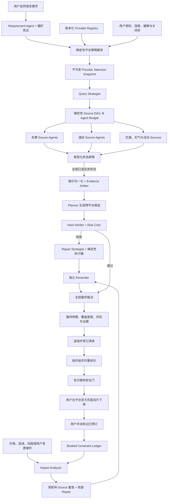
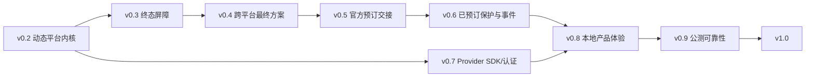

# TripChord 产品化路线图（v0.2 → v1.0）

> 状态：已完成产品决策，等待按版本门实施。本文描述的是 v0.1 之后的目标形态，
> 不是对当前代码能力的夸大声明。版本按证据门推进，不按日期强行发布。

## 1. 一句话目标

把 TripChord 从“可复现的多 Agent 旅行规划参考实现”升级为一个本地优先的自由行产品：
用户输入真实需求后，系统默认查询全部**当前可用且用户未关闭**的平台与垂类，等待所有已选来源进入
类型化终态，再完成跨平台组合、Planner → Verifier → Repair → ReVerifier → 主控裁决，最后给出
预算、证据和逐组件的**官方预订跳转**；用户手动确认已预订的组件将成为后续重规划的强约束。

## 用户最终看到的完整流程

1. 首次只配置一次本地引擎、LLM 和 Chrome Companion，并自行完成各平台登录；
2. 输入“从哪里去哪里、什么时候、几个人、预算和偏好”等自然语言需求；
3. 查看 `平台 × 机票/酒店` 矩阵，系统默认勾选全部当前合格项，用户可以逐项关闭；
4. 搜索页只展示每个平台的进度与终态，全部已选来源结束前不出现部分方案；
5. 一次性比较最终候选，看到每个组件来自哪个平台、总价、条款、覆盖缺口和风险；
6. 选择方案后，按逐组件清单执行“重核价 → 查看差异 → 去官方页面 → 手动确认已预订”；
7. 后续发生价格、延误或需求变化时，只重查受影响部分，并默认保护已经预订的组件。

## 2. 已确认且不得静默改变的产品决定

### 2.1 产品形态

- 首个正式形态是本地优先产品：API、Web、Browser Companion、用户自己的平台登录态和 LLM Key
  都留在用户机器上。
- 云端只作为后续可选能力，用于非敏感同步、公开数据、版本更新和匿名评测；首版不托管用户浏览器、
  Cookie、平台账号或支付状态。
- TripChord 可以独立运行，不依赖 Codex、ChatGPT 或任何 AI 编程工具；模型能力只依赖用户配置的
  OpenAI-compatible API。

### 2.2 默认平台策略

- 默认勾选“本次请求中全部合格平台”，不是无条件调用所有已知平台。
- 选择粒度是 `平台 × 垂类`，例如“同程机票开启、同程酒店不可用”。
- 合格平台必须同时满足：已通过 TripChord 认证、支持当前垂类、用户已授权对应官方域名、
  Companion 当前可连接、没有已知登录/健康阻断、未处于冷却期、用户没有显式关闭。
- 健康状态未知但没有已知阻断时可以进入搜索；若搜索中发现登录、验证码或页面漂移，则以相应终态结束。
- 用户关闭的平台不得生成浏览器任务、模型工具调用或后台访问；任何 Agent 都不得自动重新开启。
- 搜索开始时冻结一份不可变的选择快照。用户中途改变平台选择时，取消当前运行并用新快照重开，
  不把两个平台集合的证据混在一次方案中。

### 2.3 等所有平台结束再给方案

- Planner 只能在本次所有已选 Source 任务进入类型化终态后运行。
- 等待期间可以展示平台/垂类进度、耗时和阻断原因，但不提前展示部分报价、候选行程或临时预算。
- “结束”不等于“成功报价”。找到报价、确认无结果、有界未得到精确报价、登录阻断、验证码、
  页面漂移、平台错误、超时和用户取消都可以是本次运行的终态。
- 每个任务必须有确定性截止时间；到期后写入 `timed_out`，不得无限等待，也不得让 LLM 自行延长。
- 只有一家平台得到可用报价时允许生成方案，但必须明确说明“未形成跨平台比价”。
- 没有任何可用报价时不得编造预算或行程，改为输出各平台终态、阻断原因和安全重试入口。

### 2.4 跨平台组合与预订交接

- 机票、酒店、接驳和活动可以分别选择不同平台，不设置“必须同平台购买”的隐藏偏好。
- 输出逐组件预订清单，而不是统一支付入口。
- 产品统一使用“官方预订跳转”或“去官方页面”，不称为支付链接。
- TripChord 不下单、不支付、不使用优惠券、不锁库存，也不读取 Cookie、订单或支付状态。
- 每次跳转前只重核价该组件，并比较价格、日期、人数/房间、退改、行李、税费与稳定商品身份；
  发生实质变化时旧链接立即失效，重新进入 Verifier，必要时触发 Repair。
- 用户只能手动标记“已预订”或“暂不预订”。“已预订”是用户声明，不冒充平台订单确认。

### 2.5 已预订保护与重规划

- 用户标记已预订后，精确组件快照成为 Planner、Repair 和 ReVerifier 的强约束。
- 默认只允许修改未预订且受事件影响的组件；不得为了更便宜而自动替换已预订项目。
- 如果延误、停运等事件使已预订组件不可行，系统输出冲突和可选处理路径，但在用户显式解除保护前
  不自动删除或替换。
- 解除保护是单独的用户动作，必须展示可能产生退改损失的提示并留下审计记录。

## 3. 当前基线与真正的改造缺口

| 能力 | v0.1 已有基础 | 产品化缺口 |
|---|---|---|
| 多 Agent 闭环 | 已有 Query、Source、Planner、Verifier、Repair、ReVerifier、主控及事件链 | 继续保留，但要改为消费动态平台快照，并给已预订组件增加独立硬门 |
| 平台搜索 | Chrome Companion 可只读查询携程、去哪儿、同程机票 | 后端、前端和扩展仍多处写死三平台与固定能力矩阵 |
| 来源终态 | 已区分终态执行与可用报价覆盖 | 需要统一跨垂类终态枚举、确定性屏障和产品级失败呈现 |
| 日期与任务规划 | 已有有界日期搜索、动态 Agent 预算与并发控制 | `FlexibleDateExplorer`、Query Planner 和 live system 仍要求恰好三个平台 |
| 跨平台候选 | 候选可组合不同来源的机酒组件 | 需要公开覆盖差距、交易拆分、组件依赖顺序和逐组件重核价 |
| URL | `TravelOffer.booking_url` 只有通用 `HttpUrl` 类型 | 不能直接用于用户跳转；缺少官方域名/路径/参数/重定向校验和报价绑定 |
| 预订状态 | 通用模型有 `PriceState.BOOKED`、行程 Replanner 可保护 locked 项 | 没有用户预订声明、预订清单、解锁流程与 package 级 protected invariant |
| 产品界面 | React 工作区可展示搜索进度、Agent 轨迹和结果 | 平台类型和“3/3”仍写死，主页面过大，缺少设置向导、平台矩阵和预订清单 |
| 任务可靠性 | 有异步 job、SSE、取消和进程内监控 | 重启不恢复；超时仍以固定常量为主，缺少历史校准和恢复语义 |
| 扩展发布 | 有本地 seal、只读权限和合同测试 | Companion 发布门尚未接入远端 CI，公众安装仍需要可信分发方案 |
| 真实验收 | 能失败关闭并保留真实阻断 | 当前严格真实门仍未形成完整住宿双平台精确报价，不得宣称已完成 OTA 闭环 |

## 4. 目标架构



架构上必须区分四件事：

1. **用户想查询什么**：持久化的平台偏好；
2. **当前能查询什么**：注册能力、域名权限、连接、健康和冷却状态；
3. **本次实际查询什么**：启动时冻结的 Selection Snapshot；
4. **本次查到了什么**：每个 Source 的类型化终态和可用报价。

任何一层都不能由 Agent 用自然语言结果覆盖下一层的确定性事实。

## 5. 新的核心领域合同

### 5.1 Provider Registry

每个平台注册项至少包含：

- 由 `provider + vertical` 组成的稳定 `ProviderScopeKey`；
- `provider_id`、展示名和适配器版本；
- 支持的垂类与查询种类；
- 官方域名、允许访问的路径和最小可选 host permissions；
- 允许动作，只能是只读搜索、筛选、读取可见结果和打开安全详情页；
- 每垂类并发/速率限制、登录预检能力和健康探针；
- 是否支持稳定商品详情页、预填搜索页或只能给参数卡片；
- 当前认证阶段：开发、影子、测试、合格、冷却、停用；
- 选择器/解析器合同版本和最近一次合格证据。

Companion 心跳必须报告当前实际授权的 scopes、adapter/contract version 和运行实例，不能再只报告
固定 provider 名单；前端也不得把“三平台全部在线”当作连接成功条件。

Registry 是确定性事实源，可以被 RAG 读取用于解释，但 RAG 不能反向修改它。

### 5.2 Provider Selection Snapshot

一次搜索启动前生成不可变快照，记录：

- 用户请求的垂类；
- 每个 `平台 × 垂类` 的期望、合格、已选和排除原因；
- 用户授权证据、Companion 实例和能力版本；
- 搜索参数、任务集合、超时策略版本与快照哈希；
- 用户显式关闭项，供审计“为何没有访问某平台”。

只有快照中的 `selected=true` 项能生成任务。Agent 工具层再次校验快照哈希，防止提示注入或过期
Context 诱导系统访问未授权平台。

### 5.3 Source 终态

统一为跨机票、酒店和其他来源都能理解的运行终态：

| 终态 | 是否有 Planner 可用报价 | 含义 |
|---|---:|---|
| `quote_found` | 是 | 找到满足本任务绑定条件的可归一化报价 |
| `confirmed_empty` | 否 | 在冻结查询和证据合同内确认无结果，不外推到未来或全平台 |
| `bounded_no_exact_quote` | 否 | 有界扫描未得到精确报价，不声称平台无库存 |
| `login_required` | 否 | 需要用户本人恢复登录 |
| `captcha_required` | 否 | 需要用户本人完成验证，系统不绕过 |
| `dom_drift` | 否 | 页面合同变化，禁止猜测价格 |
| `provider_error` | 否 | 平台或适配器失败，保留可重试性和错误类别 |
| `timed_out` | 否 | 达到本次确定性截止时间 |
| `cancelled` | 否 | 用户取消或上层运行终止 |

现有 `bounded_provider_pending` 迁移为更准确的“本次有界观察仍未决”终态语义；它可以结束本次任务，
但永远不贡献报价，也不冒充平台已经搜索完成。

### 5.4 Search Completion Barrier

- 输入是 Selection Snapshot 冻结的所有 Source task IDs，而不是固定平台数量。
- 每个 task ID 恰好归入一个终态；未归类任务使屏障保持等待。
- 调度器原生支持 `ALL_TERMINAL` 依赖策略，Normalizer 依赖 settle 节点、Planner 再依赖
  Normalizer；不得继续用“把失败 Source 标成 success”来绕过只支持 `ALL_SUCCEEDED` 的调度语义。
- 截止时间由确定性策略根据 provider/vertical 历史分位数、波次、并发槽和产品上限计算，
  LLM 只能建议优先级，不能修改截止时间或把失败改成成功。
- 初期沿用经过审计的保守上限，同时收集本地匿名化延迟直方图；样本形成后冻结版本化
  `provider-timeout-policy.json`，每次调整都跑回放与慢源反例。
- 屏障关闭后才向 Planner 暴露报价；UI 在此之前只显示进度和终态，不显示部分方案。

### 5.5 Official Handoff

不要直接把现有 `TravelOffer.booking_url` 暴露给用户。新增 `OfficialHandoff` 合同，至少绑定：

- provider、vertical、offer ID、稳定商品身份和计划组件 ID；
- 出发/到达或入住/退房、人数、房间数、舱等/房型等比较身份；
- 报价总额、币种、税费完整性、条款摘要、观察时间和过期时间；
- 目标类型：官方商品详情页、官方预填搜索页、仅参数卡片；
- 允许的 scheme、host、path、query keys、redirect hops 与清洗后的 URL；
- revalidation receipt、binding hash 和失效原因。

安全规则：

- 只允许 `https` 官方域名；拒绝短链、开放重定向、账号、订单、收银台、支付、优惠券和未知路径；
- 删除会话标识、Cookie 等价参数、非必要跟踪参数和优惠券参数；
- URL 与报价/日期/人数/房间/组件不一致时不生成跳转；
- 平台不支持稳定深链时，退化为官方搜索入口 + 可复制的精确参数卡片，不伪造商品链接；
- 每次用户点击“重核价”生成新的短期 handoff，旧 handoff 立即作废；
- 重核价成功后仍由用户再次点击“去官方页面”，不在后台自动打开、聚焦或提交页面。
- `BrowserQuote.page_url` 只作为证据页面，不能直接当作商品详情入口；必须经过独立 locator 和
  每一跳重定向校验后才能签发 handoff。

### 5.6 Booking Checklist 与保护约束

`PriceState.BOOKED` 不能单独代表用户订单。新增：

- `BookingChecklist`：绑定一个最终计划版本；
- `BookingComponent`：航班、每段酒店、接驳或活动的独立条目及依赖顺序；
- `UserBookingAcknowledgement`：用户手动声明、时间、组件快照和可选备注；
- `ProtectedComponentConstraint`：从用户声明派生的强约束；
- `ConstraintOverrideRequest`：解除保护的单独请求、风险提示和用户确认。

状态至少包括：未处理、重核价中、可跳转、报价已变化、用户标记已预订、暂不预订、需要处理冲突。
用户标记已预订不表示 TripChord 读取或验证了平台订单。

## 6. Agent 与确定性代码的边界

| 能力 | Agent 负责 | 确定性系统负责 |
|---|---|---|
| 需求理解 | 从自然语言提取日期、预算、偏好、模糊项和权重建议 | Schema 校验、日期/人数/货币合法性、用户显式权重优先 |
| 平台选择 | 解释覆盖差距、建议是否重试 | 合格性、权限、关闭项、选择快照和实际任务集合 |
| 搜索策略 | Query Strategist 排序日期、来源波次和证据补全优先级 | 总预算、并发、速率、任务白名单、超时和取消 |
| 候选规划 | Planner/Candidate Scouts 评议跨平台组合 | 金额、时区、衔接、库存新鲜度、稳定商品身份和候选上界 |
| 验证 | Risk Critic 发现脆弱性和语义风险 | Hard Verifier 重算全部硬约束并有最终否决权 |
| 修复 | Repair Strategist 提出替换、移位或拆住方案 | Repair Executor 只执行白名单 diff，禁止修改受保护组件 |
| 复验 | 异构 ReVerifier Agent/模型检查新风险 | 独立算法重算不变量、父链、证据和 protected invariant |
| 最终裁决 | 主控整合证据并解释接受/拒绝/需用户处理 | Safety Gate 防止绕过硬拒绝和发布无证据报价 |
| 预订跳转 | Agent 解释条款、排序用户操作步骤 | URL allowlist、报价绑定、重核价、失效和用户手势 |
| 事件恢复 | Diagnoser 判断影响范围，Planner/Repair 提方案 | 事件类型、受影响集合、预算、保护约束和版本提交 |

Agent 数量继续由现有确定性预算控制器按日期规模、候选数、证据缺口和事件范围动态派生；
LLM 不直接决定无限扩容，也不改变 Chrome lease、平台限速或 96 个逻辑 Agent 的请求级硬上限。

## 7. 版本化实施计划

### v0.2 — 动态平台内核

**目标**：移除“恰好三平台”的产品假设，建立动态能力、用户选择和运行快照。

主要工作：

1. 新建 provider capability、user selection、eligibility snapshot 和 selection snapshot 模型及迁移；
2. 把 `TravelPlatform` 固定元组改为 Registry 查询，把平台数量指标改为 `selected/terminal/quoted`；
3. 改造 `FlexibleDateExplorer`、`FlexibleQueryPlanBuilder`、live/flexible live systems 和应用装配，
   全部消费 Selection Snapshot；
4. Companion 改为逐平台可选 host permission 和 scope-aware heartbeat，不再用一个按钮一次授权
   全部域名或要求固定三平台同时在线；
5. API 增加能力矩阵、授权健康和用户开关；前端移除固定 union、“3/3”和硬编码标签；
6. 将超长 live system 与前端主页面按 Provider Policy、Source Runtime、Barrier、Planning Pipeline、
   Platform Settings 等职责拆分，先建立测试缝隙再迁移逻辑。

退出门：

- 0、1、2、3、4 个合格平台的回放场景都能构建正确任务集合；
- 每个必需垂类至少选择一个合格来源；为 0 时在浏览器/模型调用前阻止启动并解释原因；
- 关闭任一 `平台 × 垂类` 后，对应浏览器任务、模型工具调用和网络记录均为 0；
- 未授权域名无法进入 Selection Snapshot；Agent 伪造平台 ID 或快照哈希时原子拒绝；
- 旧三平台场景通过兼容转换，输出语义不回退；
- Registry 与数据库迁移有向前/回滚测试，公开 API 有版本化 contract fixture。

### v0.3 — 全来源终态屏障与诚实发布

**目标**：严格实现“等所有已选平台结束后再给方案”。

主要工作：

1. 统一 Source 终态模型，迁移现有 flight/lodging/browser failure 类型；
2. 新建 SearchRun、SourceAttempt、TerminalReceipt 和 SearchCompletionBarrier 持久化模型；
3. 为每个来源设置可审计 deadline，超时/取消传播到 Companion 和所有子 Agent；
4. 新增 `ALL_TERMINAL` 调度依赖、独立 settle 节点和 `ScopeCancellationTombstone`；取消或更改范围时
   提升运行 generation，普通重试、publication refresh、failover 和 event replan 都必须复核；
5. SSE 只发送阶段、平台/垂类进度和终态，不提前发送候选方案；
6. 屏障关闭后一次性运行 Normalizer、Evidence Arbiter 与 Planner；
7. 明确三种输出：多平台比较、单平台有限方案、零报价阻断报告。

退出门：

- 对任意动态任务集合，Planner 首次调用时间严格晚于最后一个 Source 终态时间；
- 慢源、挂起源、登录、验证码、DOM 漂移、取消和进程异常都有类型化终态或可恢复运行状态；
- 不存在无限等待；重启后运行能恢复、终止或明确标记不可恢复，不能丢成未知成功；
- 取消 scope 后所有重试/刷新路径新增提交数为 0，迟到结果不得进入 Planner；
- 单平台结果不出现“跨平台最优”等表述；零报价时预算字段为空且没有虚构行程；
- UI 端到端测试证明屏障前不可见价格/方案，屏障后才出现最终结果。

### v0.4 — 跨平台最终方案与覆盖解释

**目标**：把“不同平台买不同组件”做成一等能力，而不是实现细节。

主要工作：

1. Planner 对机票、每段酒店、接驳和活动分别选择来源，并生成完整 package provenance；
2. 归一化同商品、同权益、同入住/乘机条件，不能把会员价、无行李、不可退与普通报价混比；
3. Verifier 校验分开交易带来的衔接、退改、行李直挂、税费和支付币种风险；
4. 输出至少包括省钱型、稳妥型和少折腾型候选，但只有满足证据门的候选才可出现；
5. 展示每个组件的平台、报价时间、可比条件、覆盖平台和未覆盖原因；
6. 同平台组合优惠只能在有明确证据时计入，默认不假设存在。

退出门：

- 固定回放中能稳定生成“平台 A 机票 + 平台 B 酒店”的有效候选；
- 金额、币种、税费、房晚、人数、行李和退改条件属性测试无静默错配；
- Agent 建议不可绕过确定性 Hard Verifier；Repair 后由独立 ReVerifier 重算；
- 随机打乱平台返回顺序不改变确定性比较结果；
- 覆盖不足、会员条件未知和分开交易风险在最终结果中可见。

### v0.5 — 官方预订跳转与逐组件清单

**目标**：让用户从可信方案安全进入平台官方页面，但始终由用户自行完成交易。

主要工作：

1. 实现 `OfficialHandoff`、URL Policy、短期绑定和失效机制；
2. 为每个已认证 adapter 声明详情页、预填搜索页或仅参数卡片能力；
3. 新增组件级重核价 API：重核一个组件，不重新搜索整趟行程；
4. 实质变化时撤销旧 handoff，运行 Verifier/Repair/ReVerifier 后生成新计划版本；
5. 构建逐组件预订清单、建议操作顺序和“重核价 → 查看差异 → 去官方页面”交互；
6. 调研每个平台允许的官方 deep-link/partner/affiliate 规则；未得到证据的平台只给搜索页或参数卡片。

退出门：

- 任一 handoff 都能回链同一报价、日期、人数/房间、计划组件、平台和新鲜 revalidation receipt；
- 非官方域名、短链、开放重定向、收银台、订单、支付、优惠券和未知路径 100% 被拒绝；
- 证据 `page_url`、模型生成 URL 或中间重定向未经逐跳校验时均不能签发 handoff；
- 重核价失败或价格/条款实质变化后，旧链接不可再用；
- 平台无稳定链接能力时安全降级，不构造猜测 URL；
- 自动化测试只能验证到官方结果/详情页，不执行提交订单、支付或领取优惠券。

### v0.6 — 已预订保护与事件闭环

**目标**：把用户已完成的现实动作纳入 Agent 规划状态，避免重规划破坏已购项目。

主要工作：

1. 持久化 Booking Checklist、用户预订声明、Protected Constraint 和 override 审计；
2. 将 protected invariant 加入 package Hard Verifier、Repair Executor、ReVerifier 和 Safety Gate；
3. 支持手动事件、用户开启的价格监控、预订前重核价变化和公共事件注入；
4. Impact Analyzer 先计算受影响组件，Source Agent 只重查必要范围；
5. 未预订组件走局部 Repair；已预订组件发生冲突时停止自动替换并请求用户裁决；
6. 记录旧/新计划、保留组件、修改原因、证据变化和 Agent/工具预算。

退出门：

- 任意事件回归中，未解除保护的已预订组件修改率为 0；
- 无关组件保持不变，局部修复失败才允许提出全局重规划；
- 全局重规划仍继承已预订保护，不因开启更多 Agent 而丢失；
- 用户解除保护需要单独确认并生成版本化审计；
- 价格变化事件必须来自新工具回执，不能从 RAG 或旧缓存伪装为实时事实。

### v0.7 — Provider SDK、认证门与平台扩展

**目标**：新增平台不再修改核心 Planner，也不把不稳定适配器默认暴露给用户。

主要工作：

1. 提供 Provider Adapter SDK、能力描述文件、fixture 模板和 conformance test kit；
2. 建立开发 → 影子 → 测试 → 合格 → 冷却/停用的认证状态机；
3. 将 selector 漂移、登录阻断率、终态率、报价绑定率和延迟作为每垂类独立证据；
4. 新适配器先进入影子模式，不进入默认全选和 Planner；
5. 通过真实只读 canary、URL 安全审计和回归门后才升级为合格；
6. 从智行、同程酒店或其他官方来源中选择证据最充分者作为首个新增垂类/平台，
   不为了凑平台数量绕过网页能力或登录限制。

退出门：

- 新 provider 只需 adapter + capability profile，不改核心 Planner/Barrier 枚举；
- 未认证/冷却 provider 不会进入默认选择；
- 每个合格 provider 的机票和酒店能力分别认证，不能用机票成功替代酒店证据；
- DOM fixture、live canary、终态、报价归一化、URL Policy 和只读权限全套门可重复执行；
- 能一键停用有问题的 `provider × vertical`，既不破坏历史运行，也不访问其域名。

### v0.8 — 本地优先的完整产品体验

**目标**：让第一次接触项目的用户不依赖作者指导即可安装、配置、搜索和恢复。

主要工作：

1. 增加启动器/安装器，统一管理 API、Web、数据库迁移和本地 Bridge；
2. 将 LLM Key 存入系统安全存储，不写入仓库、日志或前端持久化；
3. 提供首次设置向导：模型连通性、Chrome Companion、逐平台授权、登录健康和回放自检；
4. 正式分发签名的 Chrome 扩展；公众版不承诺绕过 Chrome 的用户安装确认；
5. 增加运行历史、失败恢复、本地数据导出/删除、日志脱敏和可选匿名遥测；
6. 前端拆成需求、平台设置、搜索进度、最终方案、预订清单、事件中心和证据详情等独立页面；
7. 所有高技术细节默认折叠，让普通用户先看到“发生了什么、接下来能做什么”；
8. 完成键盘操作、屏幕阅读器、非颜色状态提示、正文可读字号和 WCAG 2.2 AA 审查。

退出门：

- 全新机器按 README/安装器完成回放体验，不需要手动修改代码；
- 开启真实模式前必须逐项展示权限和禁止动作；未授权时仍可完整使用回放模式；
- API Key、bridge token、真实 URL 和用户行程不出现在 Git、错误报告或默认遥测；
- 卸载/清除数据路径可验证；升级和数据库迁移失败时可安全回滚；
- Chrome 扩展安装需要用户确认，但后续兼容更新不把开发者重载变成日常用户待办。

### v0.9 — 公开测试版可靠性与评测

**目标**：把“本地能跑”提升为“别人能稳定复现，并知道什么时候不能信”。

主要工作：

1. 将 Browser Companion 合同测试、release seal、host permission 和 URL Policy 纳入远端 CI；
2. 建立 replay、模拟慢源/故障、真实只读 canary、跨平台方案、handoff 和事件恢复的分层基准；
3. 将 job/monitor 从纯进程内状态迁到可恢复存储，验证重启、取消、幂等和并发隔离；
4. 建立本地可观测面板：终态分布、Barrier 时长、报价覆盖、模型成本、Repair 次数和 handoff 失效；
5. 运行安全审计：提示注入、SSRF、恶意重定向、越权平台访问、敏感日志和供应链；
6. 发布可复现的公开演示包；真实平台原始证据只保存在用户本地，公开仓库只放脱敏摘要。

退出门：

- Python、Web、Companion、迁移、benchmark、依赖审计和容器/安装包全进入 CI；
- 选中来源终态分区完整率 100%，无无限等待和未知成功；
- 硬约束违规、未授权平台访问、旧链接继续可用、受保护组件静默修改均为 0；
- 性能门使用版本化真实基线和明确容差，不用未经校准的“看起来很快”数字；
- 公测问题都有 provider/vertical/contract version/run snapshot 可定位，不依赖用户提供敏感截图。

### v1.0 — 稳定发布

**目标**：完成下文最终 Done-Gate，并把支持边界写进产品和开源文档。

发布内容：

- 本地安装/启动与回放体验；
- 可配置的 OpenAI-compatible 模型服务；
- 默认全部合格平台、逐 `平台 × 垂类` 关闭和明确权限；
- 等全部已选来源终态后发布的一次性最终方案；
- 跨平台组件组合、覆盖差距与证据；
- 官方预订跳转、逐组件重核价和用户预订清单；
- 已预订保护、事件影响分析与局部重规划；
- Provider SDK、认证门、可恢复任务、评测与安全文档。

v1.0 不是“所有平台永远成功”，而是：系统只访问获准且合格的平台，所有来源都能在有界时间内
给出诚实终态，方案只使用可用证据，失败时不伪造价格，交易始终由用户在官方平台完成。

## 8. 目标 API 边界

接口名称可在实现时调整，但职责不得重新混合：

```text
GET    /api/v1/providers/capabilities
GET    /api/v1/providers/runtime-health
PUT    /api/v1/preferences/provider-selection

POST   /api/v1/search-runs
GET    /api/v1/search-runs/{run_id}
GET    /api/v1/search-runs/{run_id}/events
DELETE /api/v1/search-runs/{run_id}

GET    /api/v1/plans/{plan_id}
POST   /api/v1/plans/{plan_id}/components/{component_id}/revalidate
POST   /api/v1/plans/{plan_id}/components/{component_id}/handoffs

GET    /api/v1/plans/{plan_id}/booking-checklist
POST   /api/v1/plans/{plan_id}/booking-checklist/{component_id}/acknowledge
POST   /api/v1/plans/{plan_id}/booking-checklist/{component_id}/defer
POST   /api/v1/plans/{plan_id}/booking-checklist/{component_id}/request-unlock
POST   /api/v1/plans/{plan_id}/events/replan
```

`handoffs` 端点不得返回长期可复用 URL；只有新鲜重核价和 URL Policy 同时通过时才返回短期目标。

## 9. 评测与证据矩阵

| 层级 | 证明什么 | 不证明什么 |
|---|---|---|
| 单元/属性测试 | 金额、日期、终态分区、权限、URL 和 protected invariant | 真实平台当前页面可用 |
| Adapter fixture | DOM/JSON 合同、解析、失败关闭和稳定身份 | 平台账号、库存与生产风控 |
| Replay 端到端 | 多 Agent、Barrier、Planner–Repair 闭环和产品状态 | 实时报价或可下单性 |
| 故障/慢源注入 | 超时、取消、重启、局部重规划和不破坏已预订项 | 供应商自然故障发生率 |
| 真实只读 canary | 当前账号/页面下能得到类型化结果和证据 | 全网最低、库存锁定或最终成交价 |
| Handoff canary | 跳转落在允许的官方结果/详情页并保持查询条件 | 下单、支付、退款或转化率 |
| 公开新装验收 | 第三方能按文档安装和复现回放产品 | 其所在地区/账号的全部平台可用 |

每次发布至少记录：代码版本、capability profile、adapter/selector 版本、模型配置、选择快照、
Source 终态、Barrier 时长、报价覆盖、最终裁决、handoff 安全结果和是否使用真实平台。

## 10. 核心产品指标

### 不允许退化的安全指标

- 未授权或用户关闭平台的任务数、模型工具调用数和浏览器访问数：`0`；
- Planner 在 Barrier 前调用次数：`0`；
- 零报价时生成虚构预算/方案次数：`0`；
- 失效 handoff 继续可用次数：`0`；
- 未解除保护的已预订组件被 Repair 修改次数：`0`；
- Agent 绕过 Hard Verifier、ReVerifier 或 Safety Gate 的发布次数：`0`。

### 需要持续观察而非夸大的效果指标

- 每 `provider × vertical` 的终态率、可用报价率和失败分类；
- 搜索 Barrier 的 p50/p95 与各 Source 等待占比；
- `selected_source_settlement`、精确报价覆盖与可比组件覆盖分别统计，不能再用一个
  `all_platforms_complete` 混合三种含义；
- 多平台、单平台和零报价输出比例；
- 重核价保持率、价格/条款实质变化率和 handoff 安全降级率；
- Repair 成功率、局部保留率和需要用户裁决的比例；
- 每次请求的模型调用、token、逻辑 Agent 数和浏览器任务数；
- 用户关闭平台、手动重试、标记已预订和解除保护的行为漏斗。

这些数字先作为事实采集，再据真实分布冻结 SLO；不得先写任意百分比再为了达标扭曲终态语义。

## 11. 每个版本后的检查与调整协议

每完成一个版本都必须生成 `docs/phase-reviews/product-vX.Y.md`，只允许四种结论：
**通过、有条件通过、返工、调整计划**。评审至少回答：

1. 原计划的每个交付物是否有代码、测试、运行证据或明确未完成项；
2. 当前实现与本文的产品决定有哪些偏差，偏差是缺陷、合理变更还是新外部限制；
3. 真实运行暴露了哪些平台、模型、浏览器或 UX 假设错误；
4. 哪些指标变好、变差或仍未知，是否存在把技术成功冒充业务成功的表述；
5. 下一版本范围是否仍成立，是否需要调整顺序、收窄声明或回滚接口。

只有“通过”或风险已被写清的“有条件通过”可以进入下一版本；出现权限、安全、报价真实性、
已预订保护或外部平台政策问题时必须返工，不用更多 Agent 掩盖合同缺口。

## 12. 关键依赖与可并行工作



不能颠倒的主路径是：动态平台集合 → 终态屏障 → 最终方案 → 安全 handoff → 已预订保护。
以下工作可以提前并行，但必须在对应版本门汇合：

- 前端平台矩阵、搜索进度和预订清单原型；
- provider deep-link/affiliate/robots/使用条款审查；
- Companion CI、URL 攻击样本和慢源故障基准；
- 安装器、系统密钥存储和本地数据删除；
- 新 provider 的影子适配与 fixture，不提前进入默认全选。

## 13. 尚需用证据裁决、不能靠猜的事项

1. 各平台允许使用的官方详情/预填搜索链接、跳转参数与 partner/affiliate 资格；
2. 每个 `provider × vertical` 的超时分布、冷却策略和恢复阈值；
3. DOM/接口发生多大漂移后应自动冷却，何时可恢复为默认合格；
4. 价格、退改、行李或税费变化达到什么程度必须 Repair，而不只是提示；
5. 已预订组件不可行时，解除保护、取消、改签和重新规划的用户确认流程；
6. 桌面启动器采用现有 Web + 后台进程封装还是 Tauri 等壳层，先做最小原型和升级/签名审计再定。

这些事项都在对应版本的证据门裁决，不阻碍先完成其上游确定性合同。

## 14. v1.0 最终 Done-Gate

只有以下全部满足，才能称为“完整独立产品，可供别人安装体验”：

### 独立运行

- 全新环境只按公开 README 即可完成安装、迁移、启动和 replay 演示；
- 配置任意受支持的 OpenAI-compatible 模型后，模型 Agent 可运行且 required 模式失败关闭；
- 不需要 Codex、ChatGPT、作者电脑上的私有服务或未公开脚本。

### 平台与权限

- 默认选择全部当前合格平台，用户可以逐垂类关闭；
- 未授权、关闭、冷却或不支持的平台不会产生任何访问；
- Chrome Companion 只读、最小权限、可撤销，登录/验证码只能由用户处理。

### 搜索与方案

- 每次运行绑定不可变 Selection Snapshot，全部已选 Source 在有界时间内进入终态；
- Planner 只在 Barrier 关闭后运行；
- 用户取消/关闭 scope 后，重试、刷新、failover、事件和迟到结果都不能把它重新加入当前 generation；
- 多平台时可组合，单平台时如实披露，零报价时不输出伪预算；
- Planner、Verifier、Repair、ReVerifier 和主控链都有结构化交接与可回放证据。

### 官方预订交接

- 每个可跳转组件都先完成新鲜重核价和 URL Policy；
- 链接绑定报价、日期、人数/房间、平台和计划组件；变化后旧链接失效；
- 产品不能下单、支付、使用优惠券、读取订单或自动确认已购买。

### 事件与已预订保护

- 用户手动声明已预订后生成强约束；
- 任意 Repair/Replan 都不能静默修改受保护组件；
- 事件只重查受影响范围，全局升级仍保留保护约束；
- 解除保护必须由用户显式确认并留痕。

### 工程、评测与声明

- Python、Web、Companion、迁移、安装、回放、故障、handoff、安全和依赖门都在 CI；
- 公开 benchmark、claim ledger、已知限制和真实 canary 结论彼此一致；
- 真实平台失败、DOM 漂移或单平台报价不会被包装成“全网最低”或“完整 OTA 成功”；
- 版本升级、失败恢复、数据导出/删除和隐私边界有公开文档与验证证据。

## 15. v1.0 之后的可选方向

- 端到端加密的偏好/计划多设备同步，不同步 Cookie 或平台账号；
- 公共交通、天气、签证和景点数据的共享缓存；
- 用户自选的云模型代理和团队协作；
- 在明确披露、排序独立且符合平台规则后接入 affiliate 链接；
- 原生移动端只做查看、事件确认和预订清单，不在云端接管用户平台登录。

这些方向都不能改变 v1.0 的本地优先和用户自行交易边界。

## 16. 给后续 AI 开发者的执行要求

开始任一版本前先阅读本文、`AGENTS.md`、`docs/providers.md`、`docs/data-source-policy.md`、
`docs/done-gate.md` 和 `docs/claim-ledger.md`。实施时必须：

1. 先写/更新领域合同和反例测试，再迁移现有 live pipeline；
2. 每次只推进一个版本门，保留旧 replay 与真实失败证据；
3. 不用新增 Agent 数量代替权限、终态、URL 或金额等确定性合同；
4. 不访问用户关闭的平台，不绕登录/验证码，不执行订单/支付/优惠券动作；
5. 完成后生成中文阶段评审，逐项对照计划与实际差异；
6. 测试成功、模型调用成功、Source 终态完整和业务方案可发布必须分开报告。
