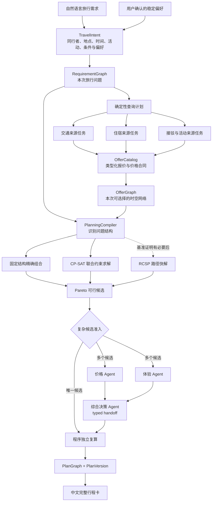

# TripChord 复杂自由行目标架构

> 状态：2.0 已采用该主架构，并在七轮范围受控场景中完成验证；文中更广泛的组合、来源扩展和迁移路线仍属于后续设计。当前版本与逐轮证据以 [2.0 公共验收](v2.0-acceptance.md) 为准，1.0 验收是历史单目的地基线。

## 目录

- [1. 最终目的与成功标准](#1-最终目的与成功标准)
- [2. 主架构决定](#2-主架构决定)
- [3. 当前代码提供的起点](#3-当前代码提供的起点)
- [4. 目标领域模型](#4-目标领域模型)
- [5. 组合求解内核](#5-组合求解内核)
- [6. Multi-Agent 的准确边界](#6-multi-agent-的准确边界)
- [7. 上下文、记忆、Skill、工具与插件](#7-上下文记忆skill工具与插件)
- [8. 单一状态与变化后的重新规划](#8-单一状态与变化后的重新规划)
- [9. 保留、迁移与删除](#9-保留迁移与删除)
- [10. 分阶段实施路线](#10-分阶段实施路线)
- [11. 怎样证明架构有效](#11-怎样证明架构有效)
- [12. 重新评估条件](#12-重新评估条件)

## 1. 最终目的与成功标准

### 产品要解决的问题

TripChord 面向个人或多人复杂自由行。用户可以只用自然语言说明：

- 谁出发、是否从不同地点出发、哪些行程一起走；
- 想去一个还是多个地方，是否异地进出；
- 哪段时间可出行、准备玩几天、有哪些不能移动的活动；
- 预算、交通、住宿、餐食、行李、无障碍和体验偏好；
- 哪些条件不能妥协，哪些条件可以用价格或时间交换。

系统从本次实际取得的交通、住宿、接驳和活动中，组成时间地点连续、同行者安排成立、总费用不重复计算、符合用户取舍的一份完整方案。偏好不足时，可以从同一批来源中给出省钱、均衡和体验优先三个代表方案。

### 可观察的成功

一次规划只有同时满足下面条件才算成功：

1. 每位同行者在整段时间内都有连续、没有冲突的地点和安排；
2. 每个选中组件都有本次来源、适用日期、适用人员、费用口径和查询时间；
3. 共享房价、往返票、联程票或酒店含接驳只计价一次；
4. 用户不能妥协的条件全部通过程序检查；
5. 最终选择能解释它相对其他可行候选的价格与体验取舍；
6. 修改行程后，未受影响的组件保持不变，受影响部分重新查询和求解；
7. 查询失败、信息不足或无可行解时明确停止，不用模型补出一个看似完整的答案。

### 空胜利与非目标

下面这些即使实现，也不等于产品成功：

- Agent、框架、平台或测试数量增加；
- 能生成漂亮攻略，但时间、人数或总费用没有闭合；
- 在保存数据上求解很快，却没有说明真实平台查询的覆盖范围；
- 从未完整查询的范围中声称“全网最低”或“全局最优”；
- 为每种旅行复制一条新工作流，短期能跑但无法继续扩展。

TripChord 永远不付款、下单、接受条款、锁定库存、使用优惠券、修改或取消预订。签证、医疗、法律结论和线下应急处置也不属于规划内核。

## 2. 主架构决定

采用 **渐进兼容的领域内核**：

> 类型化旅行问题模型 + 三种旅行图视图 + 按问题形态选择的确定性求解器 + 复杂候选上的三角色 Multi-Agent 取舍面板。



这里的旅行图是**领域数据视图**，不是 Agent 执行图，也不要求图数据库。Agent Runtime 继续负责有限任务的执行；旅行领域内核负责什么方案成立。两者不能互相代替。

### 为什么选择它

- 现有单目的地真实链可以作为第一个专用求解器继续工作，不需要大爆炸重写；
- 多城市、异地进出、分组同行和固定活动可以通过新增组件、条件和求解策略扩展，不复制中央流程；
- 日期、金额、容量、衔接和人员连续性仍由可重复计算的程序掌握；
- LLM 只在语言歧义、来源语义、用户取舍和特殊旅行判断上产生价值；
- 当前自研 Runtime 没有成为旅行结果的主要障碍，因此不为了框架标签迁移到 LangGraph、CrewAI 或其他框架。

### 明确否决的方案

| 方案 | 不采用的原因 |
| --- | --- |
| 继续扩充 `PackageCandidateKind` | 每增加一种城市结构、同行分组或活动就增加分支，最终形成不可维护的组合爆炸 |
| 一次性替换全部现有模型 | 会破坏已经跑通的真实链，且在新领域模型没有通过结构验证前无法判断回归 |
| 让 LLM 直接生成完整行程 | 模型不能可靠证明日期、总价、共享合同和每位同行者的连续性 |
| 所有问题都塞进一个万能图或一个万能求解器 | 会丢失房价、往返票、人员分组等类型语义，也会让简单问题承担复杂求解成本 |
| 按日期或平台复制 Multi-Agent 团队 | 复杂候选只保留固定的价格、体验、综合决策三角色面板；日期和平台继续由普通并行任务扩展，避免角色数量随查询规模膨胀 |

## 3. 当前代码提供的起点

仓库并不是从零开始，但“通用领域对象”和“真实套餐链”尚未统一：

- [`TripSpec`](../apps/api/src/tripchord/domain/trip.py) 已能描述多个目的地和不同年龄同行者；
- [`ItineraryItem`](../apps/api/src/tripchord/domain/itinerary.py) 已有交通、住宿、活动、餐食和缓冲等类型；
- [`ImpactAnalyzer`](../apps/api/src/tripchord/planning/impact.py) 与 [`replanner`](../apps/api/src/tripchord/planning/replanner.py) 已提供依赖传播、锁定和保留未受影响组件的基础；
- [`optimizer`](../apps/api/src/tripchord/planning/optimizer.py) 已使用 CP-SAT 处理活动时间；
- 来源记录、币种、产品身份、查询任务、偏好记忆和最终核对都有可复用实现。

与此同时，当前真实套餐链仍然绑定单出发地、单目的地和整团同行：

- [`PackageIntent`](../apps/api/src/tripchord/planning/package.py) 只表达一次往返；
- `PackageArea`、`PackagePlaceKey` 和住宿形态直接包含马尔代夫地点；
- 往返航班被包装成一份报价，难以自然表示单程、异地进出和多段交通；
- `TravelPackageCandidate` 固定由一份往返航班、住宿和两段接驳组成；
- 当前 CP-SAT 没有统一处理航班、住宿、人员、房间和共享价格合同。

因此，当前代码证明了首个纵向切片能够工作，但没有证明通用复杂自由行已经实现。目标是合并这两组能力，不是舍弃真实链重新做一套演示架构。

## 4. 目标领域模型

下列名称是目标合同，尚未全部进入生产代码。

### 4.1 TravelIntent：用户到底要什么

| 对象 | 关键内容 |
| --- | --- |
| `Traveler` | 匿名同行者 ID、出发地、年龄类别、可出行时间、无障碍、饮食和证件限制等 |
| `TravelerGroup` | 本次一起行动或共享报价的人员集合，避免任意人员子集到处扩散 |
| `TripWindow` | 最早出发、最晚结束、旅行天数范围 |
| `PlaceRef` | 层级化地点身份，可表示国家、城市、机场、车站、岛屿、酒店或活动地点 |
| `TripAnchor` | 演唱会、会议、固定入住或必须到达地点，包含时间窗、参加者和是否锁定 |
| `TripConstraint` | 不能妥协的条件、适用人员、来源以及只用于本次还是来自长期偏好 |
| `PreferencePolicy` | 本次优先顺序、可接受交换关系和价格容忍，不依赖全局固定权重 |

自然语言模型可以提出这些字段，但程序必须校验日期、人员引用、单位、枚举和值域。缺失但影响可行性的字段不能被静默猜测。

### 4.2 三种图视图

1. **RequirementGraph**：用户必须去哪里、何时出现、谁参加、哪些条件不能违反。它描述问题，不包含平台价格。
2. **OfferGraph**：从本次归一报价临时编译出的时空网络，用于寻找可选交通、住宿覆盖和活动连接。它随来源快照更新，不进入长期记忆。
3. **PlanGraph**：最终选中的组件、同行者、时间地点、价格合同和依赖关系，是修改与差异展示的依据。

图只表达连接和依赖。同行者、条件、报价和价格合同仍是类型化对象，避免把所有语义塞进任意节点与边。

### 4.3 OfferCatalog：来源到底提供了什么

所有来源结果先进入统一外壳，再保留各组件的类型字段：

```text
OfferEnvelope
├── provider / source / observed_at / freshness
├── product_identity / status / comparison_scope
├── participant_scope / time_scope / capacity
├── PriceContract
├── terms / evidence_refs
└── typed_payload
    ├── TransportOffer
    ├── StayOffer
    ├── ActivityOffer
    ├── TransferOffer
    └── BundleOffer
```

`PriceContract` 必须说明价格覆盖哪些人、哪些组件和哪些日期，按每人、每房晚、每段、整团还是整包计费，税费与币种是否完整。往返票可以拆成两段交通，但共享同一价格合同；不可拆的度假套餐保留为 `BundleOffer`，不能伪造每个组件的价格。

来源连接模块只负责观察并返回结果。它不选择最终方案，也不把页面打开成功当成可比较报价。来源还要声明自己支持的同行者、日期和产品能力；失败、无库存和未知必须是不同状态。

### 4.4 PlanGraph：最终选了什么

每个 `PlanComponent` 至少包含：

- 起点、终点、开始和结束时间；
- 参与的 `traveler_ids`；
- 选中的 `offer_id` 与 `price_contract_ids`；
- 对应的固定活动或用户条件；
- 来源、新鲜度和锁定状态。

依赖边至少包括时间先后、地点连续、同行者连续、住宿夜间覆盖、共用价格或预订合同、活动锚点、房间容量与分配。最终总价从选中的价格合同重新聚合，不能简单相加所有组件展示价。

## 5. 组合求解内核

TripChord 不选择一种万能算法。`PlanningCompiler` 先识别问题结构，再进入求解器组合：

| 问题结构 | 主算法 | 边界 |
| --- | --- | --- |
| 单目的地、组件槽位固定 | 现有精确连接、提前过滤和 branch-and-bound | 当前马尔代夫链的快路径 |
| 有限候选下的活动时间窗、城市顺序、房间容量、人员分合流 | CP-SAT | 作为复杂场景的首个参考求解器；输入必须先缩成有限报价 |
| 同一群人、路线顺序基本固定且成本与时间可累加 | 时间扩展图上的 RCSP/标签算法 | 只有与 CP-SAT/现有组合器同数据基准证明更快后才加入 |
| 固定顺序、资源维度很少的 DAG | 动态规划 | 状态维度膨胀时停止使用 |
| 已经证明可行的多目标候选 | Pareto dominance + 词典序或 ε-constraint 选代表点 | 不能代替候选生成，也不能覆盖未查询来源 |

[OR-Tools 对 CP-SAT 的说明](https://developers.google.com/optimization/cp/cp_solver)表明它适合整数化的组合与调度约束；[带时间窗的路径示例](https://developers.google.com/optimization/routing/vrptw)说明路径算法适合时间窗口与累计资源。[RCSP 综述](https://onlinelibrary.wiley.com/doi/pdf/10.1002/net.21511)则展示了标签、支配剪枝和资源维度带来的专用复杂度。三者解决的问题不同，因此 TripChord 采用求解器组合，而不是先把全部旅行强行改写为最短路。

### 求解顺序

1. 根据来源能力和旅行结构生成有限查询与候选骨架；
2. 尽早排除日期、容量、人员、地点和明确条件不成立的项；
3. 由所选求解器生成可行 `PlanGraph`；
4. 独立复算价格合同、时间地点和每位同行者连续性；
5. 对可行解形成 Pareto 集合；
6. 用户偏好清楚时按其顺序或交换关系选择一份；偏好不足时选择三个有意义且不重复的代表点；
7. 程序再次核对后才生成行程卡。

求解器必须返回 `INFEASIBLE`、`FEASIBLE` 或 `OPTIMAL` 等准确状态。只有在查询范围完整且求解器证明最优时，才能在该范围内声称最优；否则只称“本次已比较候选中的最佳方案”。

## 6. Multi-Agent 的准确边界

Multi-Agent 不是用角色数量表达复杂度，而是用**不同语义上下文和独立判断职责**解决程序无法可靠写死的问题。出现多个非支配候选时，确定性的 `Agent Need Router` 启动固定的价格、体验、综合决策三角色面板；只有唯一候选时才不启动面板。

### 三角色面板与额外角色

多个非支配候选进入主路径后，价格与体验角色固定并行，综合决策角色接收两份提案；下面的信号只决定是否附加专业 Skill 或角色，不再决定是否把主面板降级成单一模型：

### 需要额外 Agent/Skill 的信号

- 需求存在会改变旅行结构的歧义；
- 两个来源可能是同一产品，但结构化身份不足以确认；
- Pareto 候选之间存在用户没有写成固定规则的真实取舍；
- 当前行程触发亲子、长辈、无障碍、签转风险等专业旅行判断；
- 自然语言修改无法直接映射到组件、条件或偏好；
- 用户明确确认了一条值得写入长期记忆的稳定偏好。

日期更多、平台更多、候选更多，只会增加普通并行任务，**不会自动增加 Agent**。

[Google Research 对 180 组 Agent 配置的研究](https://research.google/blog/towards-a-science-of-scaling-agent-systems-when-and-why-agent-systems-work/)显示，多 Agent 的收益高度依赖任务结构：可并行任务更可能受益，顺序依赖任务可能因协调与错误传播变差。TripChord 因而把“并行查询”和“多 Agent 判断”分开：前者扩工作池，后者只在语义职责确实不同的地方出现。

### 目标职责

| 工作 | 默认承担者 | 何时调用模型 |
| --- | --- | --- |
| 生成日期、路线骨架和来源任务 | 确定性查询计划器 | 只有目的地也开放且需要语义探索时 |
| 访问平台并读取结果 | Provider Worker / 浏览器连接 | 页面必须自主导航且无法使用稳定连接时 |
| 归一币种、人数、价格和产品身份 | 确定性归一器 | 仅处理无法规则化的身份冲突，不决定金额 |
| 生成可行方案 | 求解器组合 | 不调用模型 |
| 从 Pareto 候选中做价格与体验取舍 | Budget Agent + Experience Specialist + Decision Agent | 存在多个非支配候选时，前两个并行，后者接收提案 |
| 检查特殊旅行风险 | 对应 Risk Specialist | 当前方案触发该领域条件时，只加载相关角色与 Skill |
| 执行修改和变化重规划 | 影响分析器 + 求解器 | 修改语义或保留取舍不清楚时 |
| 最终金额、时间和条件复核 | Final Validator | 不调用模型 |
| 生成中文说明 | 模板化行程卡 | 只有需要复杂解释时调用模型，不能新增事实 |

代码式编排比让模型自由决定整个流程更可预测，也更容易控制成本；OpenAI Agents SDK 的[编排指南](https://openai.github.io/openai-agents-python/multi_agent/)也将代码编排和 Agent 自主编排明确区分。LangGraph 的[多 Agent 示例](https://langchain-ai.github.io/langgraph/tutorials/multi_agent/multi-agent-collaboration/)同样体现了按上下文和协作边界拆分角色，而不是默认让所有任务多 Agent 化。

## 7. 上下文、记忆、Skill、工具与插件

### 7.1 上下文

每个 Agent 只接收：

- 当前 `TravelIntent` 中与本职责有关的字段；
- 相关的 RequirementGraph/PlanGraph 子图；
- 有界候选或单个来源冲突组；
- 已有程序检查结果；
- 本次适用且用户确认过的偏好；
- 允许使用的工具与必须遵守的 Skill；
- 当前 `graph_version`、候选 ID 和来源引用。

Agent 输出只能是带版本和引用的提议，不能直接修改图、报价、价格合同或最终方案。状态已变化时，旧提议自动失效。

### 7.2 记忆

记忆分四层，优先级从高到低：

1. 当前旅行的明确要求和已确认修改；
2. 用户确认过的稳定偏好，例如“通常不接受红眼航班”；
3. 有条件的偏好，例如“带父母时尽量少换乘”；
4. 历史选择，只能作为弱参考，不能自动变成规则。

价格、库存、班次、页面文字和本次临时可用性只属于运行快照，永不写入长期记忆。RAG 只负责找回可能相关的偏好或旅行知识；取回内容必须先编译成有类型、有来源、有作用域的条件或目标，不能直接改变排名。

### 7.3 Skill

Skill 表达可版本化的旅行工作方法，而不是实时事实。例如：

- 亲子同行的房型、年龄、餐食与活动适用性检查；
- 长辈同行的换乘、步行、红眼与医疗可达性检查；
- 岛屿、水上交通、末班船与夜间过渡住宿检查；
- 自驾的取还车、驾驶资格、停车和跨境限制检查；
- 航班中转、行李直挂与自助转机检查。

每个 Skill 必须声明适用条件、所需上下文、输出合同和验证方式。Skill 不能保存当前价格，也不能绕过来源事实和最终程序检查。

### 7.4 工具、来源连接与插件

- **工具**：向 Agent 暴露窄范围的只读操作，例如读取相关报价、查看子图或提交结构化评价；
- **来源连接**：负责平台查询、页面解析和来源快照，不属于 Agent Skill；
- **插件/MCP**：对外只暴露“创建规划、查询进度、修改方案、读取结果”等粗粒度能力，不暴露内部每个角色；
- **宿主 Agent**：Oh My Pi、DeepSeek Harness 或其他应用负责对话和展示，TripChord 继续掌握旅行状态、组合求解和最终核对。

## 8. 单一状态与变化后的重新规划

一次 `TripRun` 是唯一旅行状态源，至少包含：

- `request_version` 与编译后的 `TravelIntent`；
- `graph_version` 与 RequirementGraph；
- 本次使用的来源快照 ID；
- OfferCatalog、候选与最终 PlanVersion；
- 查询任务进度、失败类型和模型提议；
- 上一版方案到当前方案的可解释差异。

运行框架、浏览器任务和 Agent 都不能另存一份权威最终答案。

### 变化后的处理

```text
变化事件或用户修改
  → 定位报价、组件、固定活动、同行者或条件
  → 按事件类型和依赖边传播影响
  → 锁定未受影响组件
  → 只补查受影响的地点、日期、组件与同行者
  → 在受影响子图重新求解
  → 完整复算整趟价格、衔接和人员连续性
  → 生成新 PlanVersion 与差异说明
```

如果局部问题无解，逐级扩大受影响边界，最后才全局重算。酒店售罄通常影响住宿者及相邻接驳；共享套票失效会同时影响它覆盖的全部组件；仅价格变化可能不改变时间图，却可能改变全局 Pareto 排名。

## 9. 保留、迁移与删除

### 直接保留

- `Money`、来源记录、币种换算、新鲜度和产品身份；
- 灵活日期全集生成、查询任务并行、去重和持久化；
- Pareto dominance、CP-SAT 使用经验和独立最终复算；
- 偏好优先级、过期与撤销；
- 版本、差异、锁定和未受影响组件保留；
- 当前 Provider 与 Chrome Companion 的只读边界。

### 通过适配器迁移

| 当前对象 | 目标对象 |
| --- | --- |
| `PackageIntent` | `TravelIntent + JourneyProblem` |
| 往返 `NormalizedFlightQuote` | 原子 `TransportOffer + PriceContract` |
| `PackageArea / PackagePlaceKey` | 层级化 `PlaceRef` |
| `PackageCandidateKind / StayPlanId` | 由 RequirementGraph 生成的路线骨架 |
| `PackageInventory` | `OfferCatalog` |
| `TravelPackageCandidate` | `PlanGraph` |
| 固定嵌套枚举 | `PlanningCompiler + PlanSolver` |

`PackagePlanner` 先实现统一的 `PlanSolver` 接口，作为单目的地固定结构快路径。只有新模型通过等价验证后，才逐步迁移调用方。

### 通过验证后再删除

- 马尔代夫专用的地点与住宿枚举；
- 固定往返航班和整团同行假设；
- 把确定性函数包装成 Agent 的角色名；
- 每次都展开完整角色链的固定编排。

删除不能先于兼容验证；新架构必须先承接当前真实链。

## 10. 分阶段实施路线

下面按架构依赖说明迁移逻辑，不把内部合同或求解器单独算作产品迭代。面向用户结果的七次实施顺序以 [TripChord 2.0 产品需求文档](product-requirements.md) 为准。

### 阶段一：统一合同，不改当前旅行结果

新增 `TravelIntent`、同行者作用域、价格合同、三种图视图和 `PlanSolver` 接口。用适配器把当前 `PackageIntent`、来源库存和最终候选映射到新合同，再映射回现有行程卡。

完成标准：同一保存来源输入得到相同选中组件、人民币总价、违规项和来源引用；当前正式入口继续工作。

### 阶段二：用三种结构证伪领域模型

不做第二次耗时数天的全窗口真实查询，先用固定来源数据通过同一中央流程运行：

1. 当前单目的地灵活日期往返；
2. 杭州出发，多城市异地进出，包含固定时间活动；
3. 两地出发后汇合、部分活动只由部分人参加、部分人提前离开。

如果任何场景需要复制中央工作流或添加城市专用分支，应先修正领域模型，不继续堆条件。

固定来源只用于快速证伪结构，不能单独完成产品迭代。对应的多城市和分组同行迭代还必须各自从正式入口完成一次范围受控的当前来源完整行程；具体完成合同见[产品需求文档](product-requirements.md)。

### 阶段三：统一组合求解与多目标选择

保留现有固定结构求解器作为快路径，引入 CP-SAT 参考求解器，统一人员、房间、活动锚点与共享价格合同。用小规模暴力枚举作为 Oracle 核对可行解、最优状态和 Pareto 集合。RCSP 只在同一 OfferGraph 上证明有明显收益后加入。

### 阶段四：让三角色面板、上下文、记忆和 Skill 共同完成个性化取舍

实现三角色面板的确定性准入；将来源任务、日期任务、金额核对和最终验证从“Agent 角色”中剥离。复杂候选固定调用价格、体验和综合决策角色，额外专业角色由歧义、冲突、特殊风险或显式记忆信号触发，并给它最小相关子图与版本化 Skill。

### 阶段五：做一个小型真实扩展

选择一个能够体现通用架构的新组件或结构，例如铁路段或固定活动，只查询有限日期和来源。目标不是再跑一场两天的长实验，而是证明新增类型不修改中央流程，且能进入同一人民币总价、约束、Pareto 和行程卡。

### 阶段六：对外提供完整能力

通过 API/MCP 暴露创建规划、查询进度、修改行程和读取结果；不同宿主复用同一个 `TripRun`，不允许外部应用分别调度内部 Agent 或重复保存旅行状态。

## 11. 怎样证明架构有效

| 验证 | 必须观察到的结果 | 它证明什么 |
| --- | --- | --- |
| 旧流程等价 | 当前保存来源映射后，组件、总价、条件和引用一致 | 迁移没有牺牲现有真实能力 |
| 多城异地进出 | 每段时间地点连续，固定活动成立 | 领域模型不再绑定单目的地往返 |
| 分组同行 | 每个人都连续，合流/分流成立，共享价格只算一次 | 人数不再只是一个总数 |
| 局部修改 | 酒店失效后只替换酒店和必要接驳，航班与固定活动逐值保持 | PlanGraph 与影响传播真实有效 |
| 小规模最优性 Oracle | 快路径和 CP-SAT 与暴力枚举得到相同可行最优解/Pareto 集 | 求解正确，不只看起来合理 |
| Multi-Agent 面板 | 同一候选目录上价格/体验角色提出不同取舍，综合角色接收提案，程序验证后输出合法方案 | Multi-Agent 的价值来自职责分工、上下文隔离和结构化交接，不来自角色数量 |
| 性能基线 | 新合同和求解不会让当前保存数据流程出现明显回退；查询仍是主要耗时或有明确数据解释变化 | 架构没有制造新的主瓶颈 |

结构验证不等于真实平台覆盖。架构阶段先用固定来源证伪领域表达、求解和 Agent 边界；产品迭代随后用范围受控的当前来源验证对应旅行结构，阶段五再增加一个新的实时组件类型。任何公开说明都必须区分冻结结构验证、当前来源行程和新来源扩展。

## 12. 重新评估条件

下面事实出现时才重新讨论主架构：

- 新旅行类型反复无法表示成组件、条件、价格合同或图依赖；
- CP-SAT 在代表性有限候选上无法满足交互时间，而专用 RCSP、分解算法或其他求解器通过同数据基准明显更好；
- 当前 Runtime 直接阻碍三角色面板、任务恢复或单一状态，而且局部替换无法解决；
- 来源长期只提供不可拆整包，使原子报价假设不成立；
- 价格/体验提案无法在同一候选目录上形成可解释分歧，综合决策交接没有进入最终选择，或新增等待成为主要用户阻塞。

在这些证据出现前，主线是渐进合并领域内核，而不是迁移 Agent 框架、增加角色数量或扩张通用基础设施。
